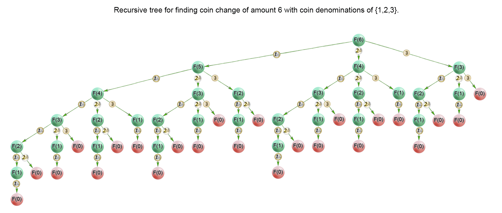

== 322. Coin Change

https://leetcode.com/problems/coin-change/[LeetCode - Coin Change]

思考题：

. 如何把动态规划代码写得更简洁一些？
. 如何使用自底向上方法来实现一遍动态规划？

You are given coins of different denominations and a total amount of money _amount_. Write a function to compute the fewest number of coins that you need to make up that amount. If that amount of money cannot be made up by any combination of the coins, return `-1`.

*Example 1:*

[subs="verbatim,quotes,macros"]
----
*Input:* coins = `[1, 2, 5]`, amount = `11`
*Output:* `3` 
*Explanation:* 11 = 5 + 5 + 1
----

*Example 2:*

[subs="verbatim,quotes,macros"]
----
*Input:* coins = `[2]`, amount = `3`
*Output:* -1

----

*Note*:

You may assume that you have an infinite number of each kind of coin.

[[src-0322]]
[source,{java_source_attr}]
----
include::{sourcedir}/_0322_CoinChange.java[]
----

