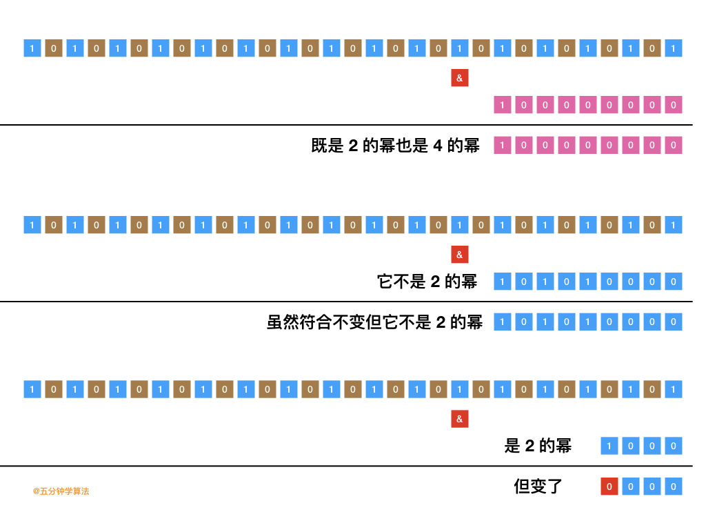

[#0342-power-of-four]
= 342. 4的幂

https://leetcode.cn/problems/power-of-four/[LeetCode - 342. 4的幂 ^]

给定一个整数，写一个函数来判断它是否是 4 的幂次方。如果是，返回 `true`；否则，返回 `false` 。

整数 `n` 是 4 的幂次方需满足：存在整数 `x` 使得 `n == 4^x^`

*示例 1：*

....
输入：n = 16
输出：true
....

*示例 2：*

....
输入：n = 5
输出：false
....

*示例 3：*

....
输入：n = 1
输出：true
....

*提示：*

* `-2^31^ \<= n \<= 2^31^ - 1`

**进阶：**你能不使用循环或者递归来完成本题吗？

== 思路分析

`4` 的幂次方，则必然是 `2` 的幂次方，必然 `n & (n - 1) == 0`。再观察 `4` 的幂次方的二进制表示特征，长度都是 `(length - 1) % 2 == 0`。

[[src-0342]]
[tabs]
====
一刷::
+
--
[{java_src_attr}]
----
include::{sourcedir}/_0342_PowerOfFour.java[tag=answer]
----
--

// 二刷::
// +
// --
// [{java_src_attr}]
// ----
// include::{sourcedir}/_0342_PowerOfFour_2.java[tag=answer]
// ----
// --
====

== 参考资料

. https://leetcode.cn/problems/power-of-four/solutions/798268/4de-mi-by-leetcode-solution-b3ya/[342. 4的幂 - 官方题解^]
. https://leetcode.cn/problems/power-of-four/solutions/804398/gong-shui-san-xie-zhuan-hua-wei-2-de-mi-y21lq/[342. 4的幂 - 转化为 2 的幂求解^]
