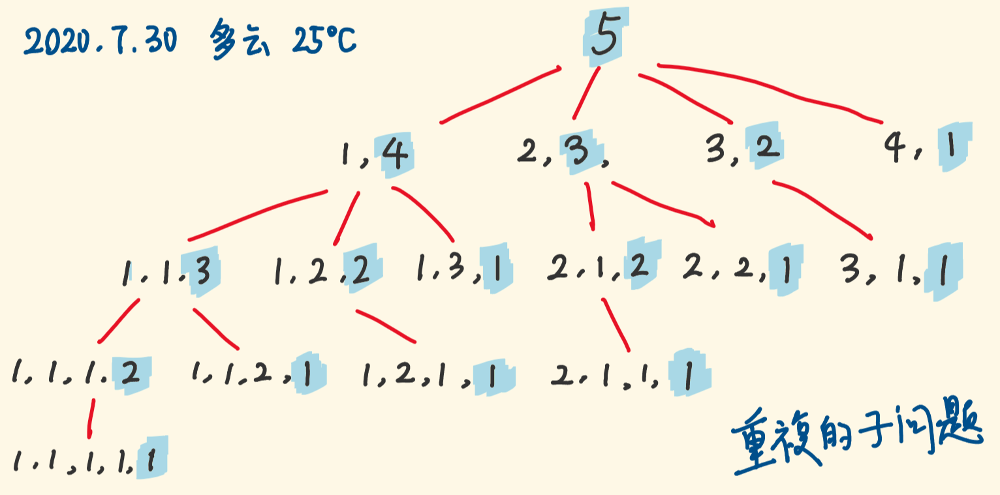
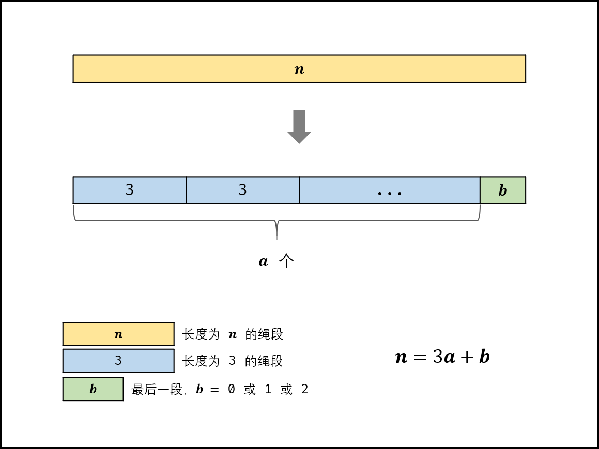

[#0343-integer-break]
= 343. 整数拆分

https://leetcode.cn/problems/integer-break/[LeetCode - 343. 整数拆分 ^]

给定一个正整数 `+n+` ，将其拆分为 `+k+` 个 *正整数*
的和（ `+k >= 2+` ），并使这些整数的乘积最大化。

返回 _你可以获得的最大乘积_  。

*示例 1:*

....
输入: n = 2
输出: 1
解释: 2 = 1 + 1, 1 × 1 = 1。
....

*示例  2:*

....
输入: n = 10
输出: 36
解释: 10 = 3 + 3 + 4, 3 ×  3 ×  4 = 36。
....

*提示:*

* `+2 <= n <= 58+`

== 思路分析

[[src-0343]]
[tabs]
====
一刷::
+
--
[{java_src_attr}]
----
include::{sourcedir}/_0343_IntegerBreak.java[tag=answer]
----
--

二刷::
+
--
[{java_src_attr}]
----
include::{sourcedir}/_0343_IntegerBreak_2.java[tag=answer]
----
--

三刷::
+
--
[{java_src_attr}]
----
include::{sourcedir}/_0343_IntegerBreak_3.java[tag=answer]
----
--
====

== 参考资料

. https://leetcode.cn/problems/jian-sheng-zi-lcof/solutions/104809/mian-shi-ti-14-i-jian-sheng-zi-tan-xin-si-xiang-by/[面试题14- I. 剪绳子（数学推导 / 贪心思想，清晰图解） - 剪绳子 - 力扣（LeetCode）^] -- 数学分析真牛逼！
. https://leetcode.cn/problems/integer-break/solutions/352875/zheng-shu-chai-fen-by-leetcode-solution/[343. 整数拆分 - 官方题解^]
. https://leetcode.cn/problems/integer-break/solutions/353190/shou-hua-tu-jie-di-gui-ji-yi-hua-di-gui-dong-tai-g/[343. 整数拆分 - 「手画图解」递归、记忆化递归、动态规划^]

