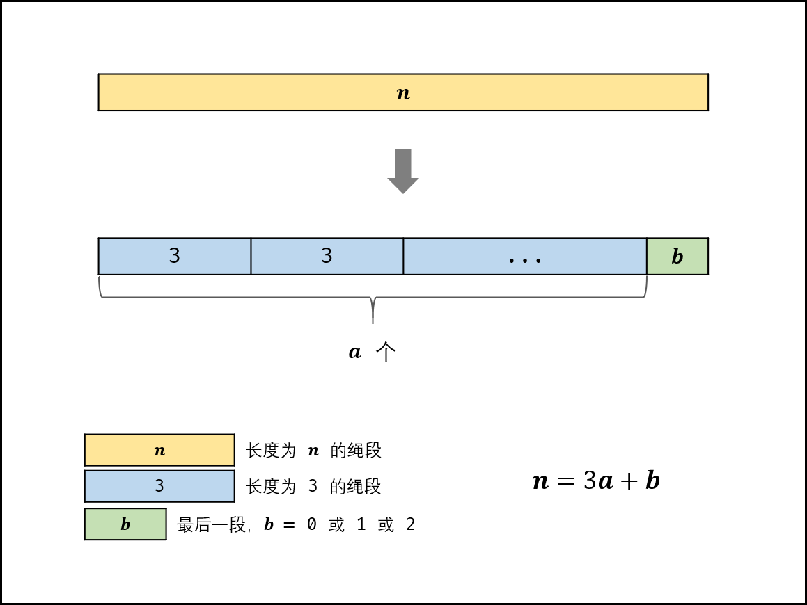

= 343. Integer Break

https://leetcode.com/problems/integer-break/[LeetCode - Integer Break]

Given a positive integer _n_, break it into the sum of *at least* two positive integers and maximize the product of those integers. Return the maximum product you can get.

*Example 1:*

[subs="verbatim,quotes,macros"]
----
*Input:* 2
*Output:* 1
*Explanation:* 2 = 1 + 1, 1 &times; 1 = 1.
----

*Example 2:*

[subs="verbatim,quotes,macros"]
----
*Input:* 10
*Output:* 36
*Explanation:* 10 = 3 + 3 + 4, 3 &times; 3 &times; 4 = 36.
----

*Note*: You may assume that _n_ is not less than 2 and not larger than 58.

== 解题分析

[[src-0343]]
[{java_src_attr}]
----
include::{sourcedir}/_0343_IntegerBreak.java[]
----

== 参考资料

. https://leetcode-cn.com/problems/jian-sheng-zi-lcof/solution/mian-shi-ti-14-i-jian-sheng-zi-tan-xin-si-xiang-by/[面试题14- I. 剪绳子（数学推导 / 贪心思想，清晰图解） - 剪绳子 - 力扣（LeetCode）] -- 数学分析真牛逼！

