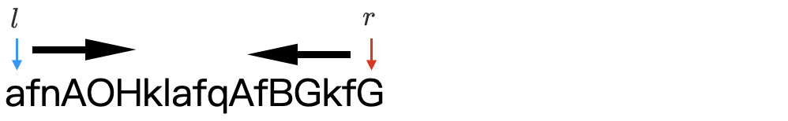

[#0345-reverse-vowels-of-a-string]
= 345. 反转字符串中的元音字母

https://leetcode.cn/problems/reverse-vowels-of-a-string/[LeetCode - 345. 反转字符串中的元音字母 ^]

给你一个字符串 `s` ，仅反转字符串中的所有元音字母，并返回结果字符串。

元音字母包括 `a`、`e`、`i`、`o`、`u`，且可能以大小写两种形式出现不止一次。

*示例 1：*

*输入：*[.example-io]#s = "IceCreAm"#

[.example-io]#*输出：*"AceCreIm"#

*解释：*

`s` 中的元音是 `+['I', 'e', 'e', 'A']+`。反转这些元音，`s` 变为 `AceCreIm`.

*示例 2：*

[.example-io]#**输入：**s = "leetcode"#

*输出：*[.example-io]#"leotcede"#

*提示：*

* `1 \<= s.length \<= 3 * 10^5^`
* `s` 由 *可打印的 ASCII* 字符组成

== 思路分析

双指针！从字符串两端寻找元音字符，然后进行交换。注意大小写！

[[src-0345]]
[tabs]
====
一刷::
+
--
[{java_src_attr}]
----
include::{sourcedir}/_0345_ReverseVowelsOfAString.java[tag=answer]
----
--

// 二刷::
// +
// --
// [{java_src_attr}]
// ----
// include::{sourcedir}/_0345_ReverseVowelsOfAString_2.java[tag=answer]
// ----
// --
====

== 参考资料

. https://leetcode.cn/problems/reverse-vowels-of-a-string/solutions/2820983/geng-jian-dan-de-xie-fa-bu-xu-qian-tao-x-usph/[345. 反转字符串中的元音字母 - 更简单的写法，不需嵌套循环^]
. https://leetcode.cn/problems/reverse-vowels-of-a-string/solutions/944696/gong-shui-san-xie-note-bie-pian-shuang-z-c8ii/[345. 反转字符串中的元音字母 - 双指针 : 一个指针一百天^]
. https://leetcode.cn/problems/reverse-vowels-of-a-string/solutions/944385/fan-zhuan-zi-fu-chuan-zhong-de-yuan-yin-2bmos/[345. 反转字符串中的元音字母 - 官方题解^]
