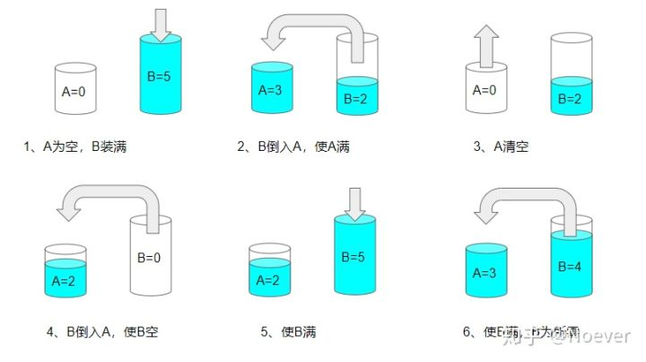

[#0365-water-and-jug-problem]
= 365. 水壶问题

https://leetcode.cn/problems/water-and-jug-problem/[LeetCode - 365. 水壶问题 ^]

有两个水壶，容量分别为 `x` 和 `y` 升。水的供应是无限的。确定是否有可能使用这两个壶准确得到 `target` 升。

你可以：

* 装满任意一个水壶
* 清空任意一个水壶
* 将水从一个水壶倒入另一个水壶，直到接水壶已满，或倒水壶已空。

*示例 1:*

....
输入: x = 3,y = 5,target = 4
输出: true
解释：
按照以下步骤操作，以达到总共 4 升水：
1. 装满 5 升的水壶(0, 5)。
2. 把 5 升的水壶倒进 3 升的水壶，留下 2 升(3, 2)。
3. 倒空 3 升的水壶(0, 2)。
4. 把 2 升水从 5 升的水壶转移到 3 升的水壶(2, 0)。
5. 再次加满 5 升的水壶(2, 5)。
6. 从 5 升的水壶向 3 升的水壶倒水直到 3 升的水壶倒满。5 升的水壶里留下了 4 升水(3, 4)。
7. 倒空 3 升的水壶。现在，5 升的水壶里正好有 4 升水(0, 4)。
参考：来自著名的 "Die Hard"
....

*示例 2:*

....
输入: x = 2, y = 6, target = 5
输出: false
....

*示例 3:*

....
输入: x = 1, y = 2, target = 3
输出: true
解释：同时倒满两个水壶。现在两个水壶中水的总量等于 3。
....

*提示:*

* `1 \<= x, y, target \<= 10^3^`

== 思路分析

深度优先遍历、广度优先遍历或数学（link:++https://baike.baidu.com/item/%E8%A3%B4%E8%9C%80%E5%AE%9A%E7%90%86/5186593[裴蜀定理^]++[贝祖定理]）。这道题重点是如何抽象倒水壶的表示办法以及梳理清楚存在几种可能的操作。

有三种情况，八种可能的操作

. 装满任意一个水壶
.. 装满 A
.. 装满 B
. 清空任意一个水壶
.. 清空 A
.. 清空 B
. 从一个水壶向另外一个水壶倒水，直到装满或者倒空
.. A 到 B，A 剩余，B 满
.. A 到 B，A 空，B 未满
.. B 到 A，A 满，B 剩余
.. B 到 A，A 未满，B 空

使用 `(x, y)` 来表示 A 和 B 中当前的水量。

[[src-0365]]
[tabs]
====
一刷::
+
--
[{java_src_attr}]
----
include::{sourcedir}/_0365_WaterAndJugProblem.java[tag=answer]
----
--

// 二刷::
// +
// --
// [{java_src_attr}]
// ----
// include::{sourcedir}/_0365_WaterAndJugProblem_2.java[tag=answer]
// ----
// --
====

== 参考资料

. https://leetcode.cn/problems/water-and-jug-problem/solutions/161837/tu-de-yan-du-you-xian-bian-li-by-liweiwei1419/[365. 水壶问题 - 图的广度优先遍历^]
. https://leetcode.cn/problems/water-and-jug-problem/solutions/161010/shui-hu-wen-ti-by-leetcode-solution/[365. 水壶问题 - 官方题解^]
. https://leetcode.cn/problems/water-and-jug-problem/solutions/161863/hu-dan-long-wei-liang-zhang-you-yi-si-de-tu-by-ant/[365. 水壶问题 - 「虎胆龙威」两张有意思的图^]
