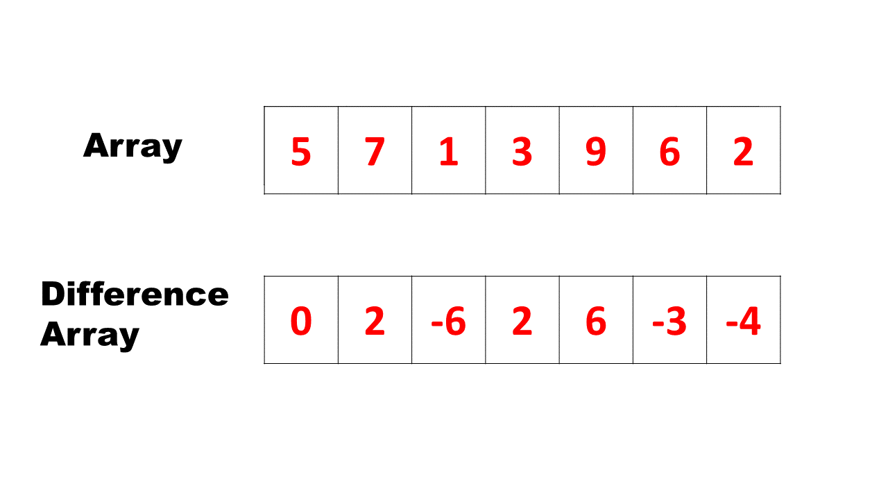

[#0370-range-addition]
= 370. Range Addition

https://leetcode.com/problems/range-addition/[LeetCode - Range Addition]

Assume you have an array of length n initialized with all 0's and are given k update operations.

Each operation is represented as a triplet: [startIndex, endIndex, inc] which increments each element of subarray A[startIndex ... endIndex] (startIndex and endIndex inclusive) with inc.

Return the modified array after all k operations were executed.

Example:

----
Given:
    length = 5,
    updates = [
        [1,  3,  2],
        [2,  4,  3],
        [0,  2, -2]
    ]

Output:

    [-2, 0, 3, 5, 3]

Explanation:

Initial state:
[ 0, 0, 0, 0, 0 ]

After applying operation [1, 3, 2]:
[ 0, 2, 2, 2, 0 ]

After applying operation [2, 4, 3]:
[ 0, 2, 5, 5, 3 ]

After applying operation [0, 2, -2]:
[-2, 0, 3, 5, 3 ]
----

Hint:

* Thinking of using advanced data structures? You are thinking it too complicated.
* For each update operation, do you really need to update all elements between i and j?
* Update only the first and end element is sufficient.
* The optimal time complexity is O(k + n) and uses O(1) extra space.

== 思路分析

差分数组：把变量记录在差分数组上进行打标，全部打标完成后，再从第二项开始逐项求与前一项的累加值。

[[src-0370]]
[{java_src_attr}]
----
include::{sourcedir}/_0370_RangeAddition.java[tag=answer]
----

== 参考资料

. https://leetcode.cn/circle/discuss/FfMCgb/[分享｜【算法小课堂】差分数组（Python/Java/C++/Go/JS^]
. https://oi-wiki.org/basic/prefix-sum/[前缀和 & 差分 - OI Wiki^]
. https://teckbakers.hashnode.dev/difference-array-technique[competitive programming difference array technique^]
