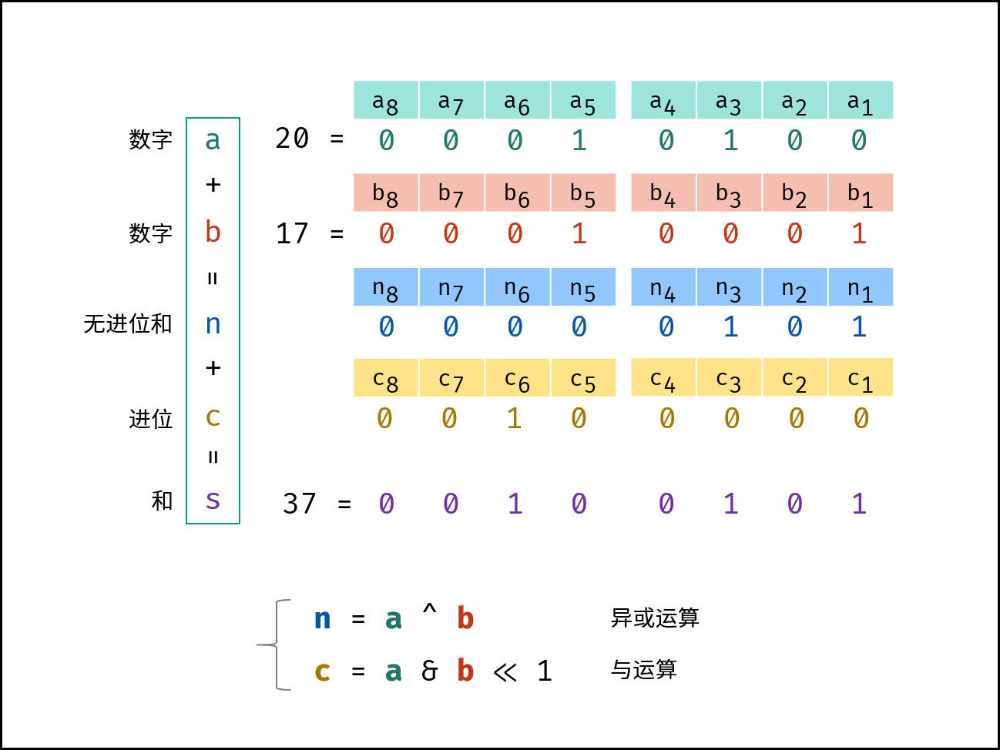

[#0371-sum-of-two-integers]
= 371. Sum of Two Integers

{leetcode}/problems/sum-of-two-integers/[LeetCode - Sum of Two Integers^]

Calculate the sum of two integers _a_ and _b_, but you are *not allowed* to use the operator `+` and `-`.

*Example 1:*

[subs="verbatim,quotes,macros"]
----
*Input:* a = 1, b = 2
*Output:* 3
----

*Example 2:*

[subs="verbatim,quotes,macros"]
----
*Input:* a = -2, b = 3
*Output:* 1
----

== 思路分析

n = a ⊕ b  非进位和：异或运算

c = a & b << 1  进位：与运算+左移一位

这道题的关键有几点：

. 通过异或操作获取在不进位的情况下，各位的值；
. 通过相与加移位来来获取各个进位项；
. 重复上面的操作，直到进位项为 0 为止。

思考题：思考如何通过位运算来实现加减乘除？

[[src-0371]]
[tabs]
====
一刷::
+
--
[{java_src_attr}]
----
include::{sourcedir}/_0371_SumOfTwoIntegers.java[tag=answer]
----
--

二刷::
+
--
[{java_src_attr}]
----
include::{sourcedir}/_0371_SumOfTwoIntegers_2.java[tag=answer]
----
--
====

== 参考资料

. {leetcode}/problems/sum-of-two-integers/discuss/84278/A-summary%3A-how-to-use-bit-manipulation-to-solve-problems-easily-and-efficiently[A summary: how to use bit manipulation to solve problems easily and efficiently - LeetCode Discuss^]

