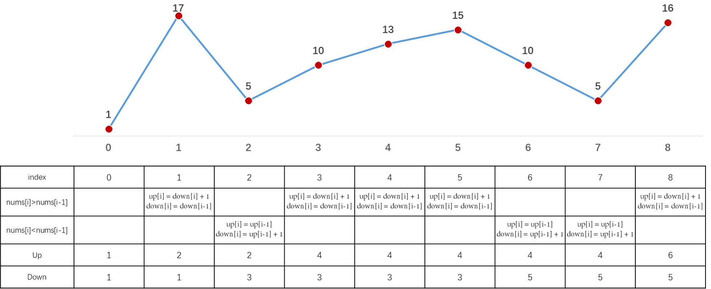

[#0376-wiggle-subsequence]
= 376. 摆动序列

https://leetcode.cn/problems/wiggle-subsequence/[LeetCode - 376. 摆动序列^]

如果连续数字之间的差严格地在正数和负数之间交替，则数字序列称为 **摆动序列**。第一个差（如果存在的话）可能是正数或负数。仅有一个元素或者含两个不等元素的序列也视作摆动序列。

* 例如， `+[1, 7, 4, 9, 2, 5]+` 是一个 *摆动序列* ，因为差值 `+(6, -3, 5, -7, 3)+` 是正负交替出现的。
* 相反，`+[1, 4, 7, 2, 5]+` 和 `+[1, 7, 4, 5, 5]+` 不是摆动序列，第一个序列是因为它的前两个差值都是正数，第二个序列是因为它的最后一个差值为零。

*子序列* 可以通过从原始序列中删除一些（也可以不删除）元素来获得，剩下的元素保持其原始顺序。

给你一个整数数组 `nums` ，返回 `nums` 中作为 *摆动序列* 的 *最长子序列的长度* 。

*示例 1：*

....
输入：nums = [1,7,4,9,2,5]
输出：6
解释：整个序列均为摆动序列，各元素之间的差值为 (6, -3, 5, -7, 3) 。
....

*示例 2：*

....
输入：nums = [1,17,5,10,13,15,10,5,16,8]
输出：7
解释：这个序列包含几个长度为 7 摆动序列。
其中一个是 [1, 17, 10, 13, 10, 16, 8] ，各元素之间的差值为 (16, -7, 3, -3, 6, -8) 。
....

*示例 3：*

....
输入：nums = [1,2,3,4,5,6,7,8,9]
输出：2
....

*提示：*

* `+1 <= nums.length <= 1000+`
* `+0 <= nums[i] <= 1000+`

**进阶：**你能否用 stem:[O(n)] 时间复杂度完成此题?

== 思路分析

一脸懵逼！

贪心算法。使用两个变量，分别记录最后两个数字是升序还是降序，然后根据最后一个是升序还是降序，来从降序和升序来增加数量。

image::images/0376-11.png[{image_attr}]

[[src-0376]]
[tabs]
====
一刷::
+
--
[{java_src_attr}]
----
include::{sourcedir}/_0376_WiggleSubsequence.java[tag=answer]
----
--

// 二刷::
// +
// --
// [{java_src_attr}]
// ----
// include::{sourcedir}/_0376_WiggleSubsequence_2.java[tag=answer]
// ----
// --
====

== 参考资料

. https://leetcode.cn/problems/wiggle-subsequence/solutions/284327/tan-xin-si-lu-qing-xi-er-zheng-que-de-ti-jie-by-lg/[376. 摆动序列 - 贪心思路 清晰而正确的题解^]
. https://leetcode.cn/problems/wiggle-subsequence/solutions/518651/376-bai-dong-xu-lie-tan-xin-jing-dian-ti-vyxt/[376. 摆动序列 - 「代码随想录」带你学透贪心算法！376. 摆动序列^]
. https://leetcode.cn/problems/wiggle-subsequence/solutions/805292/python3-yi-tu-sheng-qian-yan-by-v12de-ao-72b1/[376. 摆动序列 - 一图胜千言^]
. https://leetcode.cn/problems/wiggle-subsequence/solutions/518296/bai-dong-xu-lie-by-leetcode-solution-yh2m/[376. 摆动序列 - 官方题解^]
