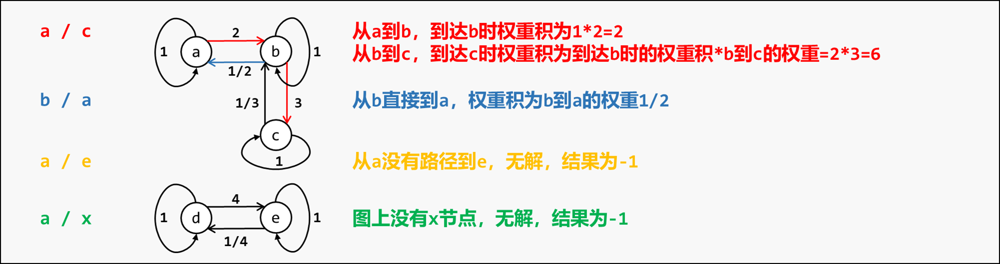

[#0399-evaluate-division]
= 399. 除法求值

https://leetcode.cn/problems/evaluate-division/[LeetCode - 399. 除法求值 ^]

给你一个变量对数组 `equations` 和一个实数值数组 `values` 作为已知条件，其中 `equations[i] = [A~i~, B~i~]` 和 `values[i]` 共同表示等式 `A~i~ / B~i~ = values[i]`。每个 `A~i~` 或 `B~i~` 是一个表示单个变量的字符串。

另有一些以数组 `queries` 表示的问题，其中 `queries[j] = [C~j~, D~j~]` 表示第 `j` 个问题，请你根据已知条件找出 `C~j~ / D~j~ = ?` 的结果作为答案。

返回 *所有问题的答案* 。如果存在某个无法确定的答案，则用 `-1.0` 替代这个答案。如果问题中出现了给定的已知条件中没有出现的字符串，也需要用 `-1.0` 替代这个答案。

**注意：**输入总是有效的。你可以假设除法运算中不会出现除数为 0 的情况，且不存在任何矛盾的结果。

**注意：**未在等式列表中出现的变量是未定义的，因此无法确定它们的答案。

*示例 1：*

....
输入：equations = [["a","b"],["b","c"]], values = [2.0,3.0], queries = [["a","c"],["b","a"],["a","e"],["a","a"],["x","x"]]
输出：[6.00000,0.50000,-1.00000,1.00000,-1.00000]
解释：
条件：a / b = 2.0, b / c = 3.0
问题：a / c = ?, b / a = ?, a / e = ?, a / a = ?, x / x = ?
结果：[6.0, 0.5, -1.0, 1.0, -1.0 ]
注意：x 是未定义的 => -1.0
....

*示例 2：*

....
输入：equations = [["a","b"],["b","c"],["bc","cd"]], values = [1.5,2.5,5.0], queries = [["a","c"],["c","b"],["bc","cd"],["cd","bc"]]
输出：[3.75000,0.40000,5.00000,0.20000]
....

*示例 3：*

....
输入：equations = [["a","b"]], values = [0.5], queries = [["a","b"],["b","a"],["a","c"],["x","y"]]
输出：[0.50000,2.00000,-1.00000,-1.00000]
....

*提示：*

* `+1 <= equations.length <= 20+`
* `equations[i].length == 2`
* `1 \<= A~i~.length, B~i~.length \<= 5`
* `values.length == equations.length`
* `0.0 < values[i] \<= 20.0`
* `+1 <= queries.length <= 20+`
* `queries[i].length == 2`
* `1 \<= C~j~.length, D~j~.length \<= 5`
* `A~i~`, `B~i~`, `C~j~`, `D~j~` 由小写英文字母与数字组成

== 思路分析

没想到这玩意竟然可以用并查集解决！还在想怎么表示代数式呢？

另外，尝试一下带权重的并查集，有意思！

[[src-0399]]
[tabs]
====
一刷::
+
--
[{java_src_attr}]
----
include::{sourcedir}/_0399_EvaluateDivision.java[tag=answer]
----
--

// 二刷::
// +
// --
// [{java_src_attr}]
// ----
// include::{sourcedir}/_0399_EvaluateDivision_2.java[tag=answer]
// ----
// --
====

== 参考资料

. https://leetcode.cn/problems/evaluate-division/solutions/548634/399-chu-fa-qiu-zhi-nan-du-zhong-deng-286-w45d/[399. 除法求值 - 官方题解^]
. https://leetcode.cn/problems/evaluate-division/solutions/2539446/javapython3cyan-du-you-xian-sou-suo-jian-uwy3/[399. 除法求值 - BFS/DFS：将变量转为节点，除法转为带权重的有向边【图解】^]
