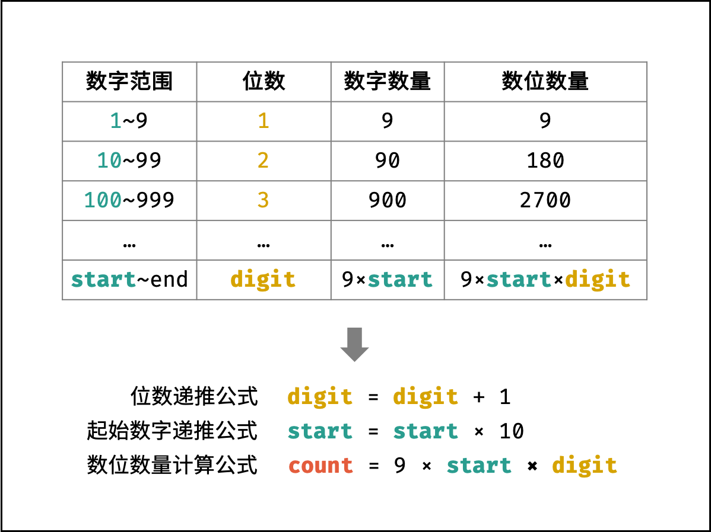
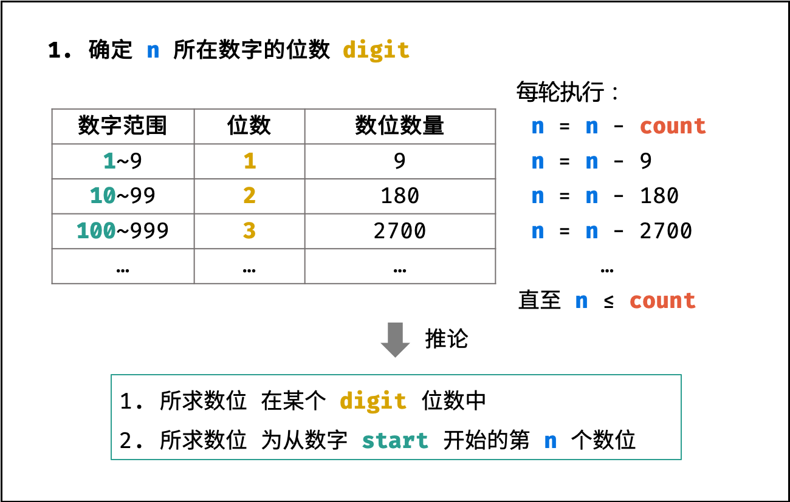
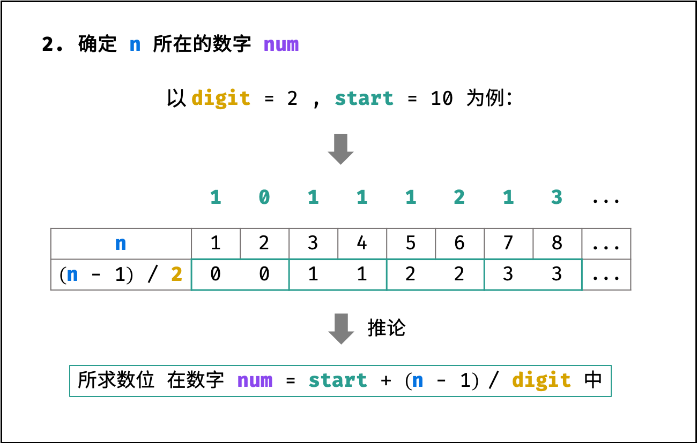
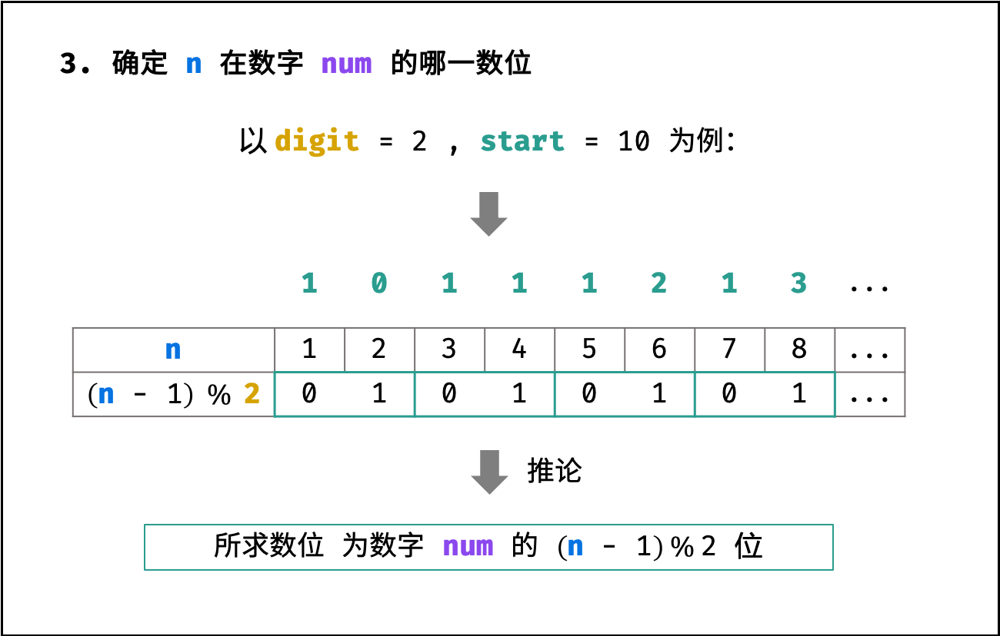
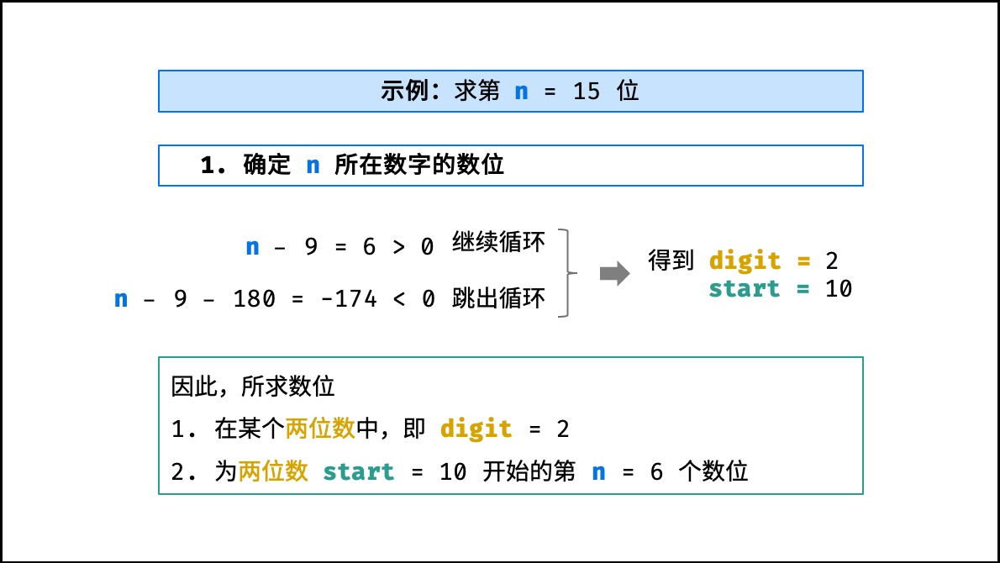
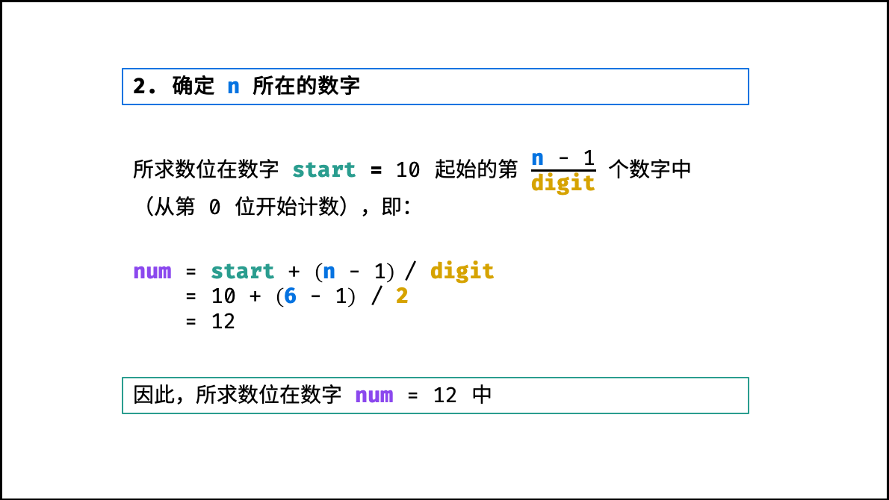
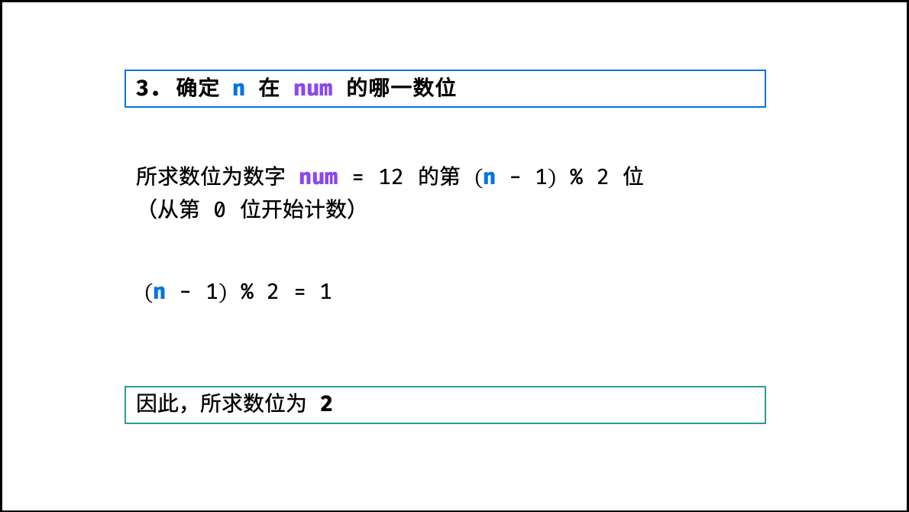

[#0400-nth-digit]
= 400. Nth Digit

{leetcode}/problems/nth-digit/[LeetCode - Nth Digit^]

Find the _n_^th^ digit of the infinite integer sequence 1, 2, 3, 4, 5, 6, 7, 8, 9, 10, 11, ... 

*Note:*

_n_ is positive and will fit within the range of a 32-bit signed integer (_n_ < 2^31^).

*Example 1:*
[subs="verbatim,quotes,macros"]
----
*Input:*
3

*Output:*
3
----

*Example 2:*
[subs="verbatim,quotes,macros"]
----
*Input:*
11

*Output:*
0

*Explanation:*
The 11th digit of the sequence 1, 2, 3, 4, 5, 6, 7, 8, 9, 10, 11, ... is a 0, which is part of the number 10.
----

== 思路分析

[[src-0400]]
[tabs]
====
一刷::
+
--
[{java_src_attr}]
----
include::{sourcedir}/_0400_NthDigit.java[tag=answer]
----
--

// 二刷::
// +
// --
// [{java_src_attr}]
// ----
// include::{sourcedir}/_0400_NthDigit_2.java[tag=answer]
// ----
// --
====

