[#0402-remove-k-digits]
= 402. Remove K Digits

{leetcode}/problems/remove-k-digits/[LeetCode - Remove K Digits^]

Given a non-negative integer _num_ represented as a string, remove _k_ digits from the number so that the new number is the smallest possible.

*Note:*

* The length of _num_ is less than 10002 and will be ≥ _k_.
* The given _num_ does not contain any leading zero.

*Example 1:*

[subs="verbatim,quotes,macros"]
----
Input: num = "1432219", k = 3
Output: "1219"
Explanation: Remove the three digits 4, 3, and 2 to form the new number 1219 which is the smallest.
----

*Example 2:*

[subs="verbatim,quotes,macros"]
----
Input: num = "10200", k = 1
Output: "200"
Explanation: Remove the leading 1 and the number is 200. Note that the output must not contain leading zeroes.
----

*Example 3:*

[subs="verbatim,quotes,macros"]
----
Input: num = "10", k = 2
Output: "0"
Explanation: Remove all the digits from the number and it is left with nothing which is 0.
----

== 思路分析

利用单调栈的思路，将前面比当前字符大的字符都删除即可。

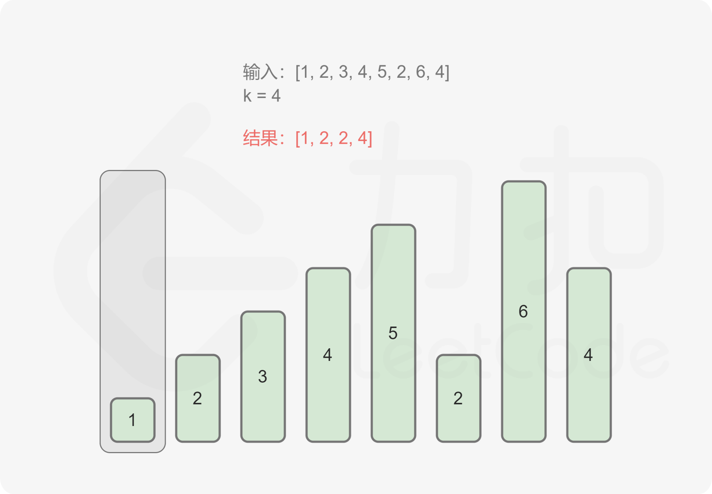

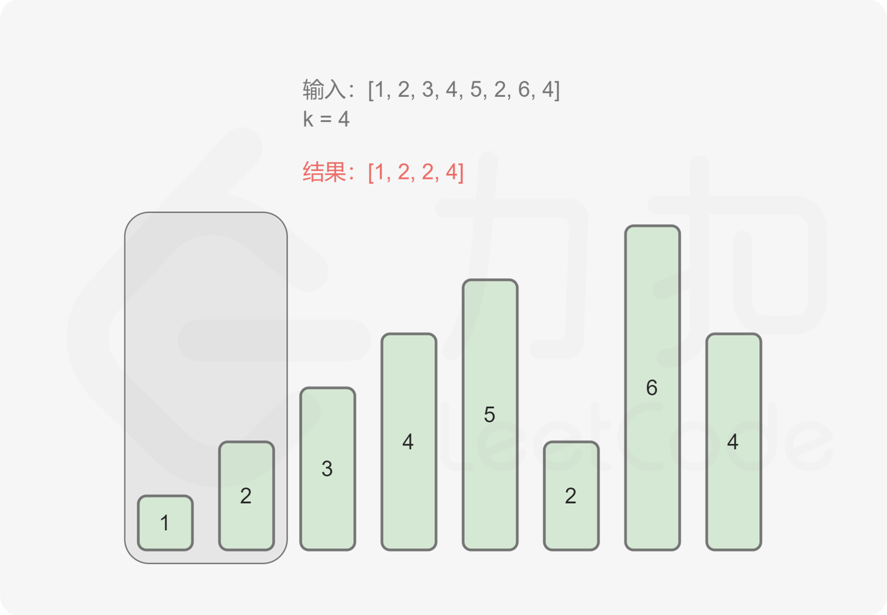

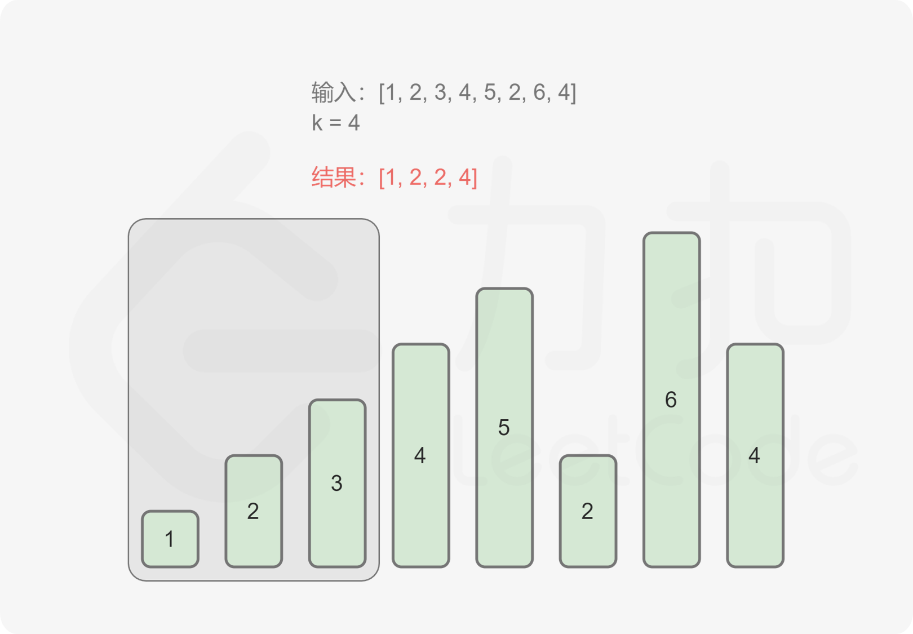

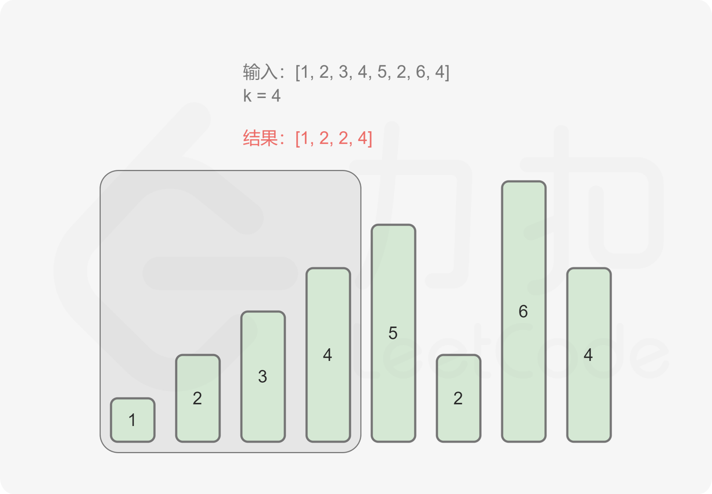

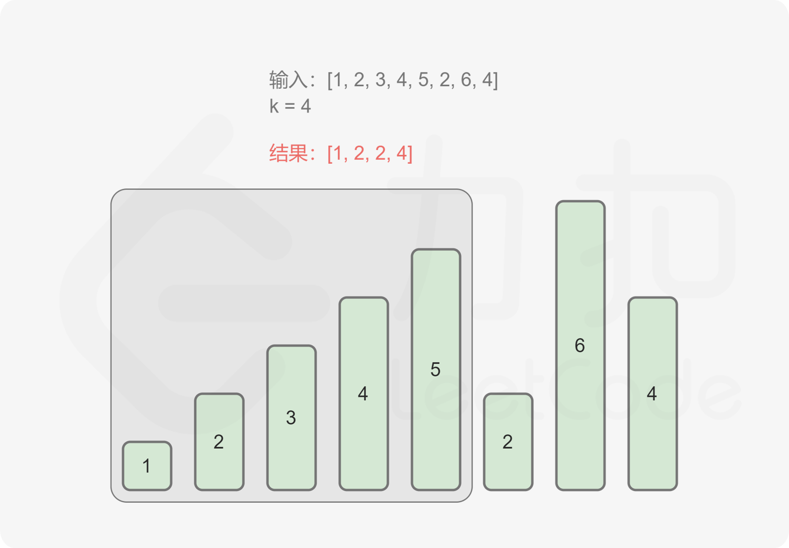

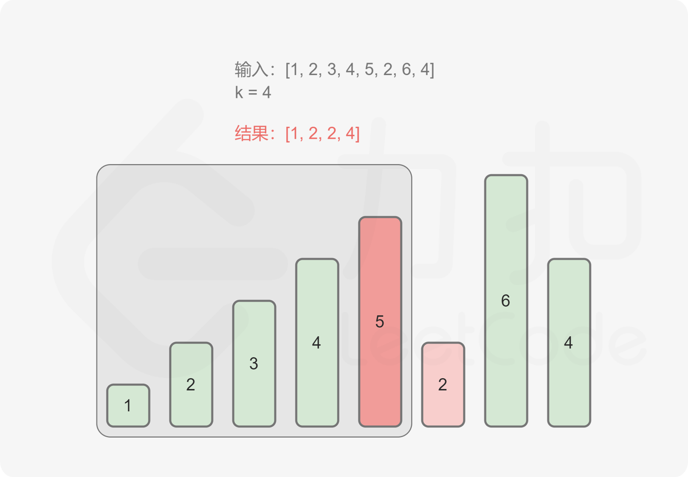

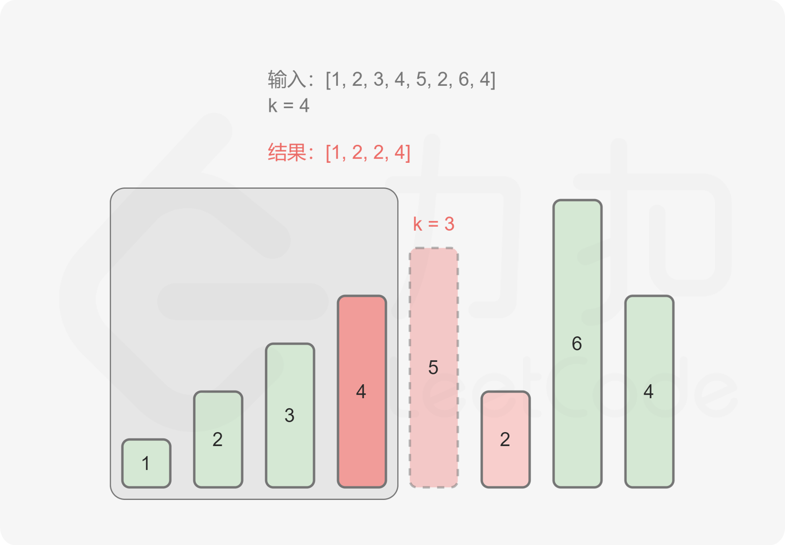

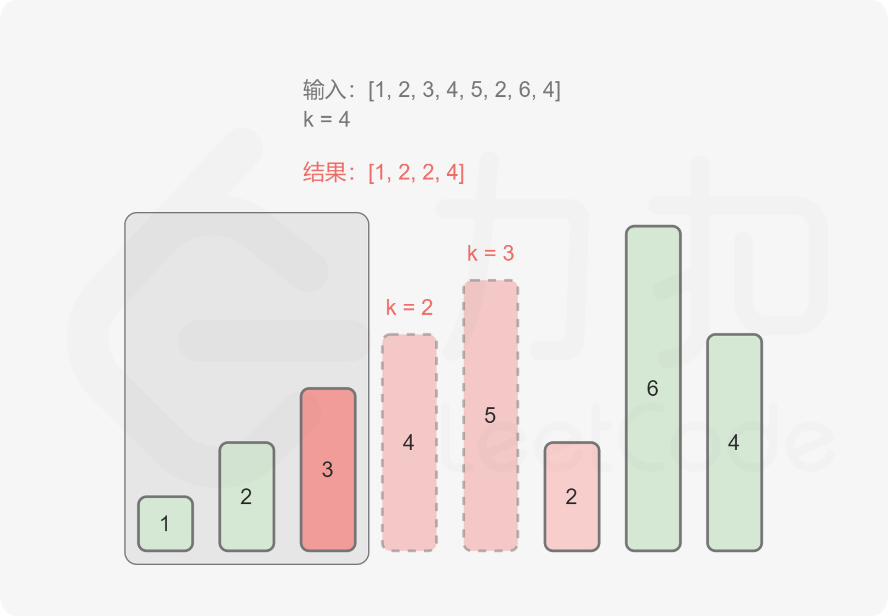

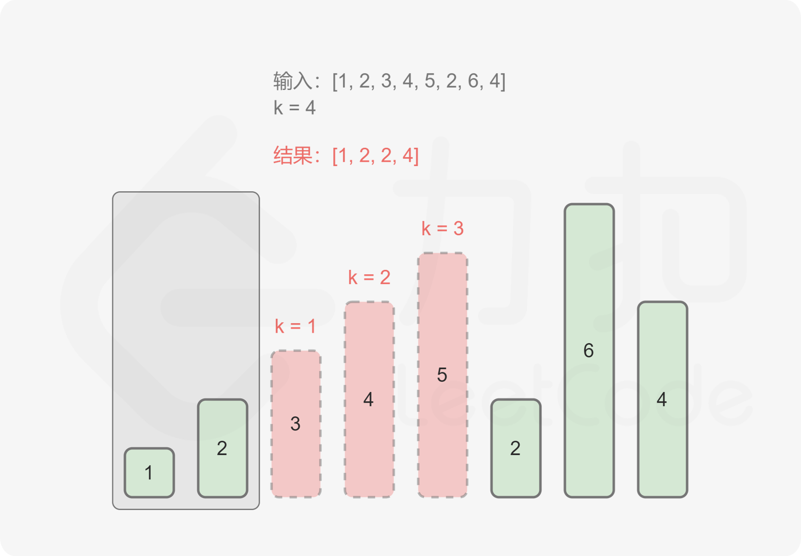

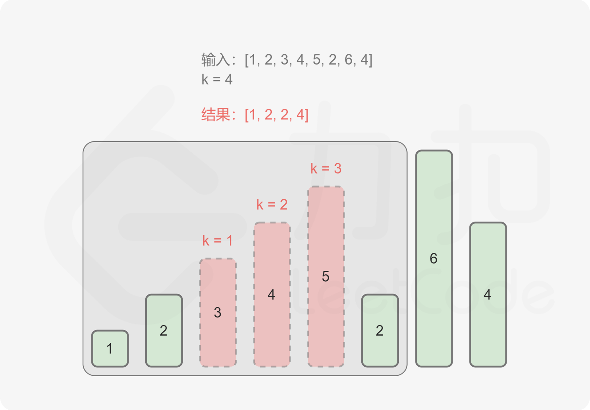

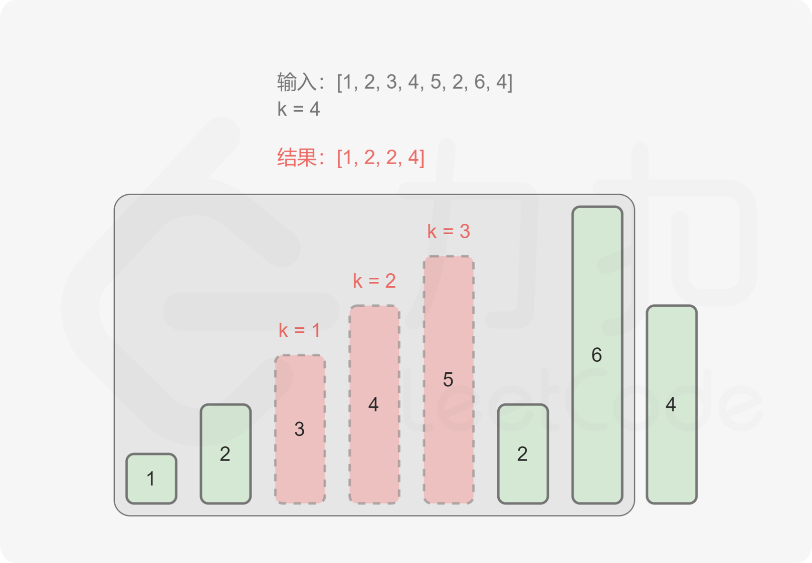

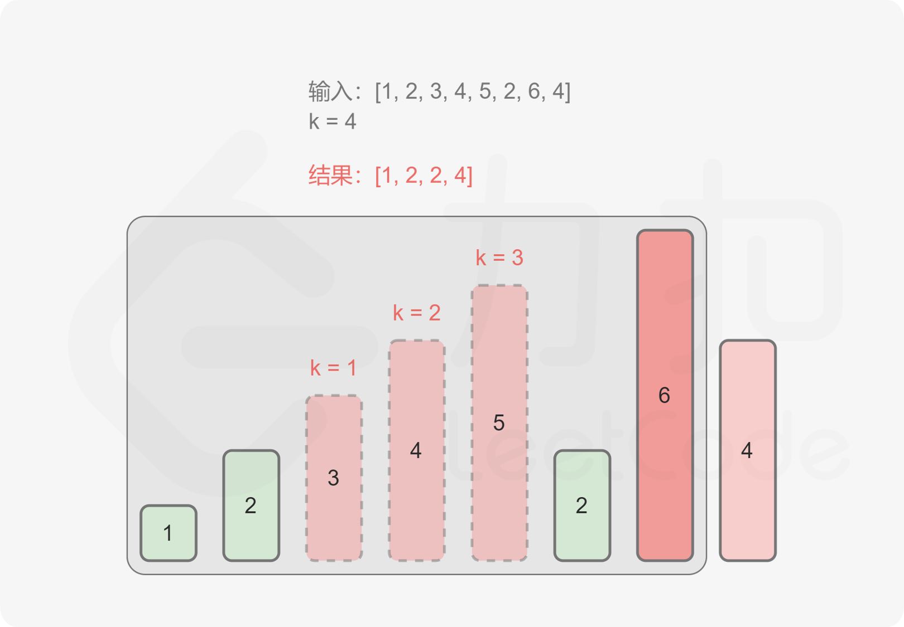

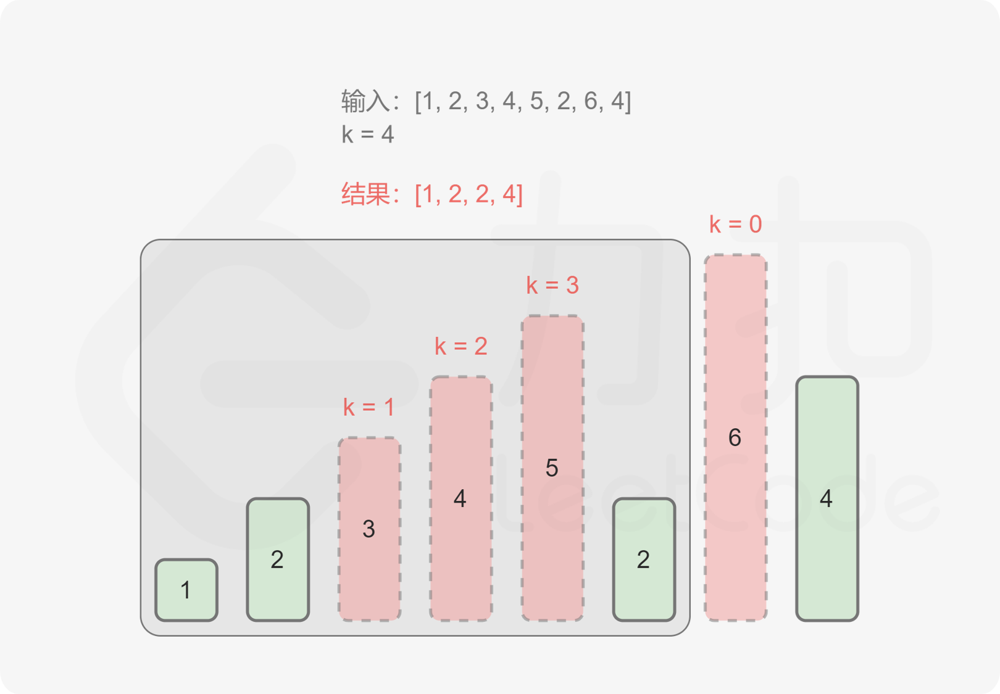

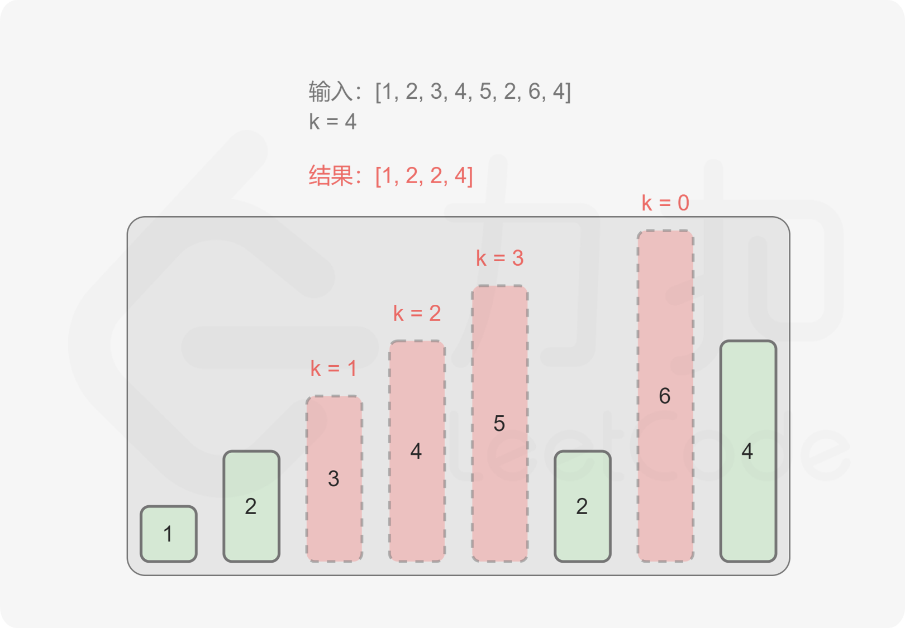

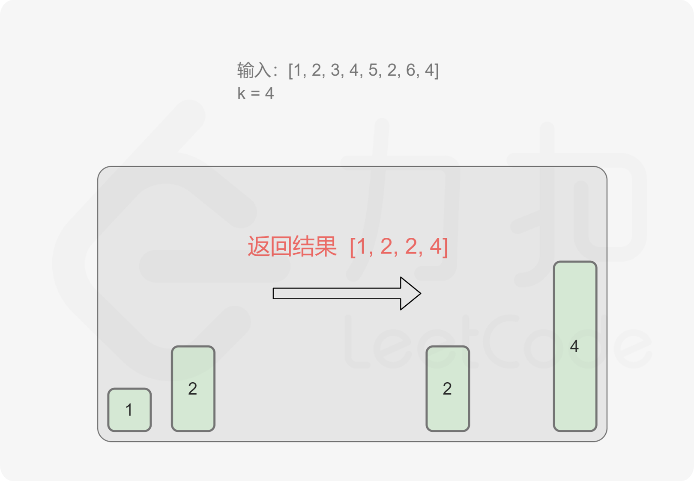

[[src-0402]]
[tabs]
====
一刷::
+
--
[{java_src_attr}]
----
include::{sourcedir}/_0402_RemoveKDigits.java[tag=answer]
----
--

// 二刷::
// +
// --
// [{java_src_attr}]
// ----
// include::{sourcedir}/_0402_RemoveKDigits_2.java[tag=answer]
// ----
// --
====

== 参考资料

. https://leetcode.cn/problems/remove-k-digits/solutions/484940/yi-diao-kwei-shu-zi-by-leetcode-solution/[402. 移掉 K 位数字 - 官方题解^]
. https://leetcode.cn/problems/remove-k-digits/solutions/290203/yi-zhao-chi-bian-li-kou-si-dao-ti-ma-ma-zai-ye-b-5/[402. 移掉 K 位数字 - 一招吃遍力扣四道题^]
. https://leetcode.cn/problems/remove-k-digits/solutions/485036/wei-tu-jie-dan-diao-zhan-dai-ma-jing-jian-402-yi-d/[402. 移掉 K 位数字 - 「手画图解」单调递增栈，为什么？何时用？^]

