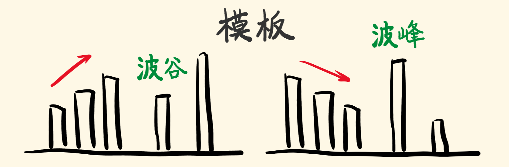

[#0402-remove-k-digits]
= 402. 移掉 K 位数字

https://leetcode.cn/problems/remove-k-digits/[LeetCode - 402. 移掉 K 位数字^]

给你一个以字符串表示的非负整数 `num` 和一个整数 `k`，移除这个数中的 `k` 位数字，使得剩下的数字最小。请你以字符串形式返回这个最小的数字。

*示例 1 ：*

....
输入：num = "1432219", k = 3
输出："1219"
解释：移除掉三个数字 4, 3, 和 2 形成一个新的最小的数字 1219 。
....

*示例 2 ：*

....
输入：num = "10200", k = 1
输出："200"
解释：移掉首位的 1 剩下的数字为 200. 注意输出不能有任何前导零。
....

*示例 3 ：*

....
输入：num = "10", k = 2
输出："0"
解释：从原数字移除所有的数字，剩余为空就是 0 。
....

*提示：*

* `1 \<= k \<= num.length \<= 10^5^`
* `num` 仅由若干位数字（0 - 9）组成
* 除了 *0* 本身之外，`num` 不含任何前导零

== 思路分析

利用单调栈的思路，将前面比当前字符大的字符都删除即可。

利用单调递增栈，将“当前元素”前面更大的元素都删除掉，这样就可以实现尽可能大的减小这个数字。如果数字是递增的，那么就从后面向前删除，直到删够为止。

image::images/0402-01.png[{image_attr}]

image::images/0402-02.png[{image_attr}]

image::images/0402-03.png[{image_attr}]

image::images/0402-04.png[{image_attr}]

image::images/0402-05.png[{image_attr}]

image::images/0402-06.png[{image_attr}]

image::images/0402-07.png[{image_attr}]

image::images/0402-08.png[{image_attr}]

image::images/0402-09.png[{image_attr}]

image::images/0402-10.png[{image_attr}]

image::images/0402-11.png[{image_attr}]

image::images/0402-12.png[{image_attr}]

image::images/0402-13.png[{image_attr}]

image::images/0402-14.png[{image_attr}]

image::images/0402-15.png[{image_attr}]

关于单调栈，记住这两句话：

* 单调递增栈，利用波谷剔除栈中的波峰，留下波谷；
* 单调递减栈，利用波峰剔除栈中的波谷，留下波峰。

[[src-0402]]
[tabs]
====
一刷::
+
--
[{java_src_attr}]
----
include::{sourcedir}/_0402_RemoveKDigits.java[tag=answer]
----
--

二刷::
+
--
[{java_src_attr}]
----
include::{sourcedir}/_0402_RemoveKDigits_2.java[tag=answer]
----
--
====

== 参考资料

. https://leetcode.cn/problems/remove-k-digits/solutions/484940/yi-diao-kwei-shu-zi-by-leetcode-solution/[402. 移掉 K 位数字 - 官方题解^]
. https://leetcode.cn/problems/remove-k-digits/solutions/290203/yi-zhao-chi-bian-li-kou-si-dao-ti-ma-ma-zai-ye-b-5/[402. 移掉 K 位数字 - 一招吃遍力扣四道题^]
. https://leetcode.cn/problems/remove-k-digits/solutions/485036/wei-tu-jie-dan-diao-zhan-dai-ma-jing-jian-402-yi-d/[402. 移掉 K 位数字 - 「手画图解」单调递增栈，为什么？何时用？^]
