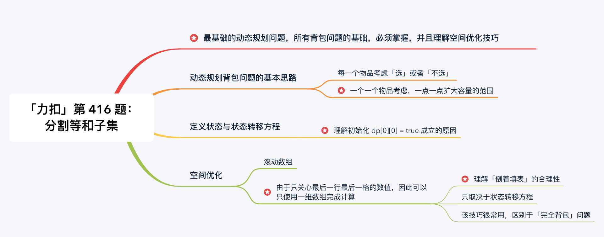
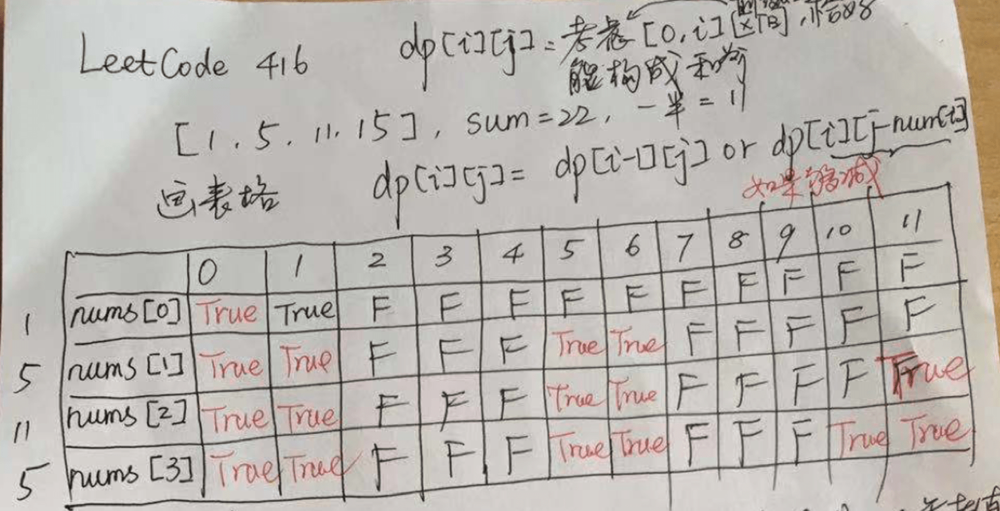

[#0416-partition-equal-subset-sum]
= 416. 分割等和子集

https://leetcode.cn/problems/partition-equal-subset-sum/[LeetCode - 416. 分割等和子集 ^]

给你一个 *只包含正整数* 的 *非空* 数组 `+nums+`。请你判断是否可以将这个数组分割成两个子集，使得两个子集的元素和相等。

*示例 1：*

....
输入：nums = [1,5,11,5]
输出：true
解释：数组可以分割成 [1, 5, 5] 和 [11] 。
....

*示例 2：*

....
输入：nums = [1,2,3,5]
输出：false
解释：数组不能分割成两个元素和相等的子集。
....

*提示：*

* `+1 <= nums.length <= 200+`
* `+1 <= nums[i] <= 100+`

== 思路分析

这道题使用回溯法更容易理解，也更高效。

建议动笔计算，手动模拟填表的过程，其实就是画表格。这个过程非常重要，自己动手填过表，更能加深体会程序是如何执行的，也能更好地理解「空间优化」技巧的思路和好处。

[[src-0416]]
[tabs]
====
一刷::
+
--
[{java_src_attr}]
----
include::{sourcedir}/_0416_PartitionEqualSubsetSum.java[tag=answer]
----
--

二刷::
+
--
[{java_src_attr}]
----
include::{sourcedir}/_0416_PartitionEqualSubsetSum_2.java[tag=answer]
----
--
====

== 思考题

. 将计算过程在纸上手动推演一遍；
. 研究一下背包问题。

== 参考资料

. https://leetcode-cn.com/problems/partition-equal-subset-sum/solution/0-1-bei-bao-wen-ti-xiang-jie-zhen-dui-ben-ti-de-yo/[动态规划（0-1 背包问题） - 分割等和子集 - 力扣（LeetCode）^]
. https://leetcode-cn.com/problems/partition-equal-subset-sum/solution/java-hui-su-fa-jie-fa-2ms-by-wang_dong/[java 回溯法解法 2ms - 分割等和子集 - 力扣（LeetCode）^]
. https://www.kancloud.cn/kancloud/pack/70124[前言 · 背包问题九讲 · 看云^]
. https://www.youtube.com/watch?v=nleY0-eexps[背包九讲问题（上） - YouTube^]
. https://www.youtube.com/watch?v=0Jp4p0uO7Dw[背包九讲问题（下） - YouTube^]

