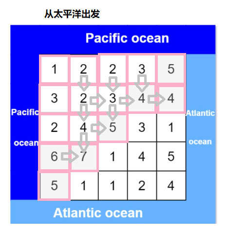

[#0417-pacific-atlantic-water-flow]
= 417. 太平洋大西洋水流问题

https://leetcode.cn/problems/pacific-atlantic-water-flow/[LeetCode - 417. 太平洋大西洋水流问题 ^]

有一个 `m × n` 的矩形岛屿，与 *太平洋* 和 *大西洋* 相邻。 **“太平洋” **处于大陆的左边界和上边界，而 *“大西洋”* 处于大陆的右边界和下边界。

这个岛被分割成一个由若干方形单元格组成的网格。给定一个 `m x n` 的整数矩阵 `heights` ， `heights[r][c]` 表示坐标 `(r, c)` 上单元格 *高于海平面的高度* 。

岛上雨水较多，如果相邻单元格的高度 *小于或等于* 当前单元格的高度，雨水可以直接向北、南、东、西流向相邻单元格。水可以从海洋附近的任何单元格流入海洋。

返回网格坐标 `result` 的 *2D 列表*，其中 `result[i] = [r~i~, c~i~]` 表示雨水从单元格 `(r~i~, c~i~)` 流动 *既可流向太平洋也可流向大西洋* 。

*示例 1：*

image:images/0417-01.jpg[{image_attr}]

....
输入: heights = [[1,2,2,3,5],[3,2,3,4,4],[2,4,5,3,1],[6,7,1,4,5],[5,1,1,2,4]]
输出: [[0,4],[1,3],[1,4],[2,2],[3,0],[3,1],[4,0]]
....

*示例 2：*

....
输入: heights = [[2,1],[1,2]]
输出: [[0,0],[0,1],[1,0],[1,1]]
....

*提示：*

* `m == heights.length`
* `n == heights[r].length`
* `+1 <= m, n <= 200+`
* `0 \<= heights[r][c] \<= 10^5^`

== 思路分析

先搞清楚题目。题目要求是找出水既可以流向太平洋，又可以流向大西洋的坐标点集合。水往低处流，靠近海洋的坐标点，都是可以流向海洋的点，靠着太平洋，就流向太平洋；靠着大西洋，就流向大西洋。以这些点为起点，深度优先遍历或者广度优先遍历，找出“步步高升”的点。

搞清楚题目要求，就是一个 DFS 或 BFS：分别以靠着海洋的点为起点，找出“步步高升”的点，最后求两个海洋的高点交集。

image::images/0417-11.png[{image_attr}]

image::images/0417-12.png[{image_attr}]

[[src-0417]]
[tabs]
====
一刷::
+
--
[{java_src_attr}]
----
include::{sourcedir}/_0417_PacificAtlanticWaterFlow.java[tag=answer]
----
--

// 二刷::
// +
// --
// [{java_src_attr}]
// ----
// include::{sourcedir}/_0417_PacificAtlanticWaterFlow_2.java[tag=answer]
// ----
// --
====

== 参考资料

. https://leetcode.cn/problems/pacific-atlantic-water-flow/solutions/754024/shui-wang-gao-chu-liu-by-xiaohu9527-xxsx/[417. 太平洋大西洋水流问题 - 水往高处流!^]
. https://leetcode.cn/problems/pacific-atlantic-water-flow/solutions/1447341/tai-ping-yang-da-xi-yang-shui-liu-wen-ti-sjk3/[417. 太平洋大西洋水流问题 - 官方题解^]
