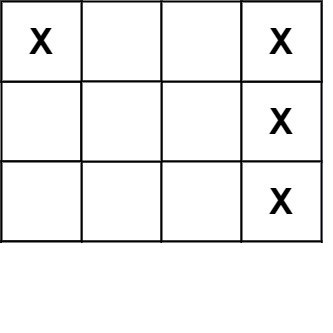

[#0419-battleships-in-a-board]
= 419. 棋盘上的战舰

https://leetcode.cn/problems/battleships-in-a-board/[LeetCode - 419. 棋盘上的战舰 ^]

给你一个大小为 `m x n` 的矩阵 `board` 表示棋盘，其中，每个单元格可以是一艘战舰 `X` 或者是一个空位 `.`，返回在棋盘 `board` 上放置的 *舰队* 的数量。

*舰队* 只能水平或者垂直放置在 `board` 上。换句话说，舰队只能按 `1 x k`（`1` 行，`k` 列）或 `k x 1`（`k` 行，`1`列）的形状放置，其中 `k` 可以是任意大小。两个舰队之间至少有一个水平或垂直的空格分隔 （即没有相邻的舰队）。

*示例 1：*

....
输入：board = [["X",".",".","X"],[".",".",".","X"],[".",".",".","X"]]
输出：2
....

*示例 2：*

....
输入：board = [["."]]
输出：0
....

*提示：*

* `m == board.length`
* `n == board[i].length`
* `+1 <= m, n <= 200+`
* `board[i][j]` 是 `.` 或 `X`

**进阶：**你可以实现一次扫描算法，并只使用 stem:[O(1)] 额外空间，并且不修改 `board` 的值来解决这个问题吗？

== 思路分析

对矩阵全扫描，遇到战舰就+1，如果当前节点的上一个节点或者坐标一个节点是 `X`，已经计数过了，就跳过。

[[src-0419]]
[tabs]
====
一刷::
+
--
[{java_src_attr}]
----
include::{sourcedir}/_0419_BattleshipsInABoard.java[tag=answer]
----
--

// 二刷::
// +
// --
// [{java_src_attr}]
// ----
// include::{sourcedir}/_0419_BattleshipsInABoard_2.java[tag=answer]
// ----
// --
====

== 参考资料

. https://leetcode.cn/problems/battleships-in-a-board/solutions/1162182/jia-ban-shang-de-zhan-jian-by-leetcode-s-kxpc/[419. 棋盘上的战舰 - 官方题解^]
. https://leetcode.cn/problems/battleships-in-a-board/solutions/1163682/gong-shui-san-xie-ji-chong-sao-miao-xian-trmc/[419. 棋盘上的战舰 - 几种「扫描限制」&「空间限制」做法^]
