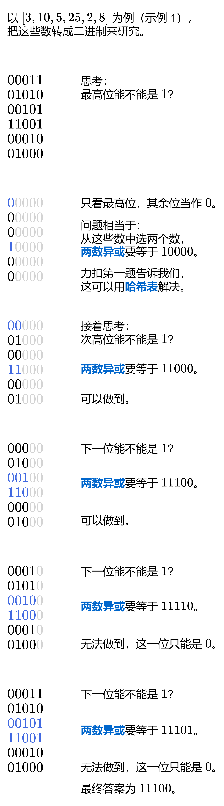

[#0421-maximum-xor-of-two-numbers-in-an-array]
= 421. 数组中两个数的最大异或值

https://leetcode.cn/problems/maximum-xor-of-two-numbers-in-an-array/[LeetCode - 421. 数组中两个数的最大异或值 ^]

给你一个整数数组 `nums` ，返回 `nums[i] XOR nums[j]` 的最大运算结果，其中 `+0 ≤ i ≤ j < n+` 。

*示例 1：*

....
输入：nums = [3,10,5,25,2,8]
输出：28
解释：最大运算结果是 5 XOR 25 = 28.
....

*示例 2：*

....
输入：nums = [14,70,53,83,49,91,36,80,92,51,66,70]
输出：127
....

*提示：*

* `1 \<= nums.length \<= 2 * 10^5^`
* `0 \<= nums[i] \<= 2^31^ - 1+`

== 思路分析

最初的思路将数组排序，从最大数字开始，寻找可以补齐地位为 `0` 的小数。看题解发现，应该是补齐尽可能高的 `0` 所在的位置。

[[src-0421]]
[tabs]
====
一刷::
+
--
[{java_src_attr}]
----
include::{sourcedir}/_0421_MaximumXorOfTwoNumbersInAnArray.java[tag=answer]
----
--

// 二刷::
// +
// --
// [{java_src_attr}]
// ----
// include::{sourcedir}/_0421_MaximumXorOfTwoNumbersInAnArray_2.java[tag=answer]
// ----
// --
====

== 参考资料

. https://leetcode.cn/problems/maximum-xor-of-two-numbers-in-an-array/solutions/778291/shu-zu-zhong-liang-ge-shu-de-zui-da-yi-h-n9m9/[421. 数组中两个数的最大异或值 - 官方题解^]
. https://leetcode.cn/problems/maximum-xor-of-two-numbers-in-an-array/solutions/2511644/tu-jie-jian-ji-gao-xiao-yi-tu-miao-dong-1427d/[421. 数组中两个数的最大异或值 - 简洁高效，一图秒懂！^] --这个题解有意思！
. https://leetcode.cn/problems/maximum-xor-of-two-numbers-in-an-array/solutions/778823/gong-shui-san-xie-noxiang-xin-ke-xue-xi-bmjdg/[421. 数组中两个数的最大异或值 - 详解为何能用「贪心」&「Trie」求解^]
