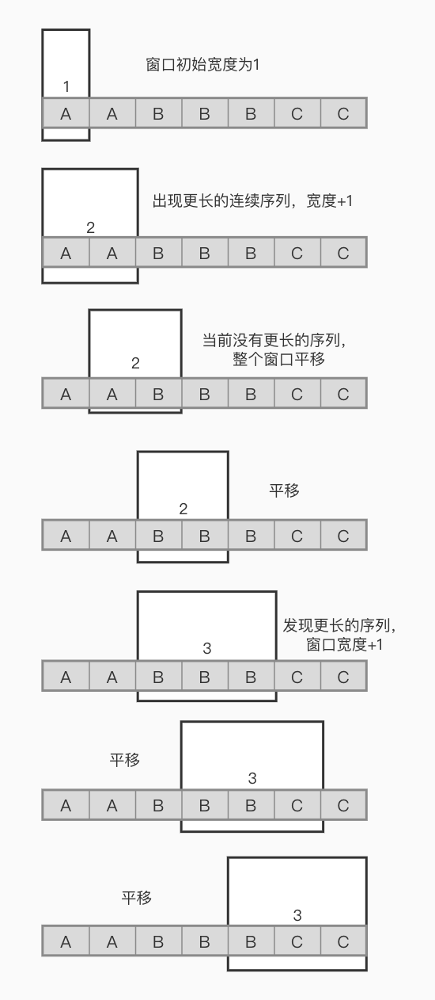
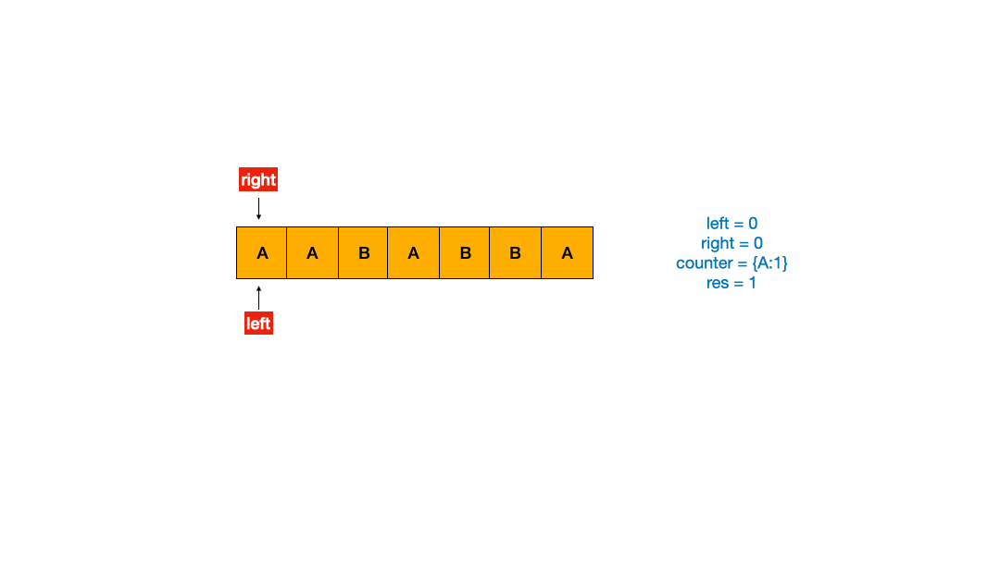

[#0424-longest-repeating-character-replacement]
= 424. 替换后的最长重复字符

https://leetcode.cn/problems/longest-repeating-character-replacement/[LeetCode - 424. 替换后的最长重复字符 ^]

给你一个字符串 `s` 和一个整数 `k`。你可以选择字符串中的任一字符，并将其更改为任何其他大写英文字符。该操作最多可执行 `k` 次。

在执行上述操作后，返回 _包含相同字母的最长子字符串的长度。_

*示例 1：*

....
输入：s = "ABAB", k = 2
输出：4
解释：用两个'A'替换为两个'B',反之亦然。
....

*示例 2：*

....
输入：s = "AABABBA", k = 1
输出：4
解释：
将中间的一个'A'替换为'B',字符串变为 "AABBBBA"。
子串 "BBBB" 有最长重复字母, 答案为 4。
可能存在其他的方法来得到同样的结果。
....

*提示：*

* `1 \<= s.length \<= 10^5^`
* `s` 仅由大写英文字母组成
* `+0 <= k <= s.length+`

== 思路分析

滑动窗口。

这道题的难点在于，如何判断一个字符串改变 K 个字符，能够变成一个连续串？

可以维护当前窗口内，单个字符的最大值，当窗口长度大于 `max + k` 时，就需要移动窗口了。

[[src-0424]]
[tabs]
====
一刷::
+
--
[{java_src_attr}]
----
include::{sourcedir}/_0424_LongestRepeatingCharacterReplacement.java[tag=answer]
----
--

// 二刷::
// +
// --
// [{java_src_attr}]
// ----
// include::{sourcedir}/_0424_LongestRepeatingCharacterReplacement_2.java[tag=answer]
// ----
// --
====

== 参考资料

. https://leetcode.cn/problems/longest-repeating-character-replacement/solutions/78520/tong-guo-ci-ti-liao-jie-yi-xia-shi-yao-shi-hua-don/[424. 替换后的最长重复字符 - 通过此题了解一下什么是滑动窗口 Java 题解^]
. https://leetcode.cn/problems/longest-repeating-character-replacement/solutions/586648/ti-huan-hou-de-zui-chang-zhong-fu-zi-fu-eaacp/[424. 替换后的最长重复字符 - 官方题解^]
. https://leetcode.cn/problems/longest-repeating-character-replacement/solutions/587405/fen-xiang-zhen-cang-de-shuang-zhi-zhen-m-fdsk/[424. 替换后的最长重复字符 - 分享珍藏的双指针模板，动图帮助理解本题^]
