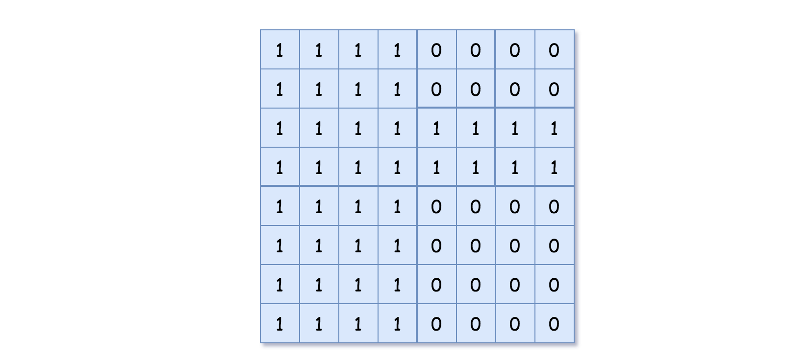

[#0427-construct-quad-tree]
= 427. 建立四叉树

https://leetcode.cn/problems/construct-quad-tree/[LeetCode - 427. 建立四叉树 ^]

给你一个 `n * n` 矩阵 `grid` ，矩阵由若干 `0` 和 `1` 组成。请你用四叉树表示该矩阵 `grid` 。

你需要返回能表示矩阵 `grid` 的 四叉树 的根结点。

四叉树数据结构中，每个内部节点只有四个子节点。此外，每个节点都有两个属性：

* `val`：储存叶子结点所代表的区域的值。1 对应 *True*，0 对应 *False*。注意，当 `isLeaf` 为 *False* 时，你可以把 *True* 或者 *False* 赋值给节点，两种值都会被判题机制 *接受* 。
* `isLeaf`: 当这个节点是一个叶子结点时为 *True*，如果它有 4 个子节点则为 *False* 。

....
class Node {
    public boolean val;
    public boolean isLeaf;
    public Node topLeft;
    public Node topRight;
    public Node bottomLeft;
    public Node bottomRight;
}
....

我们可以按以下步骤为二维区域构建四叉树：

. 如果当前网格的值相同（即，全为 `0` 或者全为 `1`），将 `isLeaf` 设为 True ，将 `val` 设为网格相应的值，并将四个子节点都设为 Null 然后停止。
. 如果当前网格的值不同，将 `isLeaf` 设为 False， 将 `val` 设为任意值，然后如下图所示，将当前网格划分为四个子网格。
. 使用适当的子网格递归每个子节点。

image::images/0427-01.png[{image_attr}]

如果你想了解更多关于四叉树的内容，可以参考 https://en.wikipedia.org/wiki/Quadtree[wiki] 。

*四叉树格式：*

你不需要阅读本节来解决这个问题。只有当你想了解输出格式时才会这样做。输出为使用层序遍历后四叉树的序列化形式，其中 `null` 表示路径终止符，其下面不存在节点。

它与二叉树的序列化非常相似。唯一的区别是节点以列表形式表示 `[isLeaf, val]`。

如果 `isLeaf` 或者 `val` 的值为 True，则表示它在列表 `[isLeaf, val]` 中的值为 *1* ；如果 `isLeaf` 或者 `val` 的值为 False ，则表示值为 *0* 。

*示例 1：*

image::images/0427-02.png[{image_attr}]

....
输入：grid = [[0,1],[1,0]]
输出：[[0,1],[1,0],[1,1],[1,1],[1,0]]
解释：此示例的解释如下：
请注意，在下面四叉树的图示中，0 表示 false，1 表示 True 。
....

image::images/0427-03.png[{image_attr}]

*示例 2：*

....
输入：grid = [[1,1,1,1,0,0,0,0],[1,1,1,1,0,0,0,0],[1,1,1,1,1,1,1,1],[1,1,1,1,1,1,1,1],[1,1,1,1,0,0,0,0],[1,1,1,1,0,0,0,0],[1,1,1,1,0,0,0,0],[1,1,1,1,0,0,0,0]]
输出：[[0,1],[1,1],[0,1],[1,1],[1,0],null,null,null,null,[1,0],[1,0],[1,1],[1,1]]
解释：网格中的所有值都不相同。我们将网格划分为四个子网格。
topLeft，bottomLeft 和 bottomRight 均具有相同的值。
topRight 具有不同的值，因此我们将其再分为 4 个子网格，这样每个子网格都具有相同的值。
解释如下图所示：
....

image:images/0427-05.png[{image_attr}]

*提示：*

. `n == grid.length == grid[i].length`
. `n == 2^x^` 其中 `+0 <= x <= 6+`

== 思路分析

递归+分治！

注意：一个区域内是否相等不能靠底层的节点来判断，需要遍历所有的节点值。

[[src-0427]]
[tabs]
====
一刷::
+
--
[{java_src_attr}]
----
include::{sourcedir}/_0427_ConstructQuadTree.java[tag=answer]
----
--

// 二刷::
// +
// --
// [{java_src_attr}]
// ----
// include::{sourcedir}/_0427_ConstructQuadTree_2.java[tag=answer]
// ----
// --
====

== 参考资料

. https://leetcode.cn/problems/construct-quad-tree/solutions/1449809/jian-li-si-cha-shu-by-leetcode-solution-gcru/[427. 建立四叉树 - 官方题解^]
. https://leetcode.cn/problems/construct-quad-tree/solutions/1457018/by-fuxuemingzhu-3dgn/[427. 建立四叉树 - 看不懂题目？详细分析题意，递归解决^]
