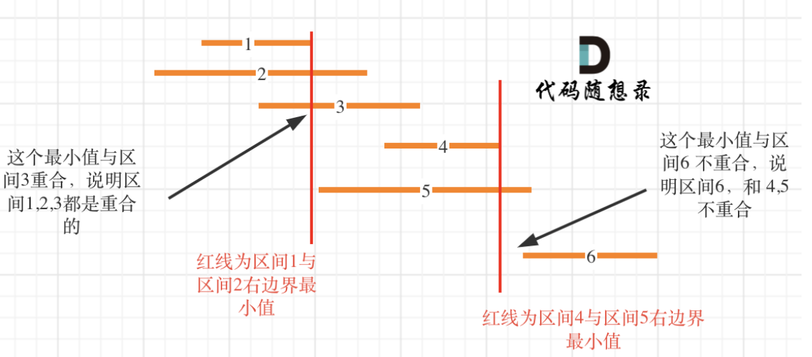

[#0435-non-overlapping-intervals]
= 435. 无重叠区间

https://leetcode.cn/problems/non-overlapping-intervals/[LeetCode - 435. 无重叠区间 ^]

给定一个区间的集合 `intervals` ，其中 `intervals[i] = [start~i~, end~i~]` 。返回 _需要移除区间的最小数量，使剩余区间互不重叠_。

*示例 1:*

....
输入: intervals = [[1,2],[2,3],[3,4],[1,3]]
输出: 1
解释: 移除 [1,3] 后，剩下的区间没有重叠。
....

*示例 2:*

....
输入: intervals = [ [1,2], [1,2], [1,2] ]
输出: 2
解释: 你需要移除两个 [1,2] 来使剩下的区间没有重叠。
....

*示例 3:*

....
输入: intervals = [ [1,2], [2,3] ]
输出: 0
解释: 你不需要移除任何区间，因为它们已经是无重叠的了。
....

*提示:*

* `1 \<= intervals.length \<= 10^5^`
* `intervals[i].length == 2`
* `-5 * 10^4^ \<= start~i~ < end~i~ \<= 5 * 10^4^`

== 思路分析

换个角度，改为计算最多可以选多少个互不重叠的区间，那么没选的区间就是要移除的区间。

首先思考一个问题：选择哪一个区间作为首个区间？

首个区间就是所有可以选择的区间中右端点最小的那个区间。

[[src-0435]]
[tabs]
====
一刷::
+
--
[{java_src_attr}]
----
include::{sourcedir}/_0435_NonOverlappingIntervals.java[tag=answer]
----
--

// 二刷::
// +
// --
// [{java_src_attr}]
// ----
// include::{sourcedir}/_0435_NonOverlappingIntervals_2.java[tag=answer]
// ----
// --
====

== 参考资料

. https://leetcode.cn/problems/non-overlapping-intervals/solutions/3077218/tan-xin-zheng-ming-pythonjavaccgojsrust-3jx4f/[435. 无重叠区间 - 贪心+证明^]
. https://leetcode.cn/problems/non-overlapping-intervals/solutions/541543/wu-zhong-die-qu-jian-by-leetcode-solutio-cpsb/[435. 无重叠区间 - 官方题解^]
. https://leetcode.cn/problems/non-overlapping-intervals/solutions/541919/435-wu-zhong-die-qu-jian-tan-xin-jing-di-qze0/[435. 无重叠区间 - 带你学透贪心算法！^]
