[#0437-path-sum-iii]
= 437. Path Sum III

https://leetcode.com/problems/path-sum-iii/[LeetCode - Path Sum III]

You are given a binary tree in which each node contains an integer value.

Find the number of paths that sum to a given value.

The path does not need to start or end at the root or a leaf, but it must go downwards (traveling only from parent nodes to child nodes).

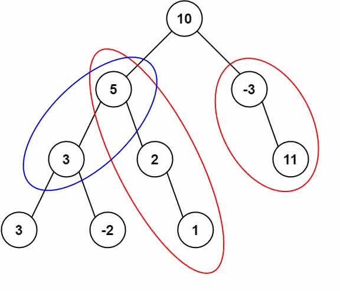

The tree has no more than 1,000 nodes and the values are in the range -1,000,000 to 1,000,000.

.Example:
[subs="verbatim,quotes,macros"]
----
root = [10,5,-3,3,2,null,11,3,-2,null,1], sum = 8

      10
     /  \
    *5*   *-3*
   */* *\*    *\*
  *3*   *2*   *11*
 / \   *\*
3  -2   *1*

Return 3. The paths that sum to 8 are:

1.  5 -> 3
2.  5 -> 2 -> 1
3. -3 -> 11
----

== 思路分析

[[src-0437]]
[{java_src_attr}]
----
include::{sourcedir}/_0437_PathSumIII.java[]
----

.错误提交
[{java_src_attr}]
----
include::{sourcedir}/_0437_PathSumIII_2.java[]
----

[{java_src_attr}]
----
include::{sourcedir}/_0437_PathSumIII_21.java[]
----

=== 前缀和解法

. 前缀和定义：一个节点的前缀和就是该节点到根之间的路径和。
. 前缀和对于本题的作用：两节点间的路径和=两节点的前缀和之差
. `Map` 存的是什么: `Map` 的 key 是前缀和， value 是该前缀和在已遍历的节点中的出现频率
. 恢复状态的意义：
.. 题目要求：路径方向必须是向下的（只能从父节点到子节点）
.. 所以当我们讨论两个节点的前缀和差值时，有一个前提：*一个节点必须是另一个节点的祖先节点。*
.. 也就是说，当我们把一个节点的前缀和信息更新到hashMap里时，它应当只对其子节点有效。
.. 所以我们应该：*在遍历完一个节点的所有子节点后，将其从 `Map` 中减去它的频率。*

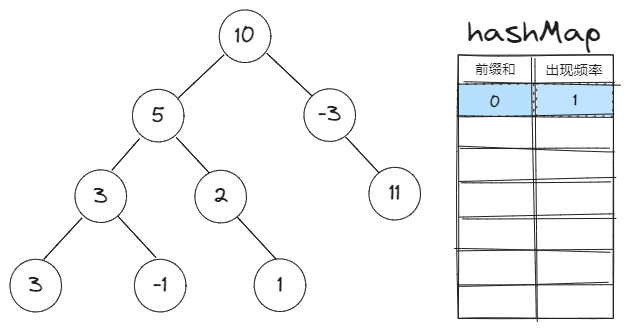

image::images/0437-02.png[{image_attr}]

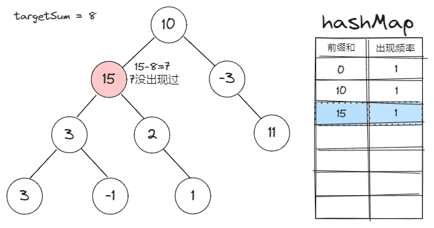

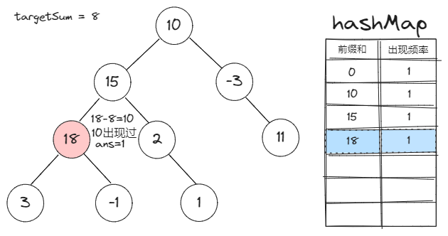

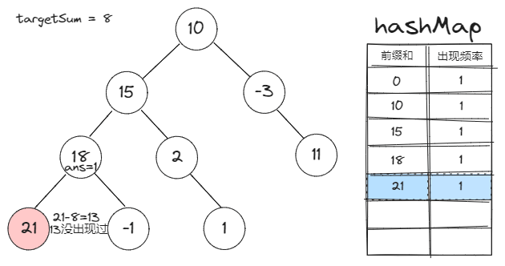

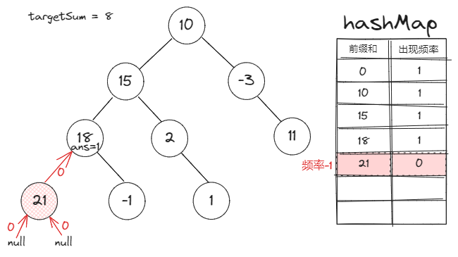

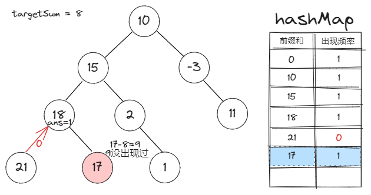

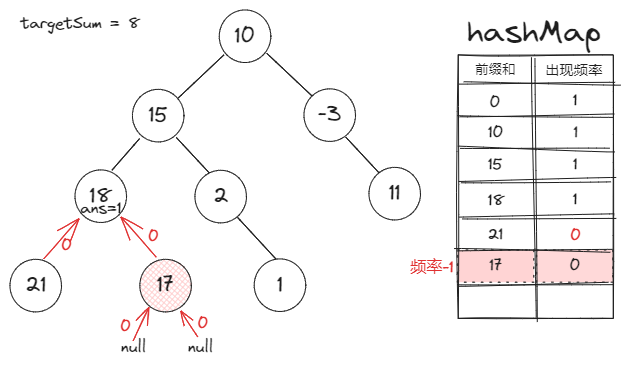

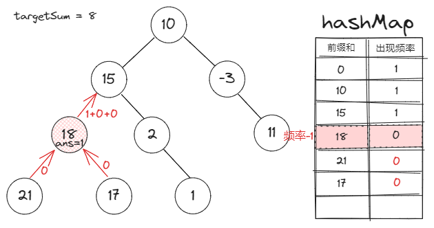

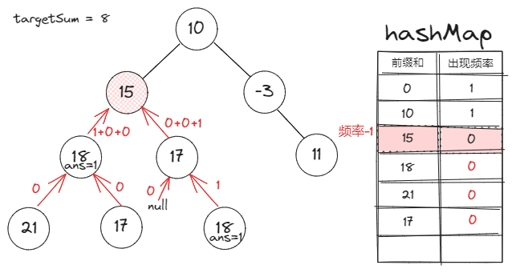

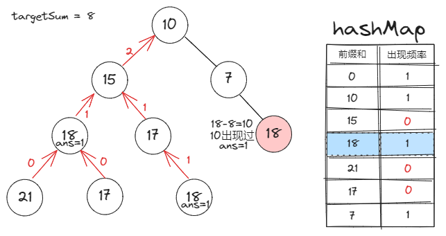

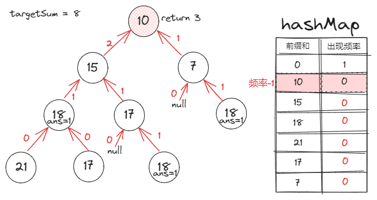

[{java_src_attr}]
----
include::{sourcedir}/_0437_PathSumIII_22.java[]
----

== 思考题

感觉目前的解法还是有些繁琐。效仿 https://leetcode.cn/problems/path-sum-iii/solutions/49141/javajie-fa-shi-jian-100-kong-jian-93-by-xiao-chao-/[java解法 时间100% 空间93% - 路径总和 III^]，设计一个更加高效的实现。

== 参考资料

. https://leetcode.cn/problems/path-sum-iii/solutions/596361/dui-qian-zhui-he-jie-fa-de-yi-dian-jie-s-dey6/[437. 路径总和 III / 对前缀和解法的一点解释^]
. https://leetcode.cn/problems/path-sum-iii/solutions/100992/qian-zhui-he-di-gui-hui-su-by-shi-huo-de-xia-tian/[437. 路径总和 III / 前缀和，递归，回溯^]
. https://leetcode.cn/problems/path-sum-iii/solutions/2791967/tuland-shu-_lu-jing-zong-he-iii_-xiang-x-ta37/[437. 路径总和 III - 「🏞️ 详细图解🏞️」&「朴素递归」&「前缀和」^] -- 图解很棒

