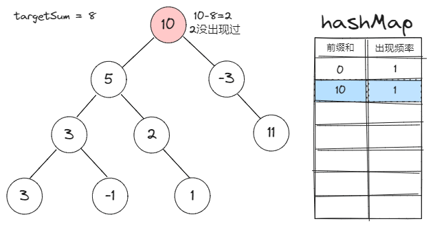

[#0437-path-sum-iii]
= 437. 路径总和 III

https://leetcode.cn/problems/path-sum-iii/[LeetCode - 437. 路径总和 III^]

给定一个二叉树的根节点 `root` ，和一个整数 `targetSum`，求该二叉树里节点值之和等于 `targetSum` 的 *路径* 的数目。

*路径* 不需要从根节点开始，也不需要在叶子节点结束，但是路径方向必须是向下的（只能从父节点到子节点）。

*示例 1：*

image::images/0437-01.jpg[{image_attr}]

....
输入：root = [10,5,-3,3,2,null,11,3,-2,null,1], targetSum = 8
输出：3
解释：和等于 8 的路径有 3 条，如图所示。
....

*示例 2：*

....
输入：root = [5,4,8,11,null,13,4,7,2,null,null,5,1], targetSum = 22
输出：3
....

*提示:*

* 二叉树的节点个数的范围是 `[0,1000]`
* `-10^9^ \<= Node.val \<= 10^9^`
* `+-1000 <= targetSum <= 1000+`

== 思路分析

=== 前缀和解法

. 前缀和定义：一个节点的前缀和就是该节点到根之间的路径和。
. 前缀和对于本题的作用：两节点间的路径和=两节点的前缀和之差
. `Map` 存的是什么: `Map` 的 `key` 是前缀和， `value` 是该前缀和在已遍历的节点中的出现频率
. 恢复状态的意义：
.. 题目要求：路径方向必须是向下的（只能从父节点到子节点）
.. 所以当我们讨论两个节点的前缀和差值时，有一个前提：*一个节点必须是另一个节点的祖先节点。*
.. 也就是说，当我们把一个节点的前缀和信息更新到 `Map` 里时，它应当只对其子节点有效。
.. 所以我们应该：*在遍历完一个节点的所有子节点后，将其从 `Map` 中减去它的频率。*

image::images/0437-01.png[{image_attr}]

image::images/0437-04.png[{image_attr}]

image::images/0437-06.png[{image_attr}]

image::images/0437-07.png[{image_attr}]

image::images/0437-08.png[{image_attr}]

image::images/0437-10.png[{image_attr}]

image::images/0437-12.png[{image_attr}]

[[src-0437]]
[tabs]
====
一刷::
+
--
[{java_src_attr}]
----
include::{sourcedir}/_0437_PathSumIII.java[tag=answer]
----
--

错误提交::
+
--
[{java_src_attr}]
----
include::{sourcedir}/_0437_PathSumIII_2.java[tag=answer]
----
--

二刷::
+
--
[{java_src_attr}]
----
include::{sourcedir}/_0437_PathSumIII_21.java[tag=answer]
----
--

二刷（前缀和）::
+
--
[{java_src_attr}]
----
include::{sourcedir}/_0437_PathSumIII_22.java[tag=answer]
----
--

三刷::
+
--
[{java_src_attr}]
----
include::{sourcedir}/_0437_PathSumIII_3.java[tag=answer]
----
--
====

== 思考题

感觉目前的解法还是有些繁琐。效仿 https://leetcode.cn/problems/path-sum-iii/solutions/49141/javajie-fa-shi-jian-100-kong-jian-93-by-xiao-chao-/[java解法 时间100% 空间93% - 路径总和 III^]，设计一个更加高效的实现。

== 参考资料

. https://leetcode.cn/problems/path-sum-iii/solutions/596361/dui-qian-zhui-he-jie-fa-de-yi-dian-jie-s-dey6/[437. 路径总和 III / 对前缀和解法的一点解释^]
. https://leetcode.cn/problems/path-sum-iii/solutions/100992/qian-zhui-he-di-gui-hui-su-by-shi-huo-de-xia-tian/[437. 路径总和 III / 前缀和，递归，回溯^]
. https://leetcode.cn/problems/path-sum-iii/solutions/2791967/tuland-shu-_lu-jing-zong-he-iii_-xiang-x-ta37/[437. 路径总和 III - 「🏞️ 详细图解🏞️」&「朴素递归」&「前缀和」^] -- 图解很棒
. https://leetcode.cn/problems/path-sum-iii/solutions/64692/di-gui-jie-fa-by-tian-ye/[437. 路径总和 III - 递归解法^]

