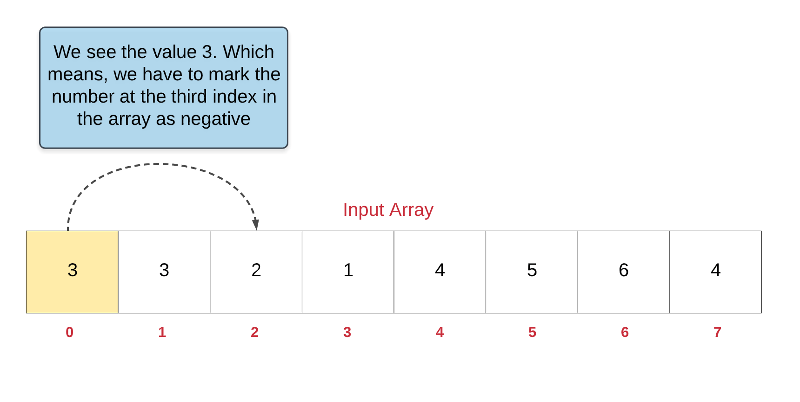
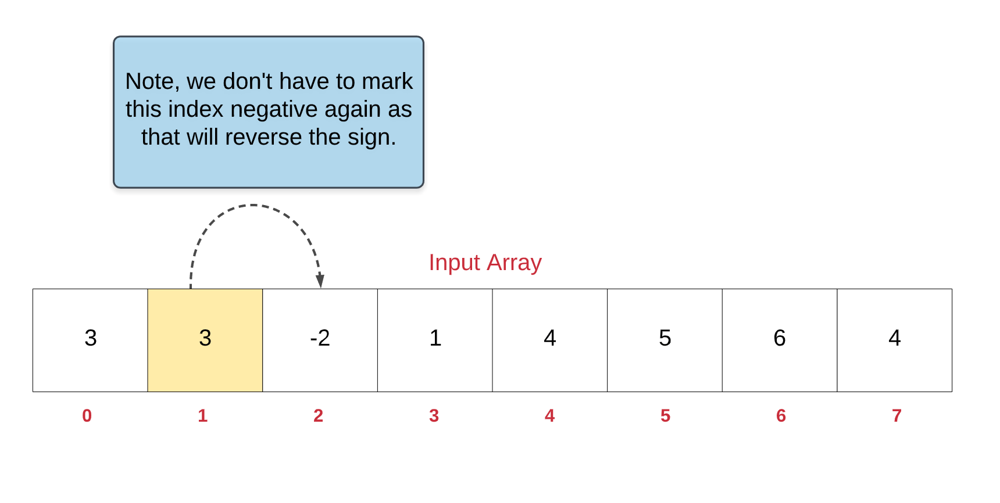
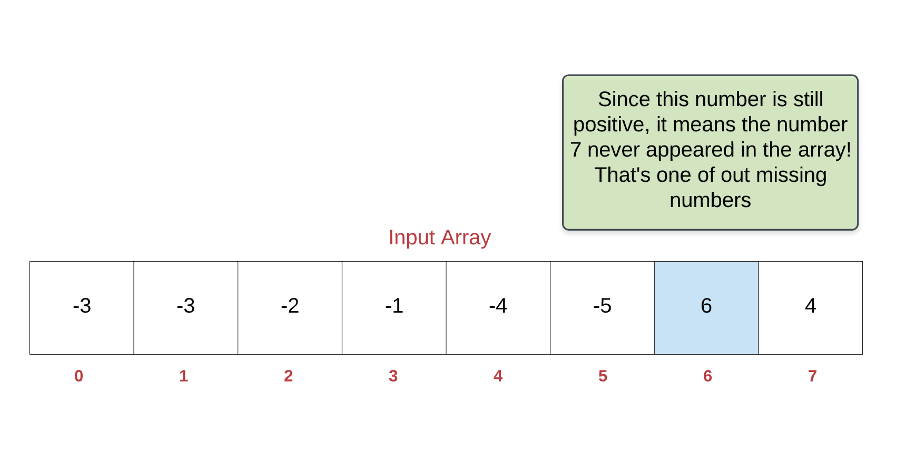

== 448. Find All Numbers Disappeared in an Array

https://leetcode.com/problems/find-all-numbers-disappeared-in-an-array/[LeetCode - Find All Numbers Disappeared in an Array]

Given an array of integers where `1 ≤ a[i] ≤ n` (n = size of array), some elements appear twice and others appear once.

Find all the elements of `[1, n]` inclusive that do not appear in this array.

Could you do it without extra space and in O(n) runtime? You may assume the returned list does not count as extra space.

.Example:
----
Input:
[4,3,2,7,8,2,3,1]

Output:
[5,6]
----

=== 解题分析

原地修改的思路有点绕。再推敲推敲。

=== 参考资料

. https://leetcode-cn.com/problems/find-all-numbers-disappeared-in-an-array/solution/zhao-dao-suo-you-shu-zu-zhong-xiao-shi-de-shu-zi-2/[找到所有数组中消失的数字 - 找到所有数组中消失的数字 - 力扣（LeetCode）]

Given an array of integers where 1 ≤ a[i] ≤ _n_ (_n_ = size of array), some elements appear twice and others appear once.

Find all the elements of [1, _n_] inclusive that do not appear in this array.

Could you do it without extra space and in O(_n_) runtime? You may assume the returned list does not count as extra space.

*Example:*
[subs="verbatim,quotes,macros"]
----
*Input:*
[4,3,2,7,8,2,3,1]

*Output:*
[5,6]
----

[[src-0448]]
[source,{java_source_attr}]
----
include::{sourcedir}/_0448_FindAllNumbersDisappearedInAnArray.java[]
----

