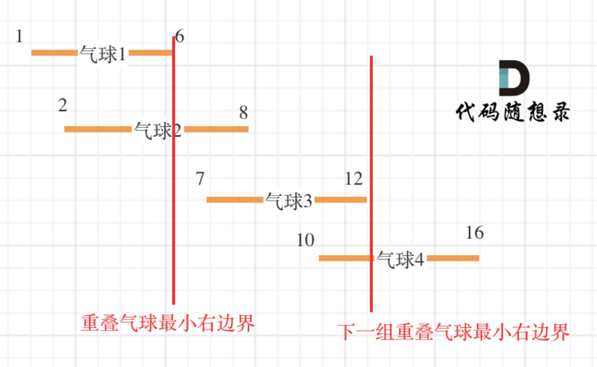

[#0452-minimum-number-of-arrows-to-burst-balloons]
= 452. 用最少数量的箭引爆气球

https://leetcode.cn/problems/minimum-number-of-arrows-to-burst-balloons/[LeetCode - 452. 用最少数量的箭引爆气球 ^]

有一些球形气球贴在一堵用 XY 平面表示的墙面上。墙面上的气球记录在整数数组 `points` ，其中 `points[i] = [x~start~, x~end~]` 表示水平直径在 `x~start~` 和 `x~end~` 之间的气球。你不知道气球的确切 `y` 坐标。

一支弓箭可以沿着 x 轴从不同点 *完全垂直* 地射出。在坐标 `x` 处射出一支箭，若有一个气球的直径的开始和结束坐标为 `x~start~`，`x~end~`，且满足 `x~start~ ≤ x ≤ x~end~`，则该气球会被 *引爆* ~。~可以射出的弓箭的数量 *没有限制* 。弓箭一旦被射出之后，可以无限地前进。

给你一个数组 `points` ，_返回引爆所有气球所必须射出的 *最小* 弓箭数_。

*示例 1：*

....
输入：points = [[10,16],[2,8],[1,6],[7,12]]
输出：2
解释：气球可以用2支箭来爆破:
-在x = 6处射出箭，击破气球[2,8]和[1,6]。
-在x = 11处发射箭，击破气球[10,16]和[7,12]。
....

*示例 2：*

....
输入：points = [[1,2],[3,4],[5,6],[7,8]]
输出：4
解释：每个气球需要射出一支箭，总共需要4支箭。
....

*示例 3：*

....
输入：points = [[1,2],[2,3],[3,4],[4,5]]
输出：2
解释：气球可以用2支箭来爆破:
- 在x = 2处发射箭，击破气球[1,2]和[2,3]。
- 在x = 4处射出箭，击破气球[3,4]和[4,5]。
....

*提示:*

* `1 \<= points.length \<= 10^5^`
* `+points[i].length == 2+`
* `+-2^31^ <= x~start~ < x~end~ <= 2^31^ - 1+`

== 思路分析

image::images/0452-10.png[{image_attr}]

对坐标区间排序，然后进行区间合并，最后统计只剩几个区间即可。看题解，也不需要保存区间，只需要记录最后一个区间的右端就可以统计出区间数量。

看题解，说这是一道贪心算法的题。

* 如果按照我上面合并区间的做法，那么就是一道 xref:0000-04-merge-intervals.adoc[Merge Intervals 区间合并] 的题目。
* 如果按照贪心的思路来解题，首先排序时，需要根据右端位置排序。每次记录最右端的位置，拿当前区间的左端，跟目前最右端的位置进行比较，只有在没有交集时，才增大射箭数量。

NOTE: 看“代码随想录”的解释，D瓜哥的区间解法是贪心思路。

[[src-0452]]
[tabs]
====
一刷::
+
--
[{java_src_attr}]
----
include::{sourcedir}/_0452_MinimumNumberOfArrowsToBurstBalloons.java[tag=answer]
----
--

// 二刷::
// +
// --
// [{java_src_attr}]
// ----
// include::{sourcedir}/_0452_MinimumNumberOfArrowsToBurstBalloons_2.java[tag=answer]
// ----
// --
====

== 参考资料

. https://leetcode.cn/problems/minimum-number-of-arrows-to-burst-balloons/solutions/494515/yong-zui-shao-shu-liang-de-jian-yin-bao-qi-qiu-1-2/[452. 用最少数量的箭引爆气球 - 官方题解^]
. https://leetcode.cn/problems/minimum-number-of-arrows-to-burst-balloons/solutions/494602/tu-jie-tan-tao-wei-shi-yao-yao-an-qu-jian-de-you-d/[452. 用最少数量的箭引爆气球 - 「图解」谈谈我为什么按右端升序排序^]
. https://leetcode.cn/problems/minimum-number-of-arrows-to-burst-balloons/solutions/858320/dai-ma-sui-xiang-lu-dai-ni-xue-tou-tan-x-5wfl/[452. 用最少数量的箭引爆气球 - 带你学透贪心算法！^]
