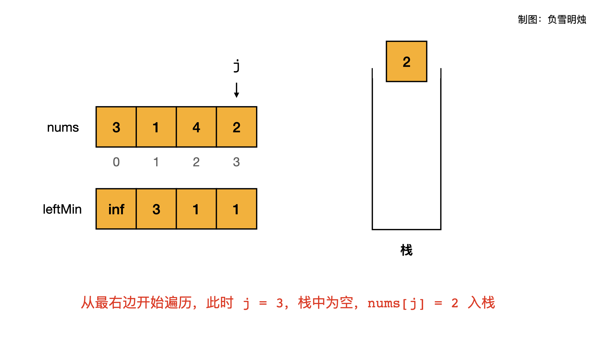
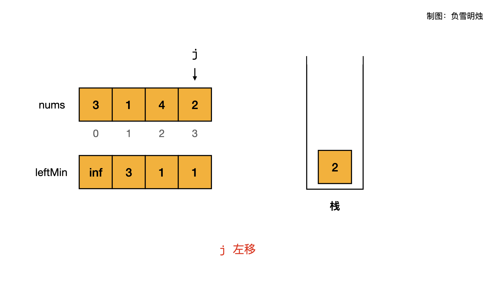
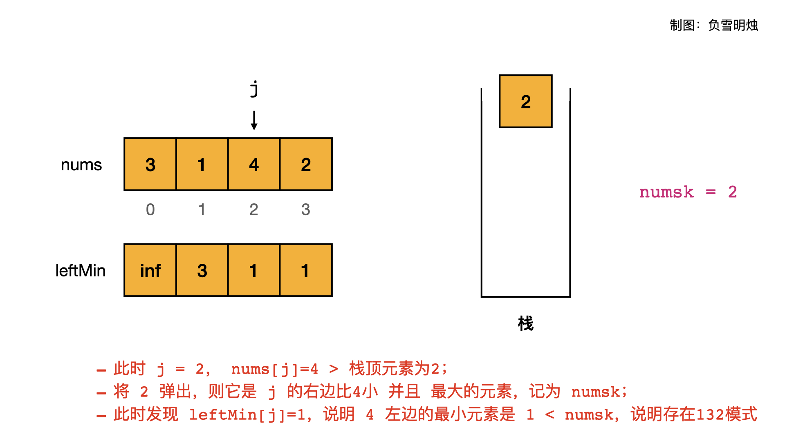

[#0456-132-pattern]
= 456. 132 模式

https://leetcode.cn/problems/132-pattern/[LeetCode - 456. 132 模式 ^]

给你一个整数数组 `nums` ，数组中共有 `n` 个整数。*132 模式的子序列* 由三个整数 `nums[i]`、`nums[j]` 和 `nums[k]` 组成，并同时满足：`+i < j < k+` 和 `+nums[i] < nums[k] < nums[j]+` 。

如果 `nums` 中存在 *132 模式的子序列* ，返回 `true` ；否则，返回 `false` 。

*示例 1：*

....
输入：nums = [1,2,3,4]
输出：false
解释：序列中不存在 132 模式的子序列。
....

*示例 2：*

....
输入：nums = [3,1,4,2]
输出：true
解释：序列中有 1 个 132 模式的子序列： [1, 4, 2] 。
....

*示例 3：*

....
输入：nums = [-1,3,2,0]
输出：true
解释：序列中有 3 个 132 模式的的子序列：[-1, 3, 2]、[-1, 3, 0] 和 [-1, 2, 0] 。
....

*提示：*

* `+n == nums.length+`
* `1 \<= n \<= 2 * 10^5^`
* `-10^9^ \<= nums[i] \<= 10^9^`

== 思路分析

完全没有想到竟然可以使用单调栈来解决！

从右向左遍历，使用一个单调递减栈，来维护 `32` 的关系：弹出的就是 `2`，栈中的就是 `3`，当前元素小于 `k` 时，就找到了 `132` 模式。

[[src-0456]]
[tabs]
====
一刷::
+
--
[{java_src_attr}]
----
include::{sourcedir}/_0456_132Pattern.java[tag=answer]
----
--

// 二刷::
// +
// --
// [{java_src_attr}]
// ----
// include::{sourcedir}/_0456_132Pattern_2.java[tag=answer]
// ----
// --
====

== 参考资料

. https://leetcode.cn/problems/132-pattern/solutions/676970/xiang-xin-ke-xue-xi-lie-xiang-jie-wei-he-95gt/[456. 132 模式 - 详解为何使用「单调栈」来找最大的 K 是正确的^]
. https://leetcode.cn/problems/132-pattern/solutions/676741/fu-xue-ming-zhu-cong-bao-li-qiu-jie-dao-eg78f/[456. 132 模式 - 从「暴力求解」到「单调栈」^]
. https://leetcode.cn/problems/132-pattern/solutions/676437/132mo-shi-by-leetcode-solution-ye89/[456. 132 模式 - 官方题解^]
