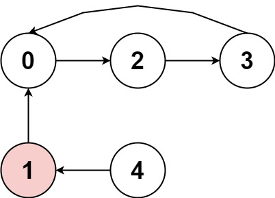
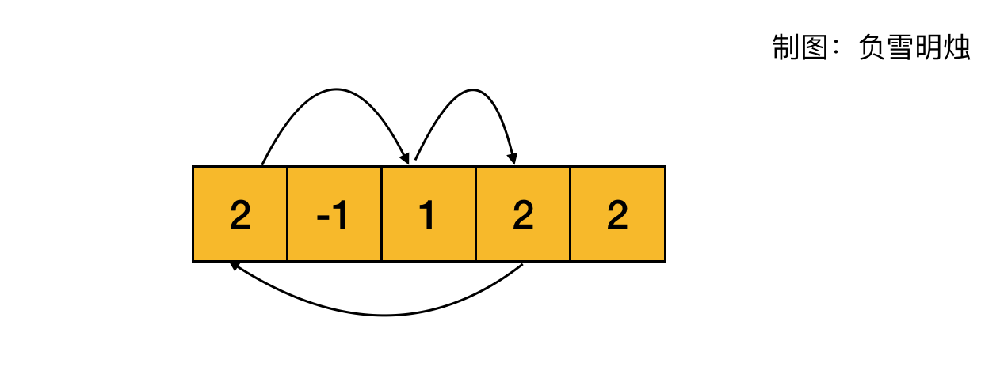
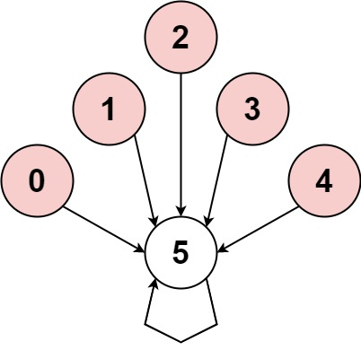
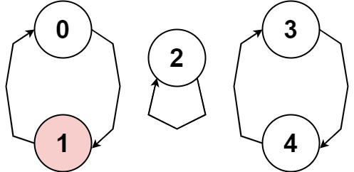
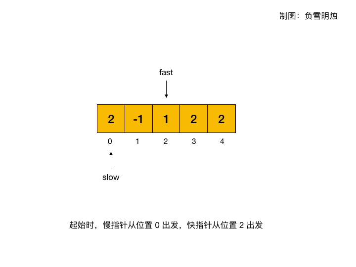

[#0457-circular-array-loop]
= 457. 环形数组是否存在循环

https://leetcode.cn/problems/circular-array-loop/[LeetCode - 457. 环形数组是否存在循环 ^]

存在一个不含 `0` 的 *环形* 数组 `nums` ，每个 `nums[i]` 都表示位于下标 `i` 的角色应该向前或向后移动的下标个数：

* 如果 `nums[i]` 是正数，*向前*（下标递增方向）移动 `+|nums[i]|+` 步
* 如果 `nums[i]` 是负数，*向后*（下标递减方向）移动 `+|nums[i]|+` 步

因为数组是 *环形* 的，所以可以假设从最后一个元素向前移动一步会到达第一个元素，而第一个元素向后移动一步会到达最后一个元素。

数组中的 *循环* 由长度为 `k` 的下标序列 `seq` 标识：

* 遵循上述移动规则将导致一组重复下标序列 `seq[0] -> seq[1] -> ... -> seq[k - 1] -> seq[0] -> ...`
* 所有 `nums[seq[j]]` 应当不是 *全正* 就是 *全负*
* `k > 1`

如果 `nums` 中存在循环，返回 `true` ；否则，返回 __ `false` __ 。

*示例 1：*

....
输入：nums = [2,-1,1,2,2]
输出：true
解释：图片展示了节点间如何连接。白色节点向前跳跃，而红色节点向后跳跃。
我们可以看到存在循环，按下标 0 -> 2 -> 3 -> 0 --> ...，并且其中的所有节点都是白色（以相同方向跳跃）。
....

TIP: 这个图更容易理解！

*示例 2：*

....
输入：nums = [-1,-2,-3,-4,-5,6]
输出：false
解释：图片展示了节点间如何连接。白色节点向前跳跃，而红色节点向后跳跃。
唯一的循环长度为 1，所以返回 false。
....

*示例 3：*

....
输入：nums = [1,-1,5,1,4]
输出：true
解释：图片展示了节点间如何连接。白色节点向前跳跃，而红色节点向后跳跃。
我们可以看到存在循环，按下标 0 --> 1 --> 0 --> ...，当它的大小大于 1 时，它有一个向前跳的节点和一个向后跳的节点，所以 它不是一个循环。
我们可以看到存在循环，按下标 3 --> 4 --> 3 --> ...，并且其中的所有节点都是白色（以相同方向跳跃）。
....

*提示：*

* `+1 <= nums.length <= 5000+`
* `+-1000 <= nums[i] <= 1000+`
* `+nums[i] != 0+`

**进阶：**你能设计一个时间复杂度为 stem:[O(n)] 且额外空间复杂度为 stem:[O(1)] 的算法吗？

== 思路分析

使用回溯，对每一个坐标元素做深度优先遍历，发现环形数组则返回，否则继续向后遍历。时间复杂度是： stem:[O(n^2)]。

进一步思考，遍历过的节点都不会是环形数组（是环形数组已经返回结果了），所以，可以把遍历过的节点留痕，那么遇到遍历过的节点，就可以直接返回 true 了。这样时间复杂度就成： stem:[O(n)]。

另外，可以把遍历过的节点设置为 `0`，由于环形数组不能为 `0`，则遇到就可以直接“判断为 false”。

代码写的有些复杂了！

快慢指针也是一个非常好的思路：

[[src-0457]]
[tabs]
====
一刷::
+
--
[{java_src_attr}]
----
include::{sourcedir}/_0457_CircularArrayLoop.java[tag=answer]
----
--

// 二刷::
// +
// --
// [{java_src_attr}]
// ----
// include::{sourcedir}/_0457_CircularArrayLoop_2.java[tag=answer]
// ----
// --
====

== 参考资料

. https://leetcode.cn/problems/circular-array-loop/solutions/920412/gong-shui-san-xie-yi-ti-shuang-jie-mo-ni-ag05/[457. 环形数组是否存在循环 - 一题三解 :「朴素模拟」&「遍历标记（含优化）」^]
. https://leetcode.cn/problems/circular-array-loop/solutions/920039/huan-xing-shu-zu-shi-fou-cun-zai-xun-hua-0ay2/[457. 环形数组是否存在循环 - 官方题解^] -- 快慢指针这个思路也很不错！
. https://leetcode.cn/problems/circular-array-loop/solutions/920480/fu-xue-ming-zhu-dong-hua-ti-jie-kuai-man-ju4g/[457. 环形数组是否存在循环 - 动画题解：快慢指针^]
