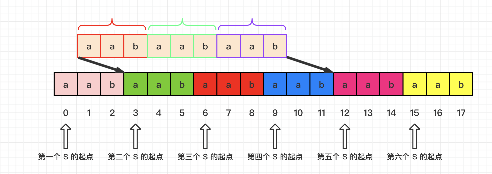

[#0459-repeated-substring-pattern]
= 459. 重复的子字符串

https://leetcode.cn/problems/repeated-substring-pattern/[LeetCode - 459. 重复的子字符串 ^]

给定一个非空的字符串 `s`，检查是否可以通过由它的一个子串重复多次构成。

*示例 1:*

....
输入: s = "abab"
输出: true
解释: 可由子串 "ab" 重复两次构成。
....

*示例 2:*

....
输入: s = "aba"
输出: false
....

*示例 3:*

....
输入: s = "abcabcabcabc"
输出: true
解释: 可由子串 "abc" 重复四次构成。 (或子串 "abcabc" 重复两次构成。)
....

*提示：*

* `1 \<= s.length \<= 10^4^`
* `s` 由小写英文字母组成

== 思路分析

遍历字符串，找到字母的最少出现次数，以 `2` 为起点，以此为终点，对字符串进行以 `length/i` 为长度的分割，分配来判断是否可以由子串重复得来。

TIP: 拼接字符串的解法真是牛逼啊！

当 `s` 中有循环节时，设循环节为 `r`，其长度为 `l`，那么 `ss` 中必然有 `s.size()/l + 1` 个 `s`。因为去掉了第一个 `S` 的第一个字符 (代码中，`(s+s).find(s, 1)`， 是从 `ss[1]` 处开始 `find` ) 所以此时必回找到第二个 `s` 的起点。

[[src-0459]]
[tabs]
====
一刷::
+
--
[{java_src_attr}]
----
include::{sourcedir}/_0459_RepeatedSubstringPattern.java[tag=answer]
----
--

// 二刷::
// +
// --
// [{java_src_attr}]
// ----
// include::{sourcedir}/_0459_RepeatedSubstringPattern_2.java[tag=answer]
// ----
// --
====

== 参考资料

. https://leetcode.cn/problems/repeated-substring-pattern/solutions/386481/zhong-fu-de-zi-zi-fu-chuan-by-leetcode-solution/[459. 重复的子字符串 - 官方题解^]
. https://leetcode.cn/problems/repeated-substring-pattern/solutions/114572/jian-dan-ming-liao-guan-yu-javaliang-xing-dai-ma-s/[459. 重复的子字符串 - 简单明了！！关于java两行代码实现的思路来源^]
. https://leetcode.cn/problems/repeated-substring-pattern/solutions/1705527/by-carlsun-2-g3iz/[459. 重复的子字符串 - 移动匹配&KMP精讲！专治各种想不懂^]
. https://leetcode.cn/problems/repeated-substring-pattern/solutions/386657/tu-jie-yi-xia-shuang-bei-zi-fu-chuan-de-jie-fa-by-/[459. 重复的子字符串 - 图解一下双倍字符串的解法^]
