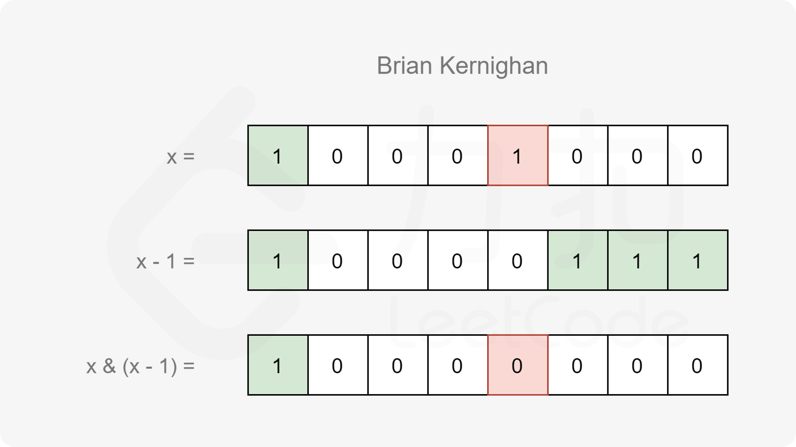

[#0461-hamming-distance]
= 461. 汉明距离

https://leetcode.cn/problems/hamming-distance/[LeetCode - 461. 汉明距离 ^]

两个整数之间的 https://baike.baidu.com/item/%E6%B1%89%E6%98%8E%E8%B7%9D%E7%A6%BB[汉明距离] 指的是这两个数字对应二进制位不同的位置的数目。

给你两个整数 `x` 和 `y`，计算并返回它们之间的汉明距离。

*示例 1：*

....
输入：x = 1, y = 4
输出：2
解释：
1   (0 0 0 1)
4   (0 1 0 0)
       ↑   ↑
上面的箭头指出了对应二进制位不同的位置。
....

*示例 2：*

....
输入：x = 3, y = 1
输出：1
....

*提示：*

* `0 \<= x, y \<= 2^31^ - 1`

**注意：**本题与 https://leetcode.cn/problems/minimum-bit-flips-to-convert-number/[2220. 转换数字的最少位翻转次数] 相同。

== 思路分析

先求异或，然后移位计算包含的 `1` 的个数。

image::images/0461-11.png[{image_attr}]

image::images/0461-12.png[{image_attr}]

求 `1` 的个数，更优异的算法是：Brian Kernighan 算法，stem:[f(x)=x & (x−1)]，可以跳过两个 `1` 之间的 `0`。

[[src-0461]]
[tabs]
====
一刷::
+
--
[{java_src_attr}]
----
include::{sourcedir}/_0461_HammingDistance.java[tag=answer]
----
--

// 二刷::
// +
// --
// [{java_src_attr}]
// ----
// include::{sourcedir}/_0461_HammingDistance_2.java[tag=answer]
// ----
// --
====

== 参考资料

. https://leetcode.cn/problems/hamming-distance/solutions/797339/yi-ming-ju-chi-by-leetcode-solution-u1w7/[461. 汉明距离 - 官方题解^]
. https://leetcode.cn/problems/hamming-distance/solutions/797607/gong-shui-san-xie-tong-ji-liang-shu-er-j-987a/[461. 汉明距离 - 统计两数「二进制表示中不同位」个数的几种方式^]
