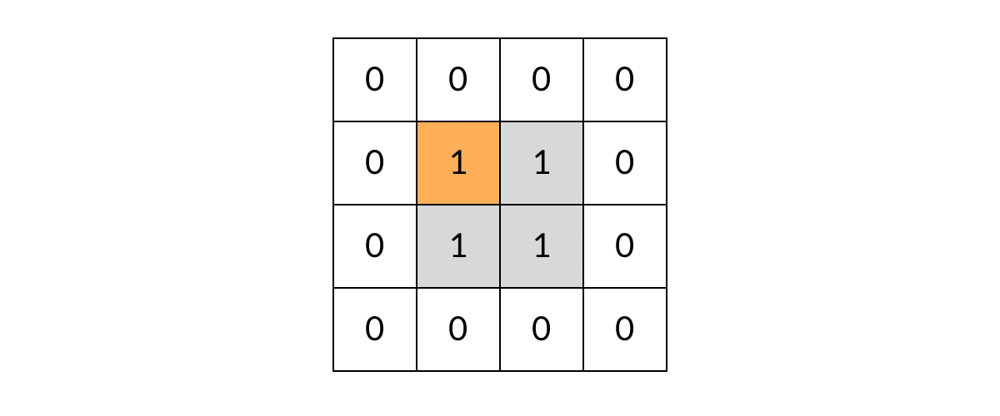

[#0463-island-perimeter]
= 463. 岛屿的周长

https://leetcode.cn/problems/island-perimeter/[LeetCode - 463. 岛屿的周长 ^]

给定一个 `row x col` 的二维网格地图 `grid`，其中：`grid[i][j] = 1` 表示陆地， `grid[i][j] = 0` 表示水域。

网格中的格子 *水平和垂直* 方向相连（对角线方向不相连）。整个网格被水完全包围，但其中恰好有一个岛屿（或者说，一个或多个表示陆地的格子相连组成的岛屿）。

岛屿中没有“湖”（“湖”指水域在岛屿内部且不和岛屿周围的水相连）。格子是边长为 1 的正方形。网格为长方形，且宽度和高度均不超过 100 。计算这个岛屿的周长。

*示例 1：*

image::images/0463-01.png[{image_attr}

....
输入：grid = [[0,1,0,0],[1,1,1,0],[0,1,0,0],[1,1,0,0]]
输出：16
解释：它的周长是上面图片中的 16 个黄色的边
....

*示例 2：*

....
输入：grid = [[1]]
输出：4
....

*示例 3：*

....
输入：grid = [[1,0]]
输出：4
....

*提示：*

* `row == grid.length`
* `col == grid[i].length`
* `+1 <= row, col <= 100+`
* `grid[i][j]` 为 `0` 或 `1`

== 思路分析

针对每个单元计算变长，然后就总和即可。这里使用迭代来实现，也可以使用深度优先遍历或者广度优先遍历。

做深度优先遍历，必须做标记，否则就会走进死胡同。

[[src-0463]]
[tabs]
====
一刷::
+
--
[{java_src_attr}]
----
include::{sourcedir}/_0463_IslandPerimeter.java[tag=answer]
----
--

// 二刷::
// +
// --
// [{java_src_attr}]
// ----
// include::{sourcedir}/_0463_IslandPerimeter_2.java[tag=answer]
// ----
// --
====

== 参考资料

. https://leetcode.cn/problems/island-perimeter/solutions/151724/tu-jie-jian-ji-er-qiao-miao-de-dfs-fang-fa-java-by/[463. 岛屿的周长 - 图解：在 DFS 遍历过程中求周长（Java）^]
. https://leetcode.cn/problems/island-perimeter/solutions/466248/dao-yu-de-zhou-chang-by-leetcode-solution/[463. 岛屿的周长 - 官方题解^]
. https://leetcode.cn/problems/island-perimeter/solutions/466367/shou-hua-tu-jie-463-dao-yu-de-zhou-chang-by-xiao_b/[463. 岛屿的周长 - 「手画图解」463. 岛屿的周长 | 很简单的解法^]
