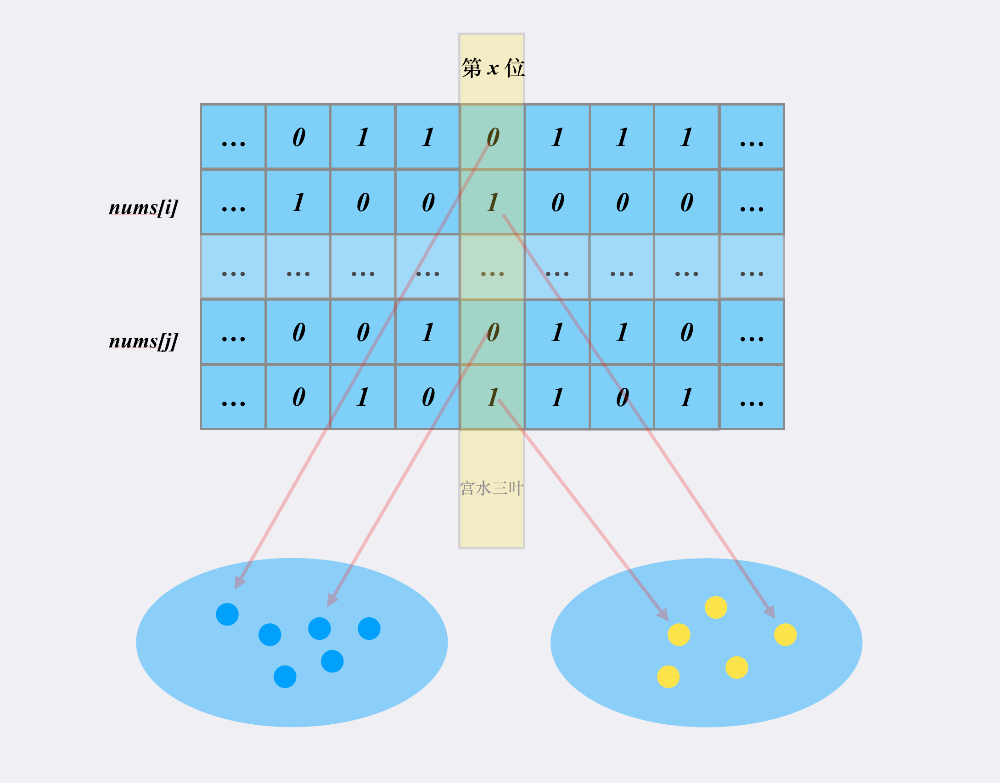
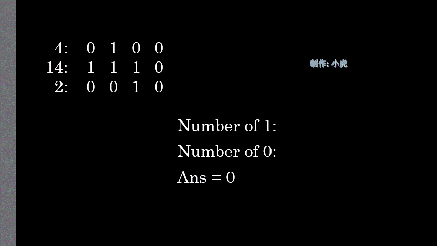

[#0477-total-hamming-distance]
= 477. 汉明距离总和

https://leetcode.cn/problems/total-hamming-distance/[LeetCode - 477. 汉明距离总和 ^]

两个整数的 https://baike.baidu.com/item/%E6%B1%89%E6%98%8E%E8%B7%9D%E7%A6%BB/475174?fr=aladdin[汉明距离] 指的是这两个数字的二进制数对应位不同的数量。

给你一个整数数组 `nums`，请你计算并返回 `nums` 中任意两个数之间 *汉明距离的总和* 。

*示例 1：*

....
输入：nums = [4,14,2]
输出：6
解释：在二进制表示中，4 表示为 0100 ，14 表示为 1110 ，2表示为 0010 。（这样表示是为了体现后四位之间关系）
所以答案为：
HammingDistance(4, 14) + HammingDistance(4, 2) + HammingDistance(14, 2) = 2 + 2 + 2 = 6
....

*示例 2：*

....
输入：nums = [4,14,4]
输出：4
....

*提示：*

* `1 \<= nums.length \<= 10^4^`
* `0 \<= nums[i] \<= 10^9^`
* 给定输入的对应答案符合 *32-bit* 整数范围

== 思路分析

对数组遍历，取两个数分别计算汉明距离。利用 `Map` 缓存结果，避免重复计算。

一个更快的计算方法是：通过求所有数字在一个指定比特位上的 `1`（`c`） 和 `0`（`n - c`） 数量，再相乘 stem:[c*(n-c)]，就这个比特位上的汉明距离，最后把每一位的汉明距离相加，得到汉明距离的总和。

[[src-0477]]
[tabs]
====
一刷::
+
--
[{java_src_attr}]
----
include::{sourcedir}/_0477_TotalHammingDistance.java[tag=answer]
----
--

// 二刷::
// +
// --
// [{java_src_attr}]
// ----
// include::{sourcedir}/_0477_TotalHammingDistance_2.java[tag=answer]
// ----
// --
====

== 参考资料

. https://leetcode.cn/problems/total-hamming-distance/solutions/798048/yi-ming-ju-chi-zong-he-by-leetcode-solut-t0ev/[477. 汉明距离总和 - 官方题解^]
. https://leetcode.cn/problems/total-hamming-distance/solutions/799362/jie-xi-dong-tu-yan-shi-by-xiaohu9527-ipxt/[477. 汉明距离总和 - 简单解析+动图演示^]
