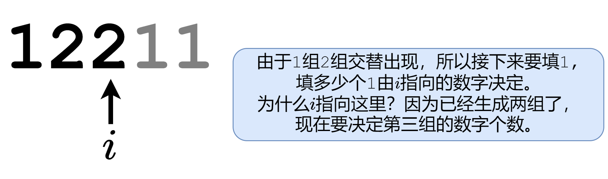
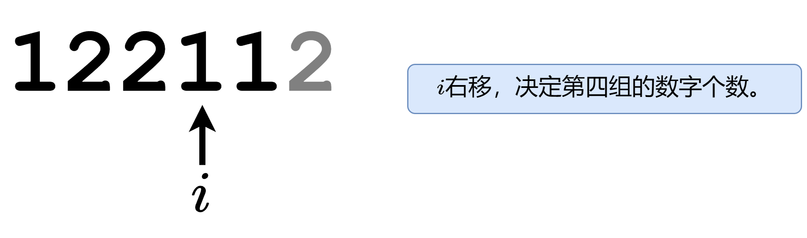
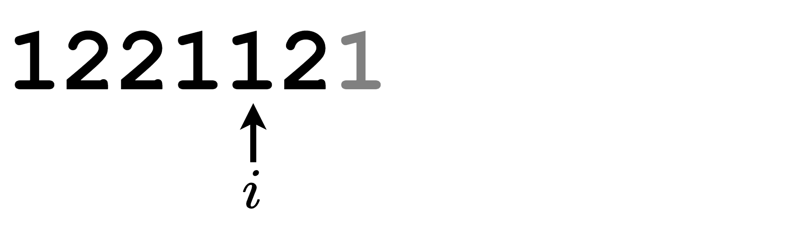
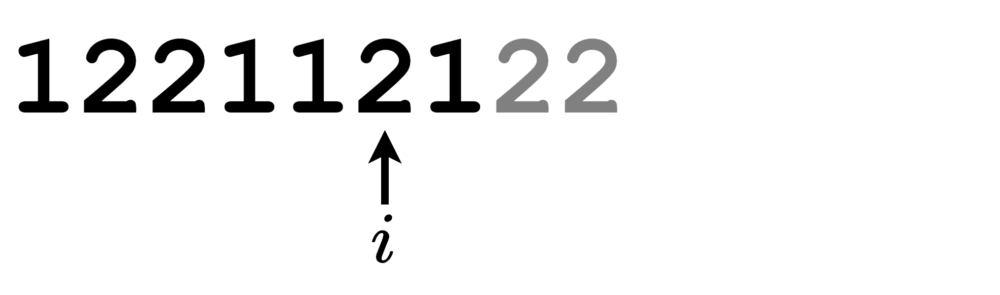
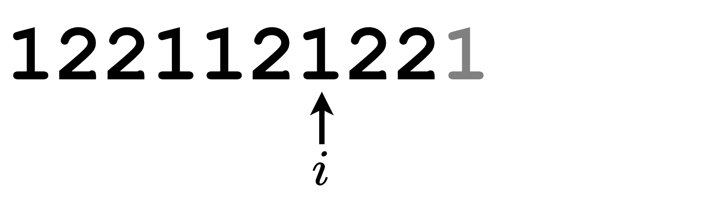
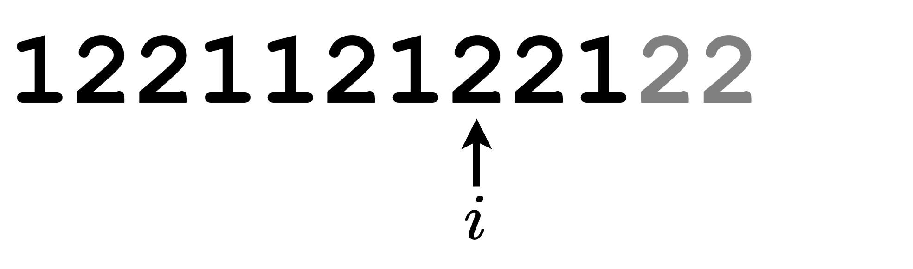
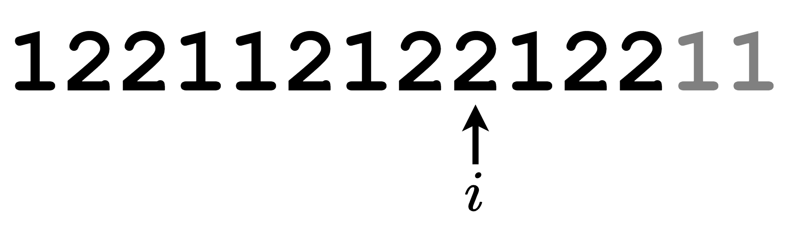
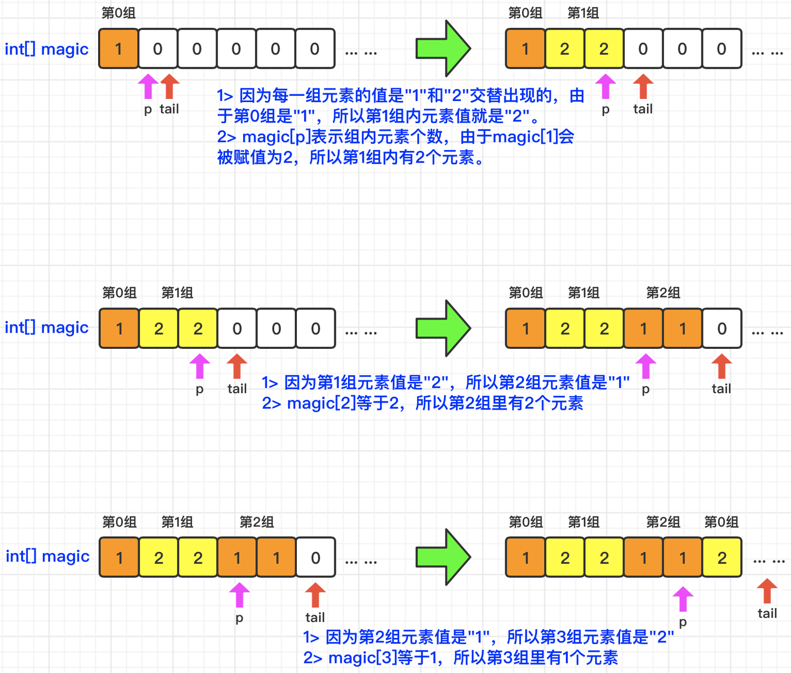

[#0481-magical-string]
= 481. 神奇字符串

https://leetcode.cn/problems/magical-string/[LeetCode - 481. 神奇字符串 ^]

神奇字符串 `s` 仅由 `1` 和 `2` 组成，并需要遵守下面的规则：

* 神奇字符串 s 的神奇之处在于，串联字符串中 `1` 和 `2` 的连续出现次数可以生成该字符串。

`s` 的前几个元素是 `s = "1221121221221121122……"` 。如果将 `s` 中连续的若干 `1` 和 `2` 进行分组，可以得到 `1 22 11 2 1 22 1 22 11 2 11 22 ......` 。每组中 `1` 或者 `2` 的出现次数分别是 `1 2 2 1 1 2 1 2 2 1 2 2 ......`。上面的出现次数正是 `s` 自身。

给你一个整数 `n` ，返回在神奇字符串 `s` 的前 `n` 个数字中 `1` 的数目。

*示例 1：*

....
输入：n = 6
输出：3
解释：神奇字符串 s 的前 6 个元素是 “122112”，它包含三个 1，因此返回 3 。
....

*示例 2：*

....
输入：n = 1
输出：1
....

*提示：*

* `1 \<= n \<= 10^5^`

== 思路分析

利用双指针，快指针指向虚位，等待生成元素；慢指针，表明要生成的元素数量。这里还有一个隐含条件： `1` 和 `2` 是交替出现的。这样就可以根据前三个元素 `122`，向后逐渐增加字符串长度了。

image::images/0481-18.png[{image_attr}]

TIP: 可以使用 `false` 和 `true` 表示 `1` 和 `2`，这样可以更加节省空间。

[[src-0481]]
[tabs]
====
一刷::
+
--
[{java_src_attr}]
----
include::{sourcedir}/_0481_MagicalString.java[tag=answer]
----
--

// 二刷::
// +
// --
// [{java_src_attr}]
// ----
// include::{sourcedir}/_0481_MagicalString_2.java[tag=answer]
// ----
// --
====

== 参考资料

. https://leetcode.cn/problems/magical-string/solutions/1938214/by-endlesscheng-z8o1/[481. 神奇字符串 - 一个动画秒懂本题+简洁写法^]
. https://leetcode.cn/problems/magical-string/solutions/1936845/shen-qi-zi-fu-chuan-by-leetcode-solution-y5dg/[481. 神奇字符串 - 官方题解^]
. https://leetcode.cn/problems/magical-string/solutions/1938388/zhua-wa-mou-si-tu-jie-leetcode-by-muse-7-i2z6/[481. 神奇字符串 - 【爪哇缪斯】图解LeetCode^]
