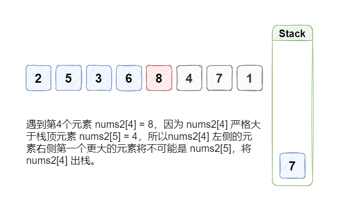
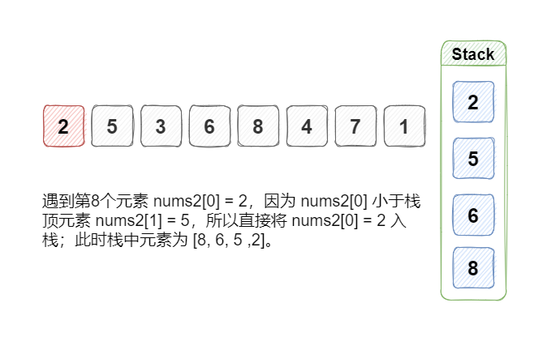

[#0496-next-greater-element-i]
= 496. Next Greater Element I

{leetcode}/problems/next-greater-element-i/[LeetCode - Next Greater Element I^]

You are given two arrays *(without duplicates)* `nums1` and `nums2` where `nums1`’s elements are subset of `nums2`. Find all the next greater numbers for `nums1`'s elements in the corresponding places of `nums2`. 

The Next Greater Number of a number *x* in `nums1` is the first greater number to its right in `nums2`. If it does not exist, output -1 for this number.

*Example 1:*

[subs="verbatim,quotes,macros"]
----
*Input:* *nums1* = [4,1,2], *nums2* = [1,3,4,2].
*Output:* [-1,3,-1]
*Explanation:*
    For number 4 in the first array, you cannot find the next greater number for it in the second array, so output -1.
    For number 1 in the first array, the next greater number for it in the second array is 3.
    For number 2 in the first array, there is no next greater number for it in the second array, so output -1.
----

*Example 2:*

[subs="verbatim,quotes,macros"]
----
*Input:* *nums1* = [2,4], *nums2* = [1,2,3,4].
*Output:* [3,-1]
*Explanation:*
    For number 2 in the first array, the next greater number for it in the second array is 3.
    For number 4 in the first array, there is no next greater number for it in the second array, so output -1.
----

*Note:*

. All elements in `nums1` and `nums2` are unique.
. The length of both `nums1` and `nums2` would not exceed 1000.

== 思路分析

单调栈

[[src-0496]]
[tabs]
====
一刷::
+
--
[{java_src_attr}]
----
include::{sourcedir}/_0496_NextGreaterElementI.java[tag=answer]
----
--

// 二刷::
// +
// --
// [{java_src_attr}]
// ----
// include::{sourcedir}/_0496_NextGreaterElementI_2.java[tag=answer]
// ----
// --
====

== 参考资料

. https://leetcode.cn/problems/next-greater-element-i/solutions/1065517/xia-yi-ge-geng-da-yuan-su-i-by-leetcode-bfcoj/[496. 下一个更大元素 I - 官方题解^]
. https://leetcode.cn/problems/next-greater-element-i/solutions/2820648/shi-pin-dan-diao-zhan-de-liang-chong-xie-ri0i/[496. 下一个更大元素 I - 单调栈的两种写法，附单调栈题单^]

