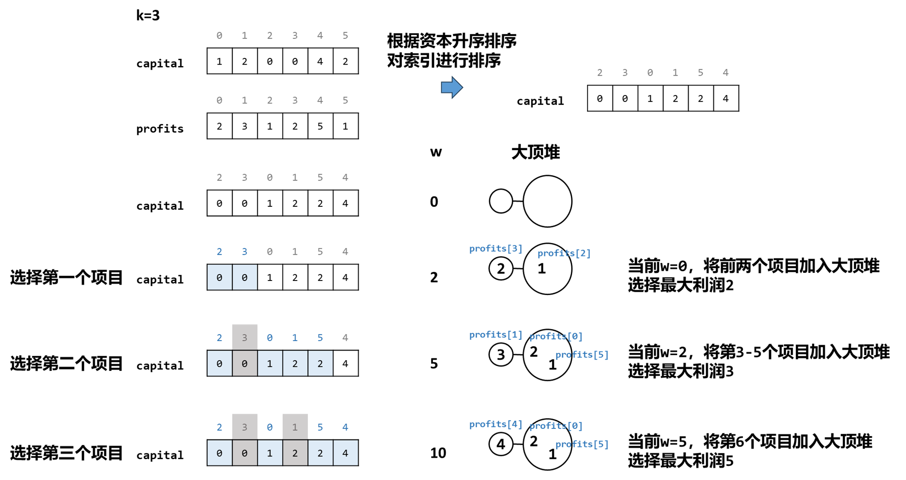

[#0502-ipo]
= 502. IPO

https://leetcode.cn/problems/ipo/[LeetCode - 502. IPO ^]

假设 力扣（LeetCode）即将开始 *IPO*。为了以更高的价格将股票卖给风险投资公司，力扣 希望在 IPO 之前开展一些项目以增加其资本。 由于资源有限，它只能在 IPO 之前完成最多 `k` 个不同的项目。帮助 力扣 设计完成最多 `k` 个不同项目后得到最大总资本的方式。

给你 `n` 个项目。对于每个项目 `i`，它都有一个纯利润 `profits[i]` ，和启动该项目需要的最小资本 `capital[i]` 。

最初，你的资本为 `w`。当你完成一个项目时，你将获得纯利润，且利润将被添加到你的总资本中。

总而言之，从给定项目中选择 *最多* `k` 个不同项目的列表，以 *最大化最终资本*，并输出最终可获得的最多资本。

答案保证在 32 位有符号整数范围内。

*示例 1：*

....
输入：k = 2, w = 0, profits = [1,2,3], capital = [0,1,1]
输出：4
解释：
由于你的初始资本为 0，你仅可以从 0 号项目开始。
在完成后，你将获得 1 的利润，你的总资本将变为 1。
此时你可以选择开始 1 号或 2 号项目。
由于你最多可以选择两个项目，所以你需要完成 2 号项目以获得最大的资本。
因此，输出最后最大化的资本，为 0 + 1 + 3 = 4。
....

*示例 2：*

....
输入：k = 3, w = 0, profits = [1,2,3], capital = [0,1,2]
输出：6
....

*提示：*

* `1 \<= k \<= 10^5^`
* `0 \<= w \<= 10^9^`
* `n == profits.length`
* `n == capital.length`
* `1 \<= n \<= 10^5^`
* `0 \<= profits[i] \<= 10^4^`
* `0 \<= capital[i] \<= 10^9^`

== 思路分析

每次都在可选的范围内，盈利最大的！

WARNING: 思路有，可惜代码写不好！

[[src-0502]]
[tabs]
====
一刷::
+
--
[{java_src_attr}]
----
include::{sourcedir}/_0502_Ipo.java[tag=answer]
----
--

// 二刷::
// +
// --
// [{java_src_attr}]
// ----
// include::{sourcedir}/_0502_Ipo_2.java[tag=answer]
// ----
// --
====

== 参考资料

. https://leetcode.cn/problems/ipo/solutions/985099/gong-shui-san-xie-noxiang-xin-ke-xue-xi-fk1ra/[502. IPO - 【宫水三叶の相信科学系列】详解优先队列实现贪心算法^]
. https://leetcode.cn/problems/ipo/solutions/987074/tong-ge-lai-shua-ti-la-yi-ti-liang-jie-t-i22t/[502. IPO - 一题两解：彤哥教你怎么写出好代码！^]
. https://leetcode.cn/problems/ipo/solutions/2649040/javapython3ctan-xin-pai-xu-da-ding-dui-x-f6vs/[502. IPO - 贪心 + 排序 + 大顶堆：选择当前可启动的最大利润项目【图解】^]
