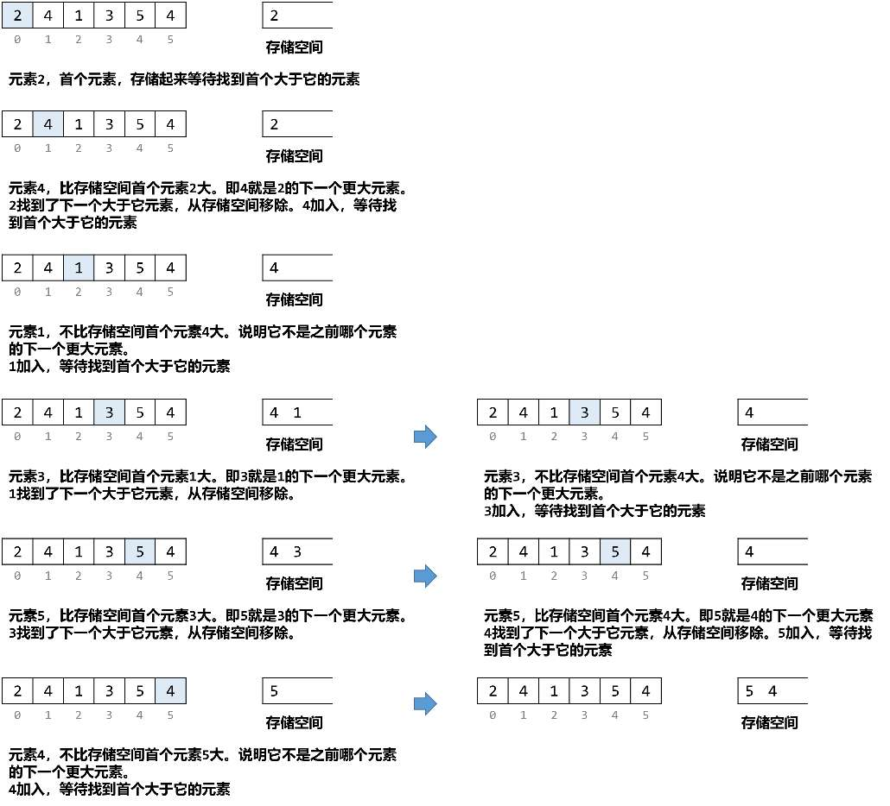
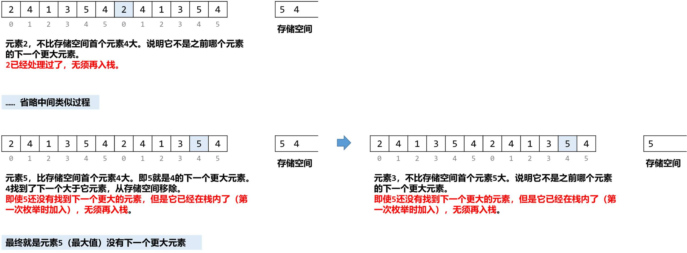

[#0503-next-greater-element-ii]
= 503. Next Greater Element II

https://leetcode.com/problems/next-greater-element-ii/[LeetCode - Next Greater Element II^]

Given a circular array (the next element of the last element is the first element of the array), print the Next Greater Number for every element. The Next Greater Number of a number x is the first greater number to its traversing-order next in the array, which means you could search circularly to find its next greater number. If it doesn't exist, output -1 for this number.

*Example 1:*

[subs="verbatim,quotes,macros"]
----
*Input:* [1,2,1]
*Output:* [2,-1,2]
*Explanation:* The first 1's next greater number is 2;  The number 2 can't find next greater number;  The second 1's next greater number needs to search circularly, which is also 2.
----

*Note:*

The length of given array won't exceed 10000.

== 思路分析

循环数组+单调栈

[[src-0503]]
[{java_src_attr}]
----
include::{sourcedir}/_0503_NextGreaterElementII.java[tag=answer]
----

== 参考资料

. https://leetcode.cn/problems/next-greater-element-ii/solutions/637573/xia-yi-ge-geng-da-yuan-su-ii-by-leetcode-bwam/[503. 下一个更大元素 II - 官方题解^]
. https://leetcode.cn/problems/next-greater-element-ii/solutions/2820545/javapython3cdan-diao-zhan-xun-huan-shu-z-bsei/[503. 下一个更大元素 II - 单调栈 + 循环数组：待匹配的元素入栈【图解】^]

