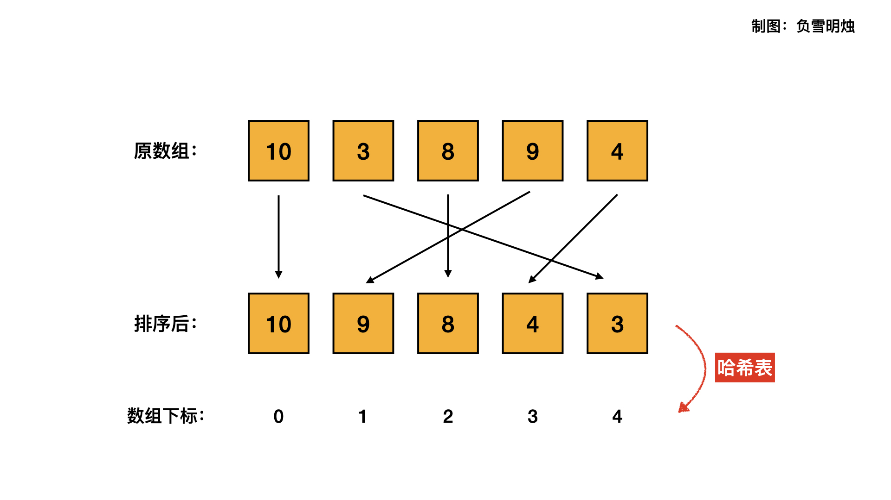

[#0506-relative-ranks]
= 506. 相对名次

https://leetcode.cn/problems/relative-ranks/[LeetCode - 506. 相对名次^]

给你一个长度为 `n` 的整数数组 `score` ，其中 `score[i]` 是第 `i` 位运动员在比赛中的得分。所有得分都 *互不相同* 。

运动员将根据得分 *决定名次* ，其中名次第 `1` 的运动员得分最高，名次第 `2` 的运动员得分第 `2` 高，依此类推。运动员的名次决定了他们的获奖情况：

* 名次第 `1` 的运动员获金牌 `Gold Medal`。
* 名次第 `2` 的运动员获银牌 `Silver Medal`。
* 名次第 `3` 的运动员获铜牌 `Bronze Medal`。
* 从名次第 `4` 到第 `n` 的运动员，只能获得他们的名次编号（即，名次第 `x` 的运动员获得编号 `x`）。

使用长度为 `n` 的数组 `answer` 返回获奖，其中 `answer[i]` 是第 `i` 位运动员的获奖情况。

*示例 1：*

....
输入：score = [5,4,3,2,1]
输出：["Gold Medal","Silver Medal","Bronze Medal","4","5"]
解释：名次为 [1st, 2nd, 3rd, 4th, 5th] 。
....

*示例 2：*

....
输入：score = [10,3,8,9,4]
输出：["Gold Medal","5","Bronze Medal","Silver Medal","4"]
解释：名次为 [1st, 5th, 3rd, 2nd, 4th] 。
....

*提示：*

* `n == score.length`
* `1 \<= n \<= 10^4^`
* `0 \<= score[i] \<= 10^6^`
* `score` 中的所有值 *互不相同*

== 思路分析

难点在于，排序之后数组和原数组的下标之间的对应。

image::images/0506-11.png[{image_attr}]

[[src-0506]]
[tabs]
====
一刷::
+
--
[{java_src_attr}]
----
include::{sourcedir}/_0506_RelativeRanks.java[tag=answer]
----
--

// 二刷::
// +
// --
// [{java_src_attr}]
// ----
// include::{sourcedir}/_0506_RelativeRanks_2.java[tag=answer]
// ----
// --
====

== 参考资料

. https://leetcode.cn/problems/relative-ranks/solutions/1133573/fu-xue-ming-zhu-qing-xi-tu-jie-xiang-xi-mugot/[506. 相对名次 - 清晰图解 + 详细举例 + 4 种方法， 让你格局打开^]
. https://leetcode.cn/problems/relative-ranks/solutions/1131693/xiang-dui-ming-ci-by-leetcode-solution-5sua/[506. 相对名次 - 官方题解^]
