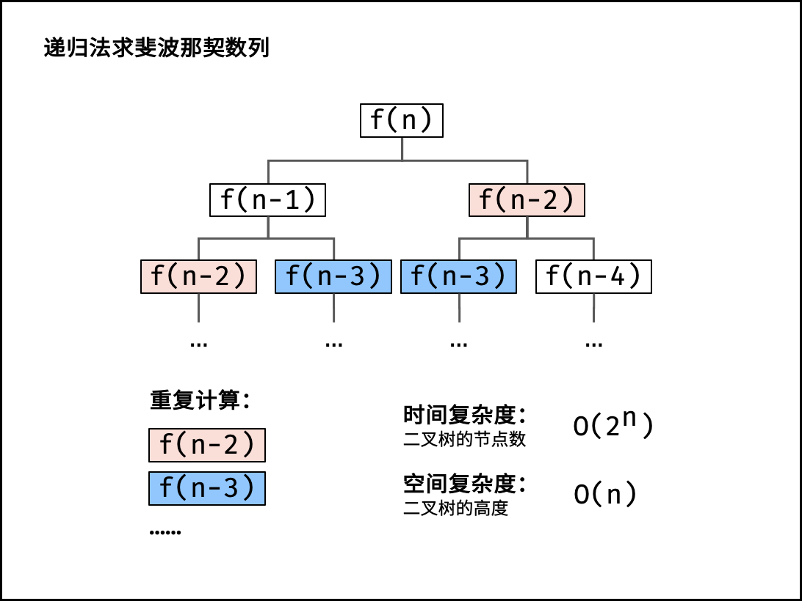

[#0509-fibonacci-number]
= 509. Fibonacci Number

{leetcode}/problems/fibonacci-number/[LeetCode - Fibonacci Number^]

The *Fibonacci numbers*, commonly denoted `F(n)` form a sequence, called the *Fibonacci sequence*, such that each number is the sum of the two preceding ones, starting from `0` and `1`. That is,

[subs="verbatim,quotes,macros"]
----
F(0) = 0,   F(1) = 1
F(N) = F(N - 1) + F(N - 2), for N > 1.
----

Given `N`, calculate `F(N)`.

*Example 1:*

[subs="verbatim,quotes,macros"]
----
*Input:* 2
*Output:* 1
*Explanation:* F(2) = F(1) + F(0) = 1 + 0 = 1.
----

*Example 2:*

[subs="verbatim,quotes,macros"]
----
*Input:* 3
*Output:* 2
*Explanation:* F(3) = F(2) + F(1) = 1 + 1 = 2.
----

*Example 3:*

[subs="verbatim,quotes,macros"]
----
*Input:* 4
*Output:* 3
*Explanation:* F(4) = F(3) + F(2) = 2 + 1 = 3.
----

*Note:*

0 ≤ `N` ≤ 30.

== 思路分析

动态规划

[[src-0509]]
[tabs]
====
一刷::
+
--
[{java_src_attr}]
----
include::{sourcedir}/_0509_FibonacciNumber.java[tag=answer]
----
--

二刷::
+
--
[{java_src_attr}]
----
include::{sourcedir}/_0509_FibonacciNumber_2.java[tag=answer]
----
--
====

== 参考资料

. https://leetcode.cn/problems/fibonacci-number/solutions/2361746/509-fei-bo-na-qi-shu-dong-tai-gui-hua-qi-so8h/?envType=study-plan-v2&envId=selected-coding-interview[509. 斐波那契数 - 动态规划，清晰图解^]

