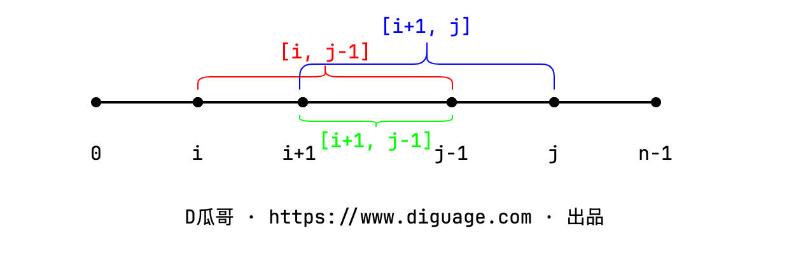

[#0516-longest-palindromic-subsequence]
= 516. 最长回文子序列

https://leetcode.cn/problems/longest-palindromic-subsequence/[LeetCode - 516. 最长回文子序列^]

给你一个字符串 `s` ，找出其中最长的回文子序列，并返回该序列的长度。

子序列定义为：不改变剩余字符顺序的情况下，删除某些字符或者不删除任何字符形成的一个序列。

*示例 1：*

....
输入：s = "bbbab"
输出：4
解释：一个可能的最长回文子序列为 "bbbb" 。
....

*示例 2：*

....
输入：s = "cbbd"
输出：2
解释：一个可能的最长回文子序列为 "bb" 。
....

*提示：*

* `+1 <= s.length <= 1000+`
* `s` 仅由小写英文字母组成

== 思路分析

最长的回文在哪里？当然是从字符串两头 `(head, tail)` 开始就是回文了。

. 如果 `chars[head] == chars[tail]`，那么往里搜索，找下一个匹配： `chars[head+1] == chars[tail-1]`。
. 如果 `chars[head] != chars[tail]`，那么最大回文字符可能存在于 `(head+1, tail)` 或者 `(head, tail-1)`。

在推演转移方程时，一个很大的误区是从 `dp` 矩阵视角去看。因为这是处理字符串，从一维字符串字符坐标去看，会更加清楚明了。如下图：

根据代码流程来看，整个处理流程是从字符串的右边向左处理，相当于在“结尾”中寻找回文子串。所以，相关遍历只涉及的矩阵的左上方一半，从最下一行向上，逐行遍历。

[[src-0516]]
[tabs]
====
一刷::
+
--
[{java_src_attr}]
----
include::{sourcedir}/_0516_LongestPalindromicSubsequence.java[tag=answer]
----
--

二刷::
+
--
[{java_src_attr}]
----
include::{sourcedir}/_0516_LongestPalindromicSubsequence_2.java[tag=answer]
----
--
====

== 参考资料

. https://leetcode.cn/problems/longest-palindromic-subsequence/solutions/930442/zui-chang-hui-wen-zi-xu-lie-by-leetcode-hcjqp/[516. 最长回文子序列 - 官方题解^]
. https://leetcode.cn/problems/longest-palindromic-subsequence/solutions/15118/dong-tai-gui-hua-si-yao-su-by-a380922457-3/comments/230465/[516. 最长回文子序列 - 动态规划，四要素^] -- 该评论详细解释了如何处理奇偶回文的。
. https://leetcode.cn/problems/longest-palindromic-subsequence/solutions/2203001/shi-pin-jiao-ni-yi-bu-bu-si-kao-dong-tai-kgkg/[516. 最长回文子序列 - 教你一步步思考动态规划：从记忆化搜索到递推到空间优化！^]
