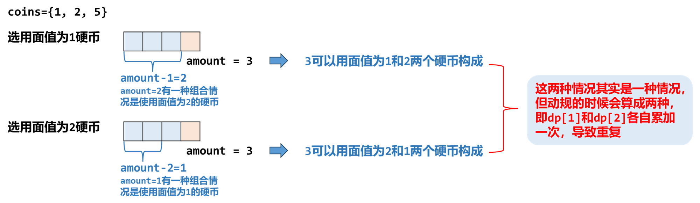
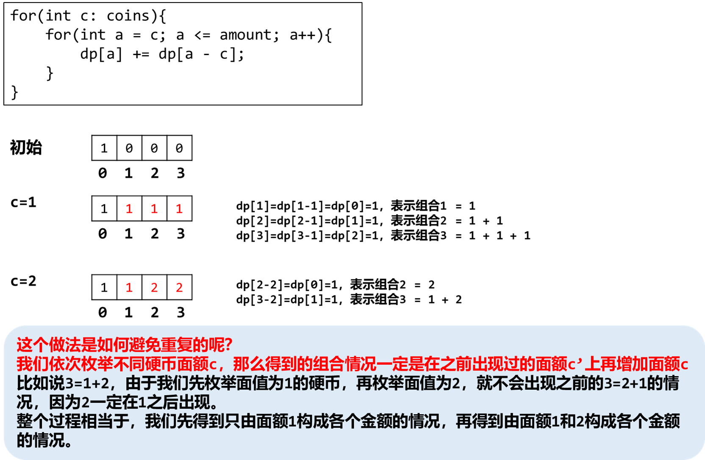

[#0518-coin-change-ii]
= 518. 零钱兑换 II

https://leetcode.cn/problems/coin-change-ii/[LeetCode - 518. 零钱兑换 II^]

给你一个整数数组 `coins` 表示不同面额的硬币，另给一个整数 `amount`表示总金额。

请你计算并返回可以凑成总金额的硬币组合数。如果任何硬币组合都无法凑出总金额，返回 `0` 。

假设每一种面额的硬币有无限个。 

题目数据保证结果符合 32 位带符号整数。

*示例 1：*

....
输入：amount = 5, coins = [1, 2, 5]
输出：4
解释：有四种方式可以凑成总金额：
5=5
5=2+2+1
5=2+1+1+1
5=1+1+1+1+1
....

*示例 2：*

....
输入：amount = 3, coins = [2]
输出：0
解释：只用面额 2 的硬币不能凑成总金额 3 。
....

*示例 3：*

....
输入：amount = 10, coins = [10]
输出：1
....

*提示：*

* `+1 <= coins.length <= 300+`
* `+1 <= coins[i] <= 5000+`
* `coins` 中的所有值 *互不相同*
* `+0 <= amount <= 5000+`

== 思路分析

一道动态规划，是 xref:0322-coin-change.adoc[322. Coin Change] 的延伸题目。

假设 `dp[i][c]` 表示使用前 `i` 个硬币表示金额为 `c` 的方案。那么对于当前的硬币 `i`，有两个选择：

* 选用：latexmath:[dp[i\][c\] = dp[i\][c - coin[i\]\]]。注意：由于硬币可以重复使用，即使选用，也要从 `i` 开始向前递推。
* 不选：latexmath:[dp[i\][c\] = dp[i-1\][c\]]。不选，则从 `i - 0` 开始向前递推。

那么，根据加法原理， latexmath:[dp[i\][c\] = dp[i-1\][c\] + dp[i\][c - coin[i\]\]]

注意：不同嵌套顺序表示不同意义。

先金额后硬币，会导致重复计数：

*先硬币再金额*，就可以避免重复计数的问题：

[[src-0518]]
[tabs]
====
一刷::
+
--
[{java_src_attr}]
----
include::{sourcedir}/_0518_CoinChangeIi_1.java[tag=answer]
----
--

一刷（优化）::
+
--
[{java_src_attr}]
----
include::{sourcedir}/_0518_CoinChangeIi.java[tag=answer]
----
--

// 二刷::
// +
// --
// [{java_src_attr}]
// ----
// include::{sourcedir}/_0518_CoinChangeIi_2.java[tag=answer]
// ----
// --
====

== 参考资料

. https://leetcode.cn/problems/coin-change-ii/solutions/2706227/shi-pin-wan-quan-bei-bao-cong-ji-yi-hua-o3ew0/[518. 零钱兑换 II - 完全背包：从记忆化搜索到递推，附题单！^]
. https://leetcode.cn/problems/coin-change-ii/solutions/143948/ling-qian-dui-huan-iihe-pa-lou-ti-wen-ti-dao-di-yo/[518. 零钱兑换 II - 零钱兑换II和爬楼梯问题到底有什么不同？^]
. https://leetcode.cn/problems/coin-change-ii/solutions/821592/gong-shui-san-xie-xiang-jie-wan-quan-bei-6hxv/[518. 零钱兑换 II - 详解完全背包问题（附背包问题攻略）^]
. https://mp.weixin.qq.com/s/xmgK7SrTnFIM3Owpk-emmg[【动态规划/背包问题】那就从 0-1 背包问题开始讲起吧 ...^]
. https://leetcode.cn/problems/coin-change-ii/solutions/1412584/by-flix-e1vv/[518. 零钱兑换 II - 『 一文搞懂完全背包 』从0-1背包到完全背包，逐层深入+数学推导^]
. https://leetcode.cn/problems/coin-change-ii/solutions/2706228/javapython3cdong-tai-gui-hua-chai-fen-li-x5a4/[518. 零钱兑换 II - 动态规划：拆分零钱兑换子问题（嵌套循环的秘密）【图解】^]
