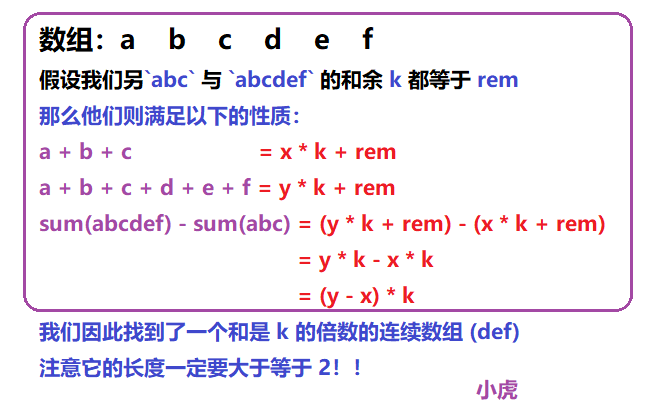
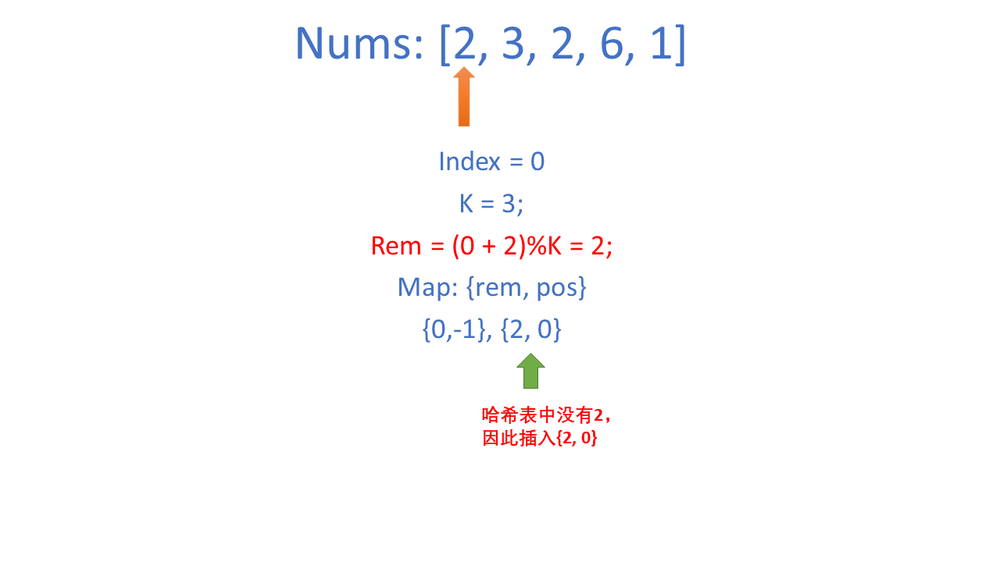
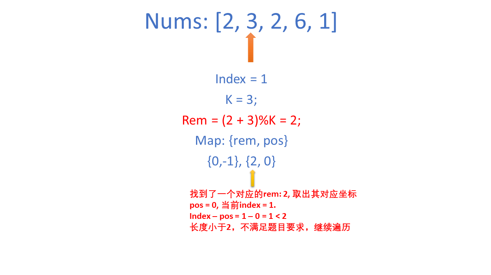
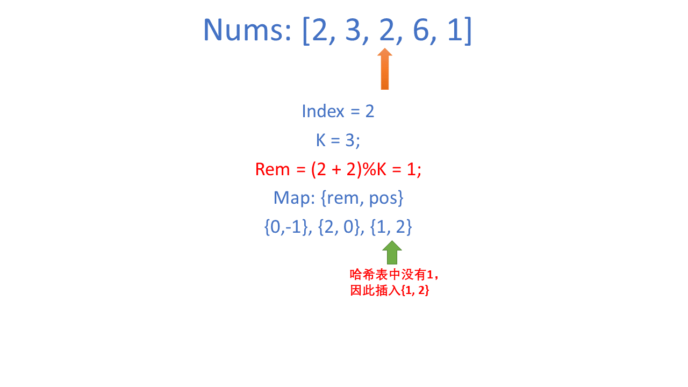
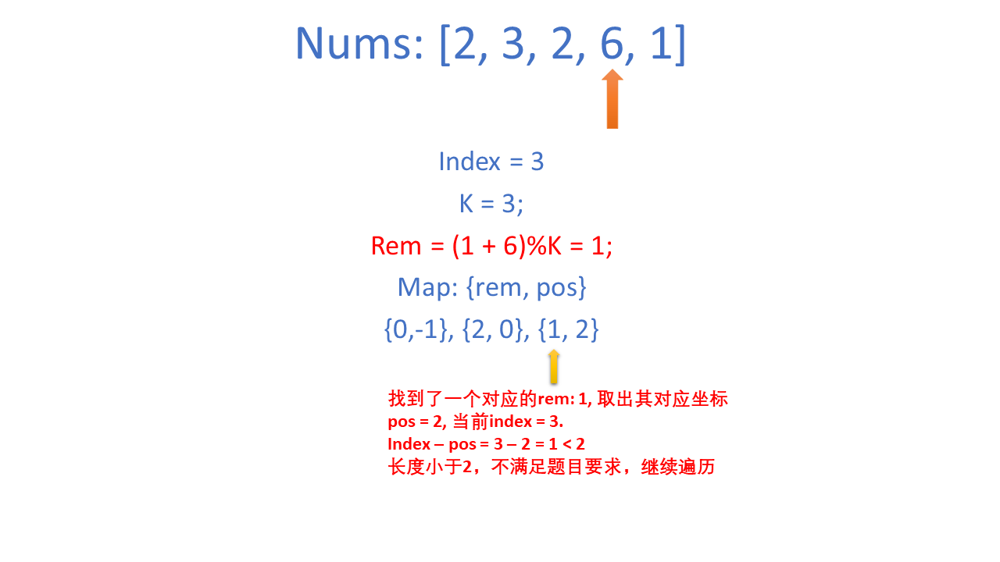
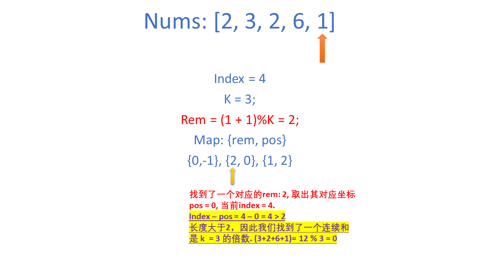

[#0523-continuous-subarray-sum]
= 523. Continuous Subarray Sum

https://leetcode.com/problems/continuous-subarray-sum/[LeetCode - Continuous Subarray Sum]

Given a list of *non-negative* numbers and a target *integer* k, write a function to check if the array has a continuous subarray of size at least 2 that sums up to a multiple of *k*, that is, sums up to n*k where n is also an *integer*.

 

*Example 1:*

[subs="verbatim,quotes,macros"]
----
*Input:* [23, 2, 4, 6, 7],  k=6
*Output:* True
*Explanation:* Because [2, 4] is a continuous subarray of size 2 and sums up to 6.
----

*Example 2:*

[subs="verbatim,quotes,macros"]
----
*Input:* [23, 2, 6, 4, 7],  k=6
*Output:* True
*Explanation:* Because [23, 2, 6, 4, 7] is an continuous subarray of size 5 and sums up to 42.
----

 

*Note:*

. The length of the array won't exceed 10,000.
. You may assume the sum of all the numbers is in the range of a signed 32-bit integer.

== 解题分析

利用同余定理：

当 latexmath:[prefixSums[q\]−prefixSums[p\]] 为 latexmath:[k] 的倍数时，latexmath:[prefixSums[p\]] 和 latexmath:[prefixSums[q\]] 除以 latexmath:[k] 的余数相同。（_D瓜哥注：余数相同，则相减之后余数就被减掉了。_）因此只需要计算每个下标对应的前缀和除以 latexmath:[k] 的余数即可，使用哈希表存储每个余数第一次出现的下标。

[[src-0523]]
[{java_src_attr}]
----
include::{sourcedir}/_0523_ContinuousSubarraySum.java[]
----

