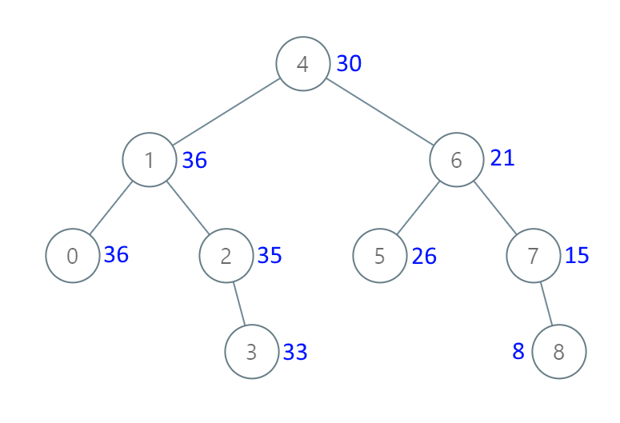

[#0538-convert-bst-to-greater-tree]
= 538. Convert BST to Greater Tree

https://leetcode.com/problems/convert-bst-to-greater-tree/[LeetCode - Convert BST to Greater Tree^]

Given a Binary Search Tree (BST), convert it to a Greater Tree such that every key of the original BST is changed to the original key plus sum of all keys greater than the original key in BST.

*Example:*
[subs="verbatim,quotes,macros"]
----
*Input:* The root of a Binary Search Tree like this:
              5
            /   \
           2     13

*Output:* The root of a Greater Tree like this:
             18
            /   \
          20     13
----

== 思路分析

题目要求：原树中大于或等于 `node.val` 的值之和。二叉搜索树中根遍历是从小到大到，那么反其道而行之，将遍历顺序从“左中右”改为“右中左”，遍历顺序就是从大到小，这样一直累加即可。

=== 一、递归

[[src-0538]]
[{java_src_attr}]
----
include::{sourcedir}/_0538_ConvertBSTToGreaterTree.java[tag=answer]
----

=== 二、迭代

基于 Morris 的倒序中根遍历

[{java_src_attr}]
----
include::{sourcedir}/_0538_ConvertBSTToGreaterTree_1.java[tag=answer]
----

== 参考资料

. https://leetcode.cn/problems/convert-bst-to-greater-tree/solutions/421616/ba-er-cha-sou-suo-shu-zhuan-huan-wei-lei-jia-sh-14/[538. 把二叉搜索树转换为累加树 - 官方题解^]
. https://leetcode.cn/problems/convert-bst-to-greater-tree/solutions/1/yi-tao-quan-fa-shua-diao-nge-bian-li-shu-de-wen-5/[538. 把二叉搜索树转换为累加树 - 一套拳法👊刷掉n个遍历树的问题^]
