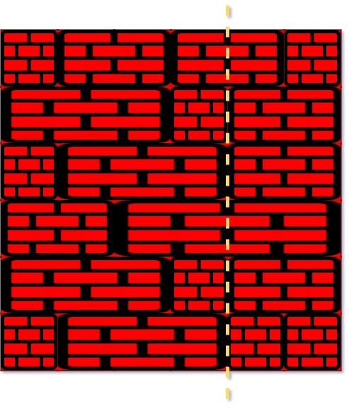
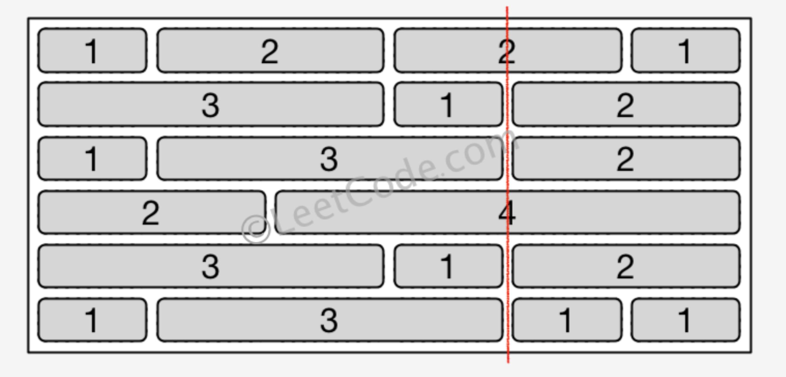

[#0554-brick-wall]
= 554. 砖墙

https://leetcode.cn/problems/brick-wall/[LeetCode - 554. 砖墙^]

你的面前有一堵矩形的、由 `n` 行砖块组成的砖墙。这些砖块高度相同（也就是一个单位高）但是宽度不同。每一行砖块的宽度之和相等。

你现在要画一条 *自顶向下* 的、穿过 *最少* 砖块的垂线。如果你画的线只是从砖块的边缘经过，就不算穿过这块砖。*你不能沿着墙的两个垂直边缘之一画线，这样显然是没有穿过一块砖的。*

给你一个二维数组 `wall`，该数组包含这堵墙的相关信息。其中，`wall[i]` 是一个代表从左至右每块砖的宽度的数组。你需要找出怎样画才能使这条线 *穿过的砖块数量最少* ，并且返回 *穿过的砖块数量* 。

*示例 1：*

....
输入：wall = [[1,2,2,1],[3,1,2],[1,3,2],[2,4],[3,1,2],[1,3,1,1]]
输出：2
....

*示例 2：*

....
输入：wall = [[1],[1],[1]]
输出：3
....

*提示：*

* `n == wall.length`
* `1 \<= n \<= 10^4^`
* `1 \<= wall[i].length \<= 10^4^`
* `1 \<= sum(wall[i].length) \<= 2 * 10^4^`
* 对于每一行 `i` ，`sum(wall[i])` 是相同的
* `1 \<= wall[i][j] \<= 2^31^ - 1`

== 思路分析

使用前缀和，求解每一行的缝隙值大小，使用哈希存储缝隙值出现的次数。缝隙值出现次数最多的值，就是要求解的情况。

[[src-0554]]
[tabs]
====
一刷::
+
--
[{java_src_attr}]
----
include::{sourcedir}/_0554_BrickWall.java[tag=answer]
----
--

// 二刷::
// +
// --
// [{java_src_attr}]
// ----
// include::{sourcedir}/_0554_BrickWall_2.java[tag=answer]
// ----
// --
====

== 参考资料

. https://leetcode.cn/problems/brick-wall/solutions/754884/gong-shui-san-xie-zheng-nan-ze-fan-shi-y-gsri/[554. 砖墙 - 正难则反，使用哈希表求解^]
. https://leetcode.cn/problems/brick-wall/solutions/747349/zhuan-qiang-by-leetcode-solution-2kls/[554. 砖墙 - 官方题解^]
. https://leetcode.cn/problems/brick-wall/solutions/754847/chi-xiao-dou-xun-lian-jie-ti-si-lu-rang-wbgfx/[554. 砖墙 - 清晰的解题思路, 让你面试中也能有序作答~^]
