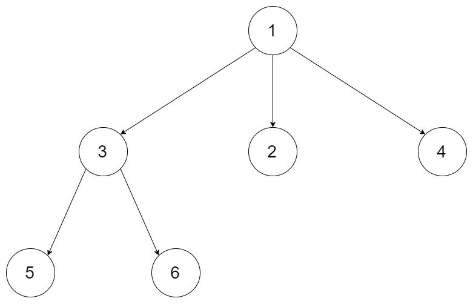
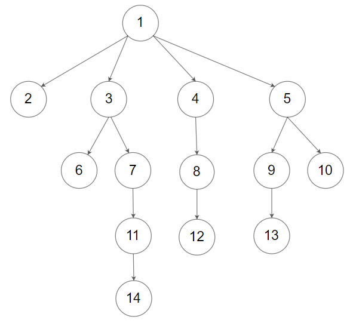

[#0559-maximum-depth-of-n-ary-tree]
= 559. Maximum Depth of N-ary Tree

https://leetcode.com/problems/maximum-depth-of-n-ary-tree/[LeetCode - Maximum Depth of N-ary Tree^]

Given a n-ary tree, find its maximum depth.

The maximum depth is the number of nodes along the longest path from the root node down to the farthest leaf node.

_Nary-Tree input serialization is represented in their level order traversal, each group of children is separated by the null value (See examples)._

 
*Example 1:*

[subs="verbatim,quotes,macros"]
----
*Input:* root = [1,null,3,2,4,null,5,6]
*Output:* 3
----

*Example 2:*

[subs="verbatim,quotes,macros"]
----
*Input:* root = [1,null,2,3,4,5,null,null,6,7,null,8,null,9,10,null,null,11,null,12,null,13,null,null,14]
*Output:* 5
----

 
*Constraints:*

* The depth of the n-ary tree is less than or equal to `1000`.
* The total number of nodes is between `[0, 10^4]`.

[[src-0559]]
[{java_src_attr}]
----
include::{sourcedir}/_0559_MaximumDepthOfNAryTree.java[tag=answer]
----

