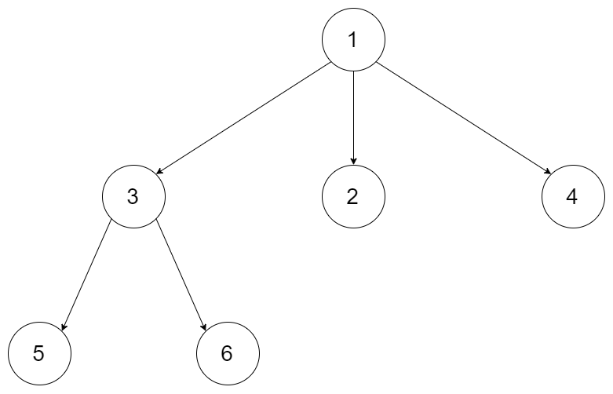
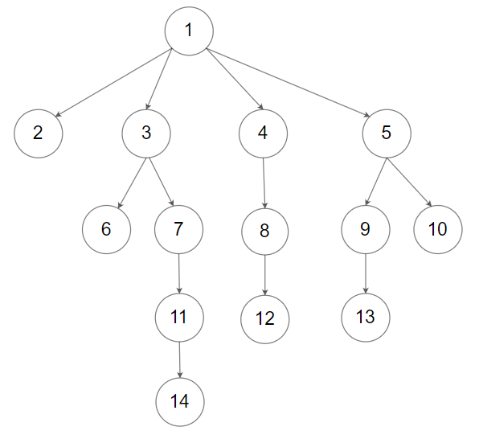

[#0559-maximum-depth-of-n-ary-tree]
= 559. N 叉树的最大深度

https://leetcode.cn/problems/maximum-depth-of-n-ary-tree/[LeetCode - 559. N 叉树的最大深度^]

给定一个 N 叉树，找到其最大深度。

最大深度是指从根节点到最远叶子节点的最长路径上的节点总数。

N 叉树输入按层序遍历序列化表示，每组子节点由空值分隔（请参见示例）。

*示例 1：*

....
输入：root = [1,null,3,2,4,null,5,6]
输出：3
....

*示例 2：*

....
输入：root = [1,null,2,3,4,5,null,null,6,7,null,8,null,9,10,null,null,11,null,12,null,13,null,null,14]
输出：5
....

*提示：*

* 树的深度不会超过 `1000` 。
* 树的节点数目位于 `[0, 10^4^]` 之间。

== 思路分析

[[src-0559]]
[tabs]
====
一刷::
+
--
[{java_src_attr}]
----
include::{sourcedir}/_0559_MaximumDepthOfNAryTree.java[tag=answer]
----
--

// 二刷::
// +
// --
// [{java_src_attr}]
// ----
// include::{sourcedir}/_0559_MaximumDepthOfNAryTree_2.java[tag=answer]
// ----
// --
====

== 参考资料

. https://leetcode.cn/problems/maximum-depth-of-n-ary-tree/solutions/1113062/gong-shui-san-xie-yi-ti-shuang-jie-dfs-b-n956/[559. N 叉树的最大深度 - 一题双解 : DFS & BFS^]
. https://leetcode.cn/problems/maximum-depth-of-n-ary-tree/solutions/1110907/n-cha-shu-de-zui-da-shen-du-by-leetcode-n7qtv/[559. N 叉树的最大深度 - 官方题解^]
. https://leetcode.cn/problems/maximum-depth-of-n-ary-tree/solutions/431228/qiu-shu-de-zui-da-shen-du-xiang-jie-by-carlsun-2-2/[559. N 叉树的最大深度 - 求树的最大深度（详解）^]
