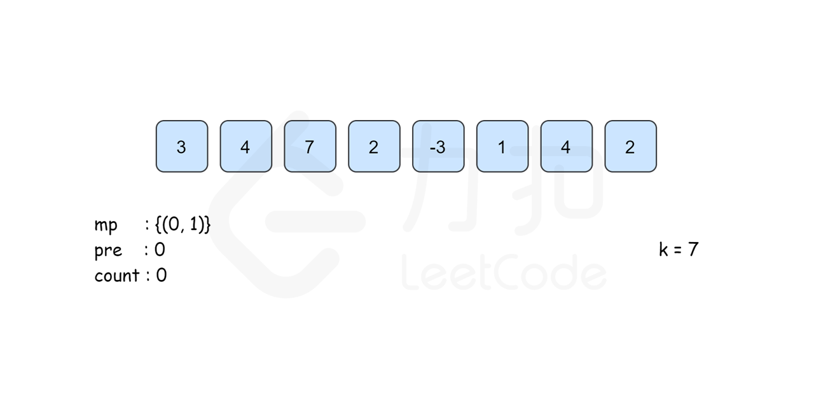
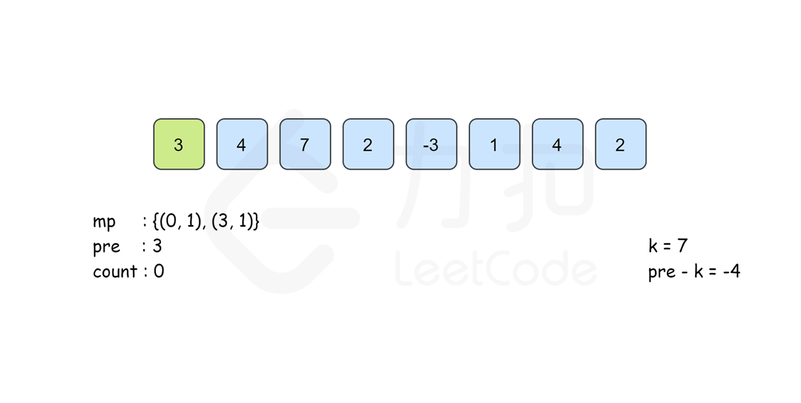
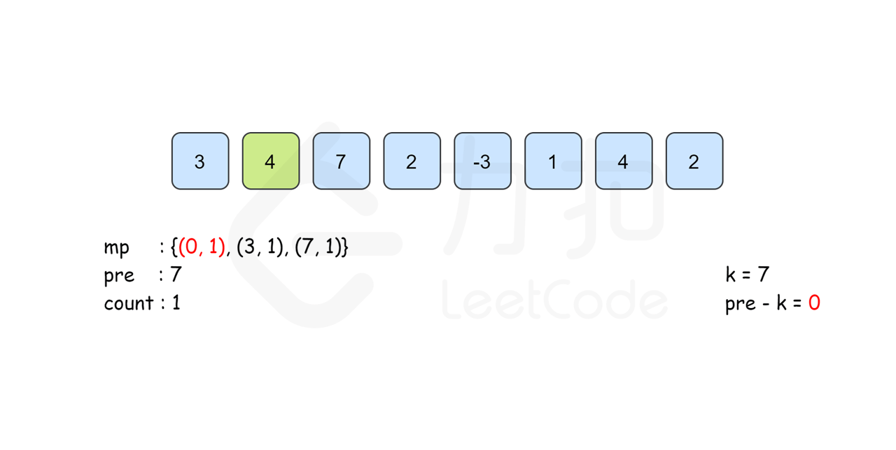
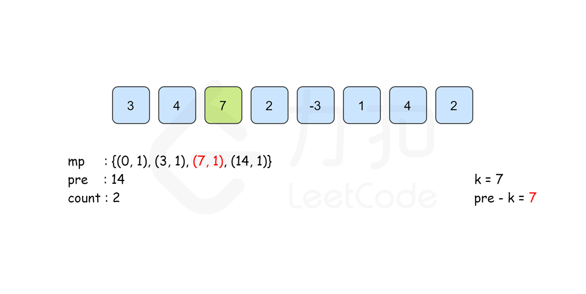
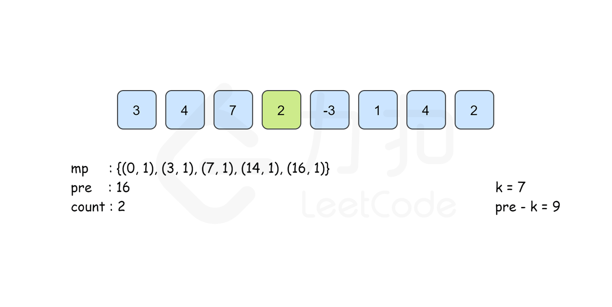
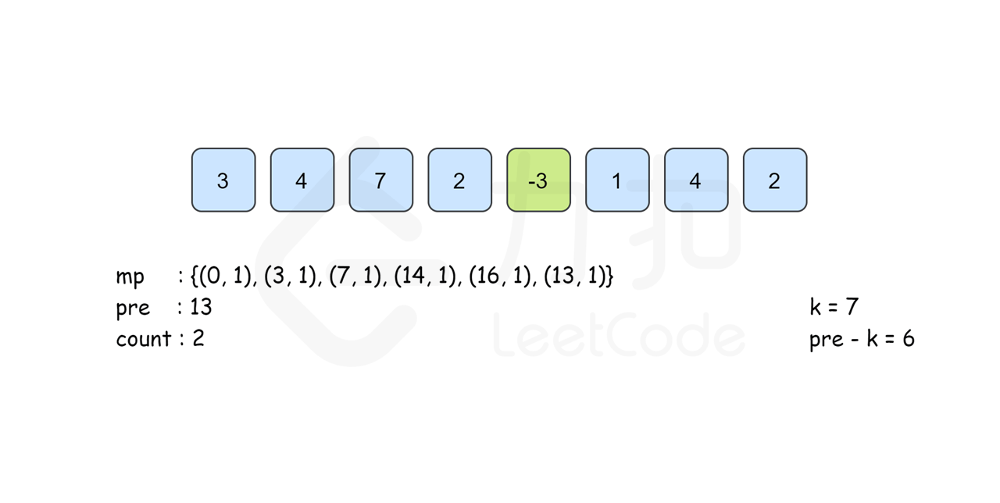
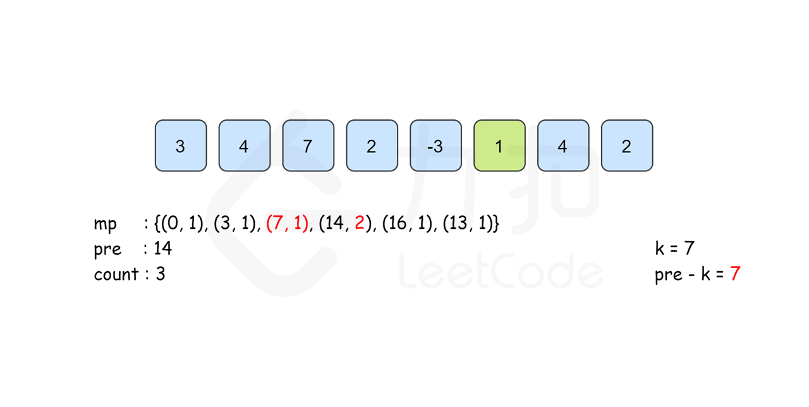
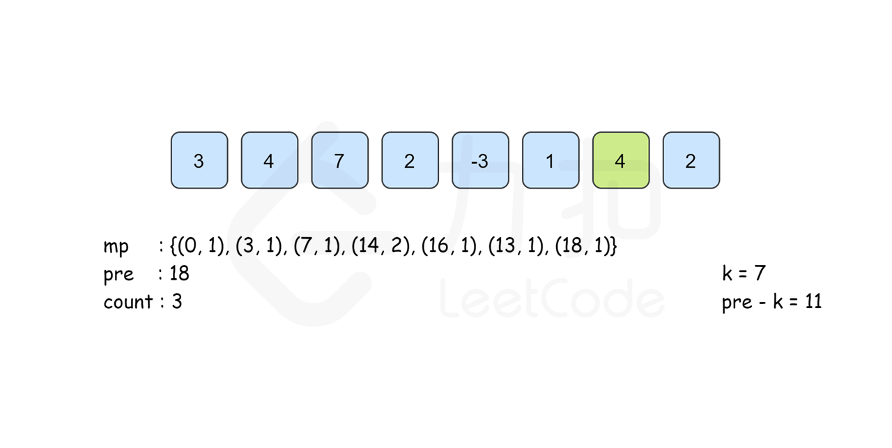
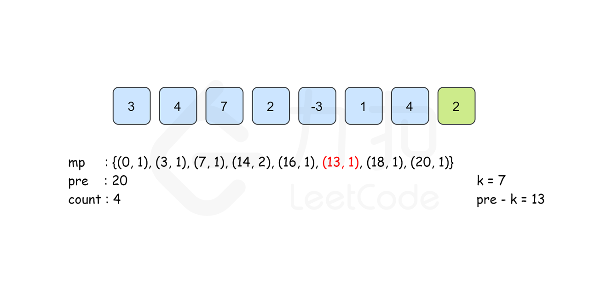

[#0560-subarray-sum-equals-k]
= 560. Subarray Sum Equals K

https://leetcode.com/problems/subarray-sum-equals-k/[LeetCode - Subarray Sum Equals K^]

Given an array of integers and an integer **k**, you need to find the total number of continuous subarrays whose sum equals to **k**.

*Example 1:*

[subs="verbatim,quotes,macros"]
----
*Input:* nums = [1,1,1], k = 2
*Output:* 2
----

*Note:*

. The length of the array is in range [1, 20,000].
. The range of numbers in the array is [-1000, 1000] and the range of the integer *k* is [-1e7, 1e7].

== 解题分析

背后的想法如下：如果累积总和（由 `sum[i]` 表示加到 `i^th^` 的和）最多两个指数是相同的，那么这些元素之间的元素总和为零。进一步扩展相同的想法，如果累计总和，在索引 `i` 和 `j` 处相差 `k`，即 `sum[i]−sum[j]=k`，则位于索引 `i` 和 `j` 之间的元素之和是 `k`。

基于这些想法，可以使用了一个哈希表 `map`，它用于存储所有可能的索引的累积总和以及相同累加和发生的次数。我们以以下形式存储数据：(`sum~i~`，`sum~i~` 的出现次数)。我们遍历数组 `nums` 并继续寻找累积总和。每当我们遇到一个新的和时，我们在 `map` 中创建一个与该总和相对应的新条目。如果再次出现相同的和，我们增加与 `map` 中的和相对应的计数。此外，对于遇到的每个总和，我们还确定已经发生 `sum - k` 总和的次数，因为它将确定具有总和 `k` 的子阵列发生到当前索引的次数。我们将 `count` 增加相同的量。

在完成遍历数组后，`count` 记录了所需结果

基于一个idea：`sum[j] - sum[i] == k` 的话，`nums[i+1, j]` 之间数字的和就是 `k`。

[[src-0560]]
[{java_src_attr}]
----
include::{sourcedir}/_0560_SubarraySumEqualsK.java[]
----

[{java_src_attr}]
----
include::{sourcedir}/_0560_SubarraySumEqualsK_2.java[]
----

== 参考资料

. https://leetcode.cn/problems/continuous-subarray-sum/solutions/807930/lian-xu-de-zi-shu-zu-he-by-leetcode-solu-rdzi/[和为K的子数组 - 和为K的子数组 - 官方题解^]

