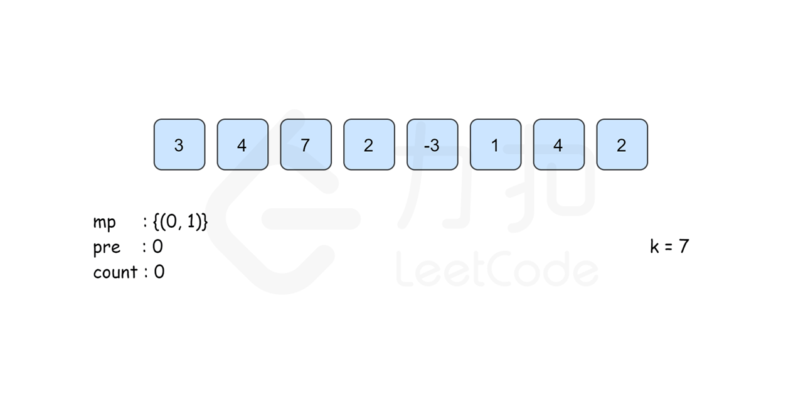

[#0560-subarray-sum-equals-k]
= 560. 和为 K 的子数组

https://leetcode.cn/problems/subarray-sum-equals-k/[LeetCode - 560. 和为 K 的子数组 ^]

给你一个整数数组 `nums` 和一个整数 `k` ，请你统计并返回 _该数组中和为 `k` 的子数组的个数_。

子数组是数组中元素的连续非空序列。

*示例 1：*

....
输入：nums = [1,1,1], k = 2
输出：2
....

*示例 2：*

....
输入：nums = [1,2,3], k = 3
输出：2
....

*提示：*

* `1 \<= nums.length \<= 2 * 10^4^`
* `+-1000 <= nums[i] <= 1000+`
* `-10^7^ \<= k \<= 10^7^`

== 思路分析

背后的想法如下：如果累积总和（由 `sum[i]` 表示加到 `i^th^` 的和）最多两个指数是相同的，那么这些元素之间的元素总和为零。进一步扩展相同的想法，如果累计总和，在索引 `i` 和 `j` 处相差 `k`，即 `sum[i]−sum[j]=k`，则位于索引 `i` 和 `j` 之间的元素之和是 `k`。

基于这些想法，可以使用了一个哈希表 `map`，它用于存储所有可能的索引的累积总和以及相同累加和发生的次数。我们以以下形式存储数据：(`sum~i~`，`sum~i~` 的出现次数)。我们遍历数组 `nums` 并继续寻找累积总和。每当我们遇到一个新的和时，我们在 `map` 中创建一个与该总和相对应的新条目。如果再次出现相同的和，我们增加与 `map` 中的和相对应的计数。此外，对于遇到的每个总和，我们还确定已经发生 `sum - k` 总和的次数，因为它将确定具有总和 `k` 的子阵列发生到当前索引的次数。我们将 `count` 增加相同的量。

在完成遍历数组后，`count` 记录了所需结果

基于一个idea：`sum[j] - sum[i] == k` 的话，`nums[i+1, j]` 之间数字的和就是 `k`。

image::images/0560-06.png[{image_attr}]

[[src-0560]]
[tabs]
====
一刷::
+
--
[{java_src_attr}]
----
include::{sourcedir}/_0560_SubarraySumEqualsK.java[tag=answer]
----
--

二刷::
+
--
[{java_src_attr}]
----
include::{sourcedir}/_0560_SubarraySumEqualsK_2.java[tag=answer]
----
--

三刷::
+
--
[{java_src_attr}]
----
include::{sourcedir}/_0560_SubarraySumEqualsK_3.java[tag=answer]
----
--
====

== 参考资料

. https://leetcode.cn/problems/continuous-subarray-sum/solutions/807930/lian-xu-de-zi-shu-zu-he-by-leetcode-solu-rdzi/[和为K的子数组 - 和为K的子数组 - 官方题解^]

