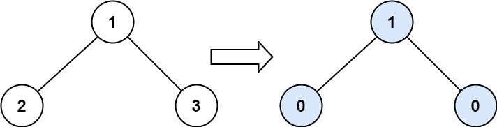
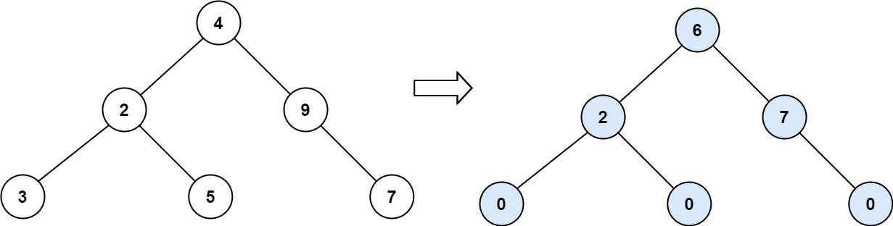
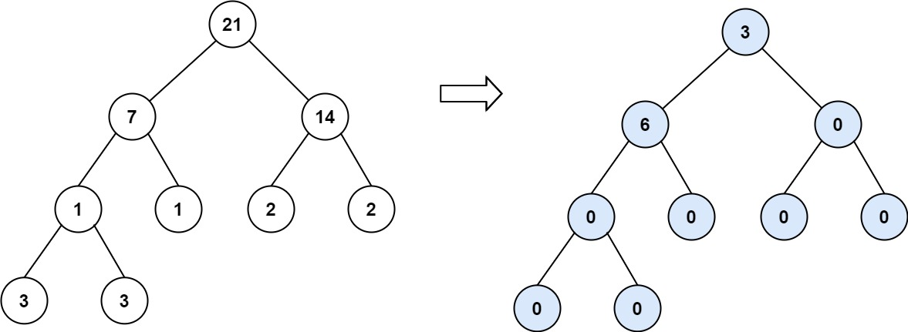

[#0563-binary-tree-tilt]
= 563. 二叉树的坡度

https://leetcode.cn/problems/binary-tree-tilt/[LeetCode - 563. 二叉树的坡度^]

给你一个二叉树的根节点 `root` ，计算并返回 *整个树* 的坡度 。

一个树的 *节点的坡度* 定义即为，该节点左子树的节点之和和右子树节点之和的 *差的绝对值* 。如果没有左子树的话，左子树的节点之和为 0；没有右子树的话也是一样。空结点的坡度是 0 。

*整个树* 的坡度就是其所有节点的坡度之和。

*示例 1：*

....
输入：root = [1,2,3]
输出：1
解释：
节点 2 的坡度：|0-0| = 0（没有子节点）
节点 3 的坡度：|0-0| = 0（没有子节点）
节点 1 的坡度：|2-3| = 1（左子树就是左子节点，所以和是 2 ；右子树就是右子节点，所以和是 3 ）
坡度总和：0 + 0 + 1 = 1
....

*示例 2：*

....
输入：root = [4,2,9,3,5,null,7]
输出：15
解释：
节点 3 的坡度：|0-0| = 0（没有子节点）
节点 5 的坡度：|0-0| = 0（没有子节点）
节点 7 的坡度：|0-0| = 0（没有子节点）
节点 2 的坡度：|3-5| = 2（左子树就是左子节点，所以和是 3 ；右子树就是右子节点，所以和是 5 ）
节点 9 的坡度：|0-7| = 7（没有左子树，所以和是 0 ；右子树正好是右子节点，所以和是 7 ）
节点 4 的坡度：|(352)-(9+7)| = |10-16| = 6（左子树值为 3、5 和 2 ，和是 10 ；右子树值为 9 和 7 ，和是 16 ）
坡度总和：0 + 0 + 0 + 2 + 7 + 6 = 15
....

*示例 3：*

....
输入：root = [21,7,14,1,1,2,2,3,3]
输出：9
....

*提示：*

* 树中节点数目的范围在 `[0, 10^4^]` 内
* `-1000 \<= Node.val \<= 1000`

== 思路分析

[[src-0563]]
[tabs]
====
一刷::
+
--
[{java_src_attr}]
----
include::{sourcedir}/_0563_BinaryTreeTilt.java[tag=answer]
----
--

// 二刷::
// +
// --
// [{java_src_attr}]
// ----
// include::{sourcedir}/_0563_BinaryTreeTilt_2.java[tag=answer]
// ----
// --
====

== 参考资料

. https://leetcode.cn/problems/binary-tree-tilt/solutions/1107817/gong-shui-san-xie-jian-dan-er-cha-shu-di-ekz4/[563. 二叉树的坡度 - 简单二叉树递归题^]
. https://leetcode.cn/problems/binary-tree-tilt/solutions/1106287/er-cha-shu-de-po-du-by-leetcode-solution-7rha/[563. 二叉树的坡度 - 官方题解^]
