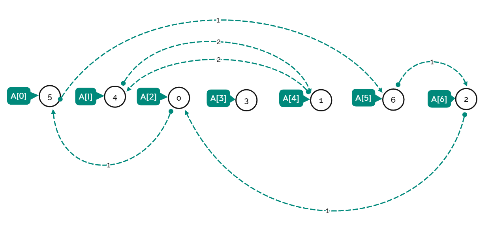
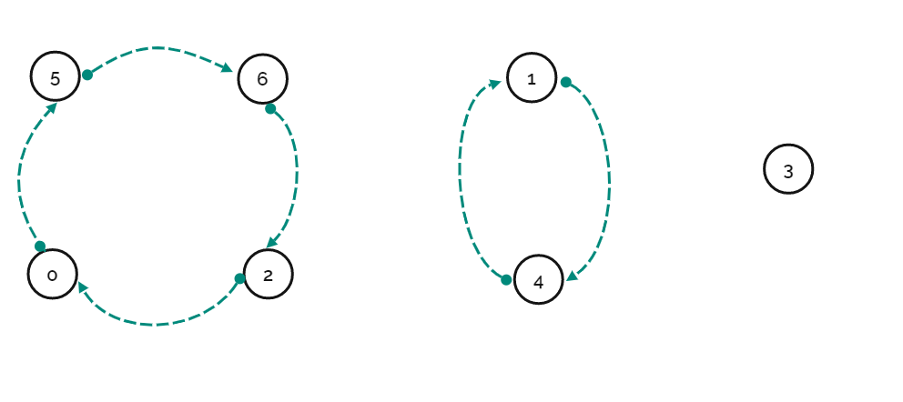

[#0565-array-nesting]
= 565. 数组嵌套

https://leetcode.cn/problems/array-nesting/[LeetCode - 565. 数组嵌套^]

索引从 `0` 开始长度为 `N` 的数组 `A`，包含 `0`到 `N - 1` 的所有整数。找到最大的集合 `S` 并返回其大小，其中 `S[i] = {A[i], A[A[i]], A[A[A[i]]], ... }`且遵守以下的规则。

假设选择索引为 `i` 的元素 `A[i]` 为 `S` 的第一个元素，`S` 的下一个元素应该是 `A[A[i]]`，之后是 `A[A[A[i]]]...` 以此类推，不断添加直到`S`出现重复的元素。

*示例 1:*

....
输入: A = [5,4,0,3,1,6,2]
输出: 4
解释:
A[0] = 5, A[1] = 4, A[2] = 0, A[3] = 3, A[4] = 1, A[5] = 6, A[6] = 2.

其中一种最长的 S[K]:
S[0] = {A[0], A[5], A[6], A[2]} = {5, 6, 2, 0}
....

*提示：*

* `1 \<= nums.length \<= 10^5^`
* `0 \<= nums[i] \< nums.length`
* `A` 中不含有重复的元素。

== 思路分析

以为是查并集。看题解发现是深度优先遍历。

TIP: 看评论，查并集也是可以的。

将“嵌套”模拟成图，如下：

[[src-0565]]
[tabs]
====
一刷::
+
--
[{java_src_attr}]
----
include::{sourcedir}/_0565_ArrayNesting.java[tag=answer]
----
--

// 二刷::
// +
// --
// [{java_src_attr}]
// ----
// include::{sourcedir}/_0565_ArrayNesting_2.java[tag=answer]
// ----
// --
====

== 参考资料

. https://leetcode.cn/problems/array-nesting/solutions/1675221/by-heren1229-bb0n/[565. 数组嵌套 - 作图帮助理解^]
. https://leetcode.cn/problems/array-nesting/solutions/1673589/shu-zu-qian-tao-by-leetcode-solution-7ur3/[565. 数组嵌套 - 官方题解^]
