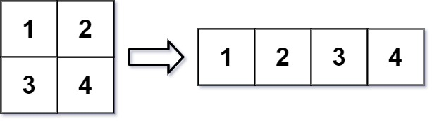
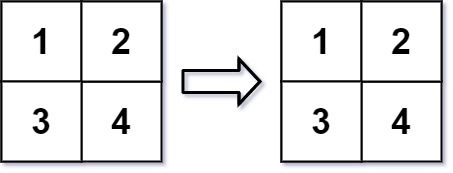

[#0566-reshape-the-matrix]
= 566. 重塑矩阵

https://leetcode.cn/problems/reshape-the-matrix/[LeetCode - 566. 重塑矩阵^]

在 MATLAB 中，有一个非常有用的函数 `reshape`，它可以将一个 `m x n` 矩阵重塑为另一个大小不同（`r x c`）的新矩阵，但保留其原始数据。

给你一个由二维数组 `mat` 表示的 `m x n` 矩阵，以及两个正整数 `r` 和 `c`，分别表示想要的重构的矩阵的行数和列数。

重构后的矩阵需要将原始矩阵的所有元素以相同的 *行遍历顺序* 填充。

如果具有给定参数的 `reshape` 操作是可行且合理的，则输出新的重塑矩阵；否则，输出原始矩阵。

*示例 1：*

....
输入：mat = [[1,2],[3,4]], r = 1, c = 4
输出：[[1,2,3,4]]
....

*示例 2：*

....
输入：mat = [[1,2],[3,4]], r = 2, c = 4
输出：[[1,2],[3,4]]
....

*提示：*

* `m == mat.length`
* `n == mat[i].length`
* `1 \<= m, n \<= 100`
* `-1000 \<= mat[i][j] \<= 1000`
* `1 \<= r, c \<= 300`

== 思路分析

就是把一个矩阵复制到另外一个矩阵里，算好对以的坐标即可。

[[src-0566]]
[tabs]
====
一刷::
+
--
[{java_src_attr}]
----
include::{sourcedir}/_0566_ReshapeTheMatrix.java[tag=answer]
----
--

// 二刷::
// +
// --
// [{java_src_attr}]
// ----
// include::{sourcedir}/_0566_ReshapeTheMatrix_2.java[tag=answer]
// ----
// --
====

== 参考资料

. https://leetcode.cn/problems/reshape-the-matrix/solutions/606281/zhong-su-ju-zhen-by-leetcode-solution-gt0g/[566. 重塑矩阵 - 官方题解^]
. https://leetcode.cn/problems/reshape-the-matrix/solutions/606481/zhu-xing-bian-li-fang-zhi-dao-dui-ying-w-ni31/[566. 重塑矩阵 - 逐行遍历放置到对应位置，三种语言代码以及直接NumPy库函数^]
