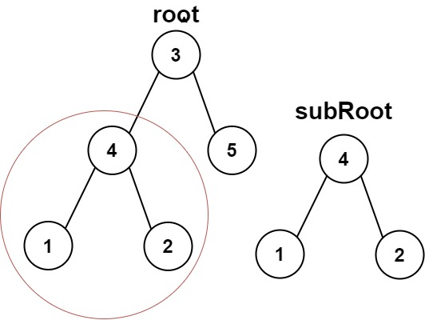
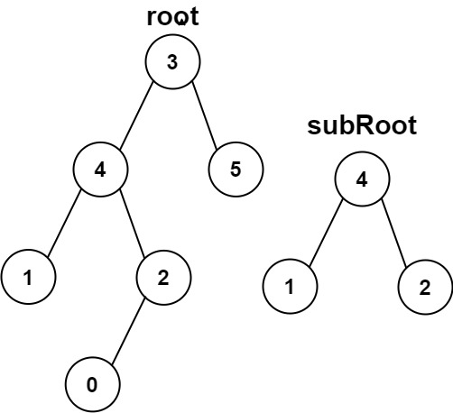

[#0572-subtree-of-another-tree]
= 572. 另一棵树的子树

https://leetcode.cn/problems/subtree-of-another-tree/[LeetCode - 572. 另一棵树的子树^]

给你两棵二叉树 `root` 和 `subRoot`。检验 `root` 中是否包含和 `subRoot` 具有相同结构和节点值的子树。如果存在，返回 `true`；否则，返回 `false`。

二叉树 `tree` 的一棵子树包括 `tree` 的某个节点和这个节点的所有后代节点。`tree` 也可以看做它自身的一棵子树。

*示例 1：*

....
输入：root = [3,4,5,1,2], subRoot = [4,1,2]
输出：true
....

*示例 2：*

....
输入：root = [3,4,5,1,2,null,null,null,null,0], subRoot = [4,1,2]
输出：false
....

*提示：*

* `root` 树上的节点数量范围是 `[1, 2000]`
* `subRoot` 树上的节点数量范围是 `[1, 1000]`
* `-10^4^ \<= root.val \<= 10^4^`
* `-10^4^ \<= subRoot.val \<= 10^4^`

== 思路分析

深度优先遍历。暴力破解就是两个递归。更优化的解法是，只在相同高度去做递归判断。

[[src-0572]]
[tabs]
====
一刷::
+
--
[{java_src_attr}]
----
include::{sourcedir}/_0572_SubtreeOfAnotherTree.java[tag=answer]
----
--

// 二刷::
// +
// --
// [{java_src_attr}]
// ----
// include::{sourcedir}/_0572_SubtreeOfAnotherTree_2.java[tag=answer]
// ----
// --
====

== 参考资料

. https://leetcode.cn/problems/subtree-of-another-tree/solutions/2868217/cong-onm-dao-onpythonjavacgo-by-endlessc-uukp/[572. 另一棵树的子树 - 从 O(nm) 到 O(n+m)^]
. https://leetcode.cn/problems/subtree-of-another-tree/solutions/2859525/tong-guo-shu-de-shen-du-qing-song-jie-ju-k6vy/[572. 另一棵树的子树 - 三种解法，可通过树的深度轻松优化至 O(m)^]
. https://leetcode.cn/problems/subtree-of-another-tree/solutions/791035/yi-pian-wen-zhang-dai-ni-chi-tou-dui-che-sd29/[572. 另一棵树的子树 - 一篇文章带你吃透对称性递归(思路分析+解题模板+案例解读)^]

