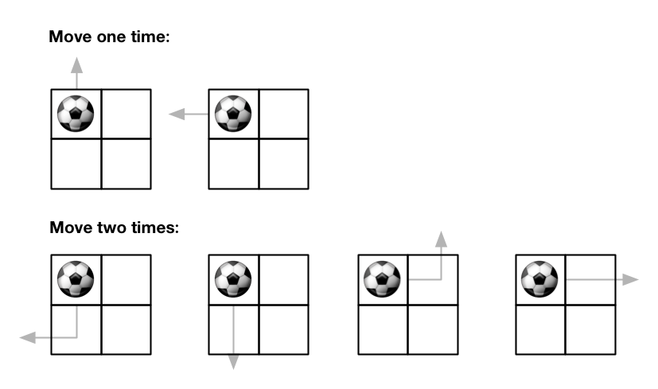
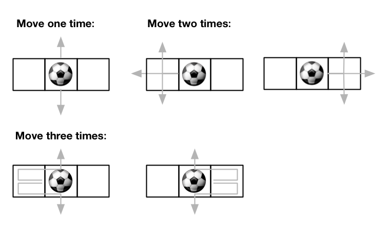

[#0576-out-of-boundary-paths]
= 576. 出界的路径数

https://leetcode.cn/problems/out-of-boundary-paths/[LeetCode - 576. 出界的路径数^]

给你一个大小为 `m x n` 的网格和一个球。球的起始坐标为 `[startRow, startColumn]`。你可以将球移到在四个方向上相邻的单元格内（可以穿过网格边界到达网格之外）。你 *最多* 可以移动 `maxMove` 次球。

给你五个整数 `m`、`n`、`maxMove`、`startRow` 以及 `startColumn`，找出并返回可以将球移出边界的路径数量。因为答案可能非常大，返回对 `10^9^ + 7` *取余* 后的结果。

*示例 1：*

....
输入：m = 2, n = 2, maxMove = 2, startRow = 0, startColumn = 0
输出：6
....

*示例 2：*

....
输入：m = 1, n = 3, maxMove = 3, startRow = 0, startColumn = 1
输出：12
....

*提示：*

* `1 \<= m, n \<= 50`
* `0 \<= maxMove \<= 50`
* `0 \<= startRow < m`
* `0 \<= startColumn < n`

== 思路分析

深度优先遍历会超时，因为会有重复计算。加一个备忘录，可以减少不必要的重复计算，提高效率。

看题解也可以用动态规格来做。下次试试。

另外，能用备忘录的题目，一般也都可以用动态规划来求解。

[[src-0576]]
[tabs]
====
一刷::
+
--
[{java_src_attr}]
----
include::{sourcedir}/_0576_OutOfBoundaryPaths.java[tag=answer]
----
--

// 二刷::
// +
// --
// [{java_src_attr}]
// ----
// include::{sourcedir}/_0576_OutOfBoundaryPaths_2.java[tag=answer]
// ----
// --
====

== 参考资料

. https://leetcode.cn/problems/out-of-boundary-paths/solutions/936439/gong-shui-san-xie-yi-ti-shuang-jie-ji-yi-asrz/[576. 出界的路径数 - 一题双解 :「记忆化搜索」&「动态规划」^]
. https://leetcode.cn/problems/out-of-boundary-paths/solutions/937539/yi-ti-wu-jie-dfs-jian-zhi-ji-yi-hua-sou-k4dtg/[576. 出界的路径数 - 一题五解：DFS & 剪枝 & 记忆化搜索 & DP & 降维优化，层层递进，保证给你...^] -- 这里的剪枝思路很不错！
. https://leetcode.cn/problems/out-of-boundary-paths/solutions/91312/zhuang-tai-ji-du-shi-zhuang-tai-ji-by-christmas_wa/[576. 出界的路径数 - 状态机！都是状态机！^]
. https://leetcode.cn/problems/out-of-boundary-paths/solutions/936069/chu-jie-de-lu-jing-shu-by-leetcode-solut-l9dw/[576. 出界的路径数 - 官方题解^]
